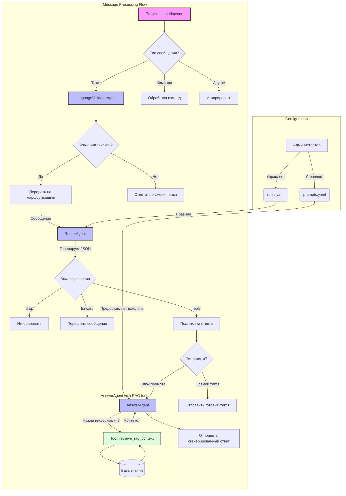

# Support Bot

> [!NOTE]
> Интеллектуальный Telegram-бот для автоматизации поддержки, использующий LLM-агентов для маршрутизации запросов и генерации ответов на основе базы знаний.

## 🚀 О проекте

**Support Bot** — это интеллектуальный ассистент, который автоматизирует процесс поддержки пользователей через Telegram. Бот использует современных LLM-агентов для понимания запросов, их гибкой маршрутизации и предоставления релевантных ответов с использованием RAG (Retrieval-Augmented Generation).

Ключевая особенность бота — гибкая маршрутизация входящих сообщений на основе набора правил, определенных в файле `rules.yaml`. Это позволяет настраивать логику поведения для различных типов запросов без изменения кода.

## ✨ Ключевые особенности

- **Гибкая маршрутизация**: Настройка сценариев обработки сообщений через `rules.yaml`.
- **RAG-пайплайн**: `AnswerAgent` самостоятельно использует инструмент для извлечения контекста из базы знаний для генерации точных ответов.
- **Динамические промпты**: Поведение агентов настраивается через шаблоны в `prompts.yaml`.
- **Поддержка команд**: Включает команды для пользователей (`/start`, `/help`) и администраторов (`/reload_rules`).
- **Строгая валидация**: Использование Pydantic моделей для валидации правил и конфигураций.

## ⚙️ Принцип работы

При получении текстового сообщения бот выполняет следующую последовательность действий:




1.  **Валидация языка**: `LanguageValidatorAgent` проверяет, написано ли сообщение на английском языке.
2.  **Маршрутизация (`RouterAgent`)**:
    - `RouterAgent` анализирует текст сообщения и на основе правил из `rules.yaml` определяет необходимое действие (`drop`, `forward`, `reply`).
    - Решение роутера валидируется через Pydantic-модель `RouterDecision`.
    - Если ни одно терминальное правило не найдено, бот по умолчанию не отвечает (можно изменить через `REPLY_ON_NO_MATCH=true`).
3.  **Выполнение действия**:
    - **`drop`**: Сообщение игнорируется.
    - **`forward`**: Сообщение пересылается в указанный чат с помощью утилиты `MessageForwarder`.
    - **`reply`**:
        - Если в правиле указан `response_text`, этот текст отправляется напрямую.
        - Если указан `system_prompt_key`, управление передается `AnswerAgent`.
4.  **Генерация ответа (`AnswerAgent`)**:
    - `AnswerAgent` получает задачу ответить пользователю.
    - Если для ответа требуется информация из базы знаний, агент **самостоятельно** вызывает инструмент `retrieve_rag_context`.
    - На основе полученного контекста, истории диалога и инструкций из `prompts.yaml` агент генерирует и отправляет финальный ответ.
5.  **Логирование**: Все ключевые действия и ошибки на каждом этапе логируются.

## 📄 Конфигурация

#### `rules.yaml`

Это сердце логики бота. Файл содержит список правил, которые определяют, как реагировать на разные сообщения.

- **`rule_id`**: Уникальный идентификатор.
- **`priority`**: Порядок проверки (меньше = раньше).
- **`conditions`**: Условия для срабатывания (ключевые слова, regex).
- **`action`**: Действие (`reply`, `forward`, `drop`).
- **`is_behavioral`**: `true` для правил, которые добавляют инструкции, но не завершают обработку.
- **`action_params`**: Параметры для действия (например, `response_text` или `destination_chat_id`).

#### `prompts.yaml`

Содержит шаблоны системных промптов для `AnswerAgent`.

- **Ключ промпта**: Например, `default_prompt`.
- **Плейсхолдеры**: Шаблоны используют `{history}` и `{instruction}` для вставки динамических данных.
- **Инструкции для инструмента**: Важно, чтобы промпт явно указывал агенту, когда и как использовать `retrieve_rag_context` tool для получения информации.

> [!IMPORTANT]
> Плейсхолдер `{context}` больше не используется в промптах. `AnswerAgent` теперь сам получает контекст через свой RAG-инструмент.

#### `.env` файл

Для работы бота необходимо создать `.env` файл в корне проекта со следующими переменными:
```
TELEGRAM_BOT_TOKEN=your_bot_token
OPENAI_API_KEY=your_openai_key
ADMIN_USER_IDS=12345678,98765432
REPLY_ON_NO_MATCH=false
```

## 📦 Установка и запуск

**Требования**:
- Python 3.10+
- Poetry

**Шаги установки**:
1.  **Клонируйте репозиторий**:
    ```bash
    git clone https://github.com/broxus/support-bot.git
    cd support-bot
    ```
2.  **Установите зависимости**:
    ```bash
    poetry install
    ```
3.  **Настройте `.env` файл**, как описано в разделе [конфигурации](#env-файл).

**Запуск бота**:
```bash
poetry run python src/main.py
```

## 👨‍💻 Команды управления

- `/start` - Приветственное сообщение.
- `/help` - Справочная информация.
- `/reload_rules` - (Только для администраторов) Перезагружает `rules.yaml` без перезапуска бота.

## 📁 Структура проекта

```
support-bot/
├── data/
│   └── vectorstore/      # Векторное хранилище для RAG
├── src/
│   ├── bot/              # Основная логика бота (конфигурация, обработчики)
│   ├── bot_agents/       # Определения агентов (RouterAgent, AnswerAgent и др.)
│   ├── prompts/          # Логика сборки промптов
│   ├── rules_manager/    # Менеджер правил из rules.yaml
│   ├── tools/            # Инструменты для агентов (RAG)
│   ├── utils/            # Вспомогательные утилиты (логгер, RAG, Telegram)
│   └── main.py           # Точка входа в приложение
├── .env.example          # Пример файла с переменными окружения
├── poetry.lock
├── pyproject.toml
├── prompts.yaml          # Шаблоны промптов для агентов
├── rules.yaml            # Правила маршрутизации
└── README.md
```

## 📄 Лицензия

Проект лицензирован под MIT License. 