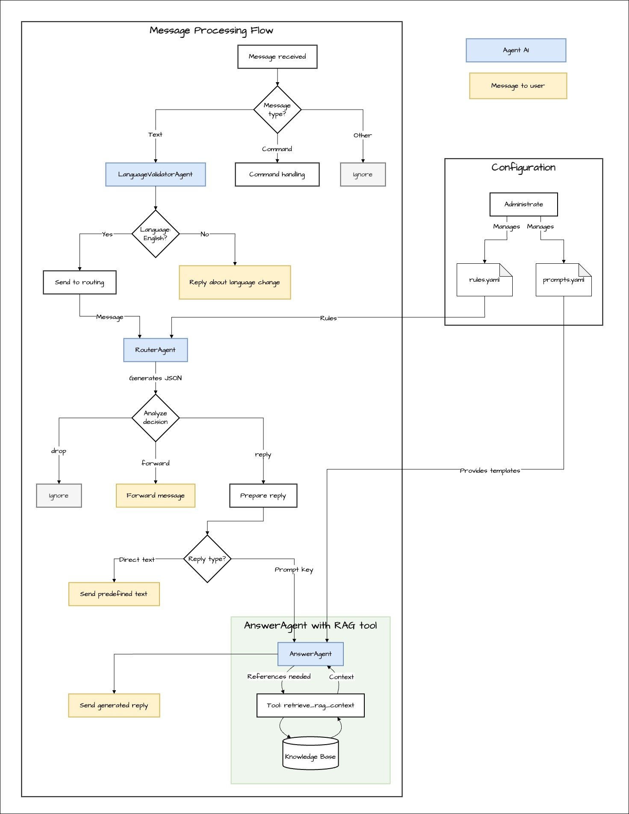

# Support Bot

> [!NOTE]
> An intelligent Telegram bot powered by LLM that streamlines customer support by intelligently routing inquiries and generating knowledge-based responses.

## 🚀 About the Project

At its core, it leverages cutting-edge LLM agents provided by OpenAI Agent SDK to comprehend user inquiries, intelligently route them, and deliver precise responses using RAG (Retrieval-Augmented Generation) technology.

What sets this bot apart is its adaptable message routing system, configured through the `rules.yaml` file. This innovative approach allows you to fine-tune response behaviors for different types of inquiries without touching a single line of code.

## ✨ Key Features

- **Smart Routing**: Configure message handling scenarios through `rules.yaml`.
- **RAG Pipeline**: `AnswerAgent` uses RAG as Tool, autonomously retrieves context from the knowledge base to generate accurate responses.
- **Dynamic Prompts**: Agent behavior is customizable via templates in `prompts.yaml`.
- **Command Support**: Features user commands (`/start`, `/help`) and admin utilities (`/reload_rules`).
- **Robust Validation**: Employs Pydantic models to ensure rule and configuration integrity.

## ⚙️ How It Works

When a message arrives, our bot springs into action with an intelligent processing workflow:



Let's walk through the sophisticated yet streamlined message processing pipeline:

1. **Language Check**: First, the `LanguageValidatorAgent` ensures the message is in English, setting the stage for accurate processing.

2. **Smart Routing** with `RouterAgent`:
   - Analyzes message content and matches it against rules in `rules.yaml` to determine the next action (`drop`, `forward`, or `reply`).
   - Each routing decision undergoes validation through the `RouterDecision` Pydantic model.
   - By default, messages without matching rules receive no response (customizable via `REPLY_ON_NO_MATCH=true`).

3. **Action Execution**:
   - **`drop`**: Message is gracefully ignored.
   - **`forward`**: The `MessageForwarder` utility seamlessly redirects the message to a specified chat.
   - **`reply`**: Two paths are possible:
     - Direct response using predefined `response_text`
     - Intelligent response generation via `AnswerAgent` using a `system_prompt_key`

4. **Response Generation** with `AnswerAgent`:
   - Takes charge of crafting personalized user responses.
   - Autonomously leverages the `retrieve_rag_context` tool when additional knowledge is needed.
   - Synthesizes final responses by combining context, conversation history, and `prompts.yaml` instructions.

5. **Comprehensive Logging**: Every critical action and error is meticulously tracked throughout the process.

## 📄 Configuration

#### `rules.yaml`

At the heart of our bot's intelligence lies the `rules.yaml` file - a sophisticated yet straightforward rulebook that governs how the bot responds to various messages.

- **`rule_id`**: A unique identifier for each rule
- **`priority`**: Determines the checking order (lower numbers are checked first)
- **`conditions`**: Defines trigger criteria using keywords or regex patterns
- **`action`**: Specifies the response type (`reply`, `forward`, or `drop`)
- **`is_behavioral`**: When set to `true`, adds instructions without terminating processing
- **`action_params`**: Contains action-specific settings (such as `response_text` or `destination_chat_id`)

#### `prompts.yaml`

This file houses the system prompt templates that guide the `AnswerAgent`'s behavior.

- **Prompt Key**: For example, `default_prompt`
- **Placeholders**: Templates leverage `{history}` and `{instruction}` for dynamic content insertion
- **Tool Instructions**: Crucial guidelines that tell the agent when and how to utilize the `retrieve_rag_context` tool for information gathering

#### `.env` file

Create an `.env` file in the project root with these essential variables:
```
TELEGRAM_BOT_TOKEN=your_bot_token
OPENAI_API_KEY=your_openai_key
ADMIN_USER_IDS=12345678,98765432
REPLY_ON_NO_MATCH=false
```

## 📦 Installation and Setup

**Prerequisites**:
- Python 3.10 or newer
- Poetry package manager

**Getting Started**:
1.  **Clone the Repository**:
    ```bash
    git clone https://github.com/Zegor88/SupportBot.git
    cd support-bot
    ```
2.  **Install Dependencies**:
    ```bash
    poetry install
    ```
3.  **Set up the `.env` file** as described in the [configuration](#env-file) section.

**Launch the Bot**:
```bash
poetry run python src/main.py
```

## 👨‍💻 Bot Commands

- `/start` - Displays a welcome message
- `/help` - Shows available commands and usage information
- `/reload_rules` - (Admin only) Refreshes `rules.yaml` configuration without bot restart

## 📁 Project Structure

```
support-bot/
├── data/
│   └── vectorstore/      # RAG vector storage
├── src/
│   ├── bot/              # Core bot logic (config and handlers)
│   ├── bot_agents/       # Agent definitions (RouterAgent, AnswerAgent, etc.)
│   ├── prompts/          # Prompt building logic
│   ├── rules_manager/    # Rules.yaml manager
│   ├── tools/            # Agent tools (RAG)
│   ├── utils/            # Utilities (logger, RAG, Telegram)
│   └── main.py           # Application entry point
├── .env.example          # Environment variables template
├── poetry.lock
├── pyproject.toml
├── prompts.yaml          # Agent prompt templates
├── rules.yaml            # Routing rules
└── README.md
```

## 📄 License

This project is licensed under the MIT License.