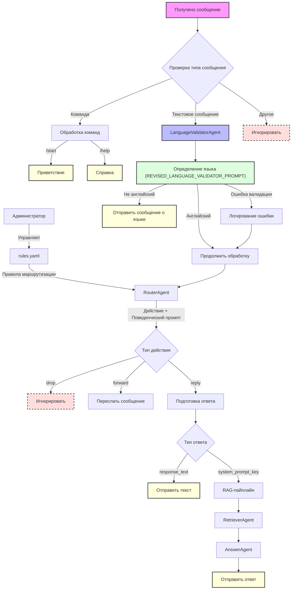

# Support Bot

Телеграм бот для автоматизации поддержки пользователей с использованием искусственного интеллекта.

## Описание

Support Bot - это интеллектуальный помощник, который автоматизирует процесс поддержки пользователей через Telegram. Бот использует современные технологии обработки естественного языка для понимания запросов пользователей и предоставления релевантных ответов.

### Маршрутизация запросов и `rules.yaml`

Одной из ключевых функций бота является гибкая маршрутизация входящих сообщений на основе набора правил, определенных в файле `rules.yaml`. Это позволяет настроить поведение бота для различных типов запросов без изменения кода.

#### Обзор `rules_manager`

Модуль `src/rules_manager` отвечает за загрузку, валидацию и управление правилами маршрутизации из файла `rules.yaml`.

*   **`RulesManager`**: Основной класс, предоставляющий интерфейс для доступа к правилам. Он загружает правила при инициализации и выполняет их валидацию.
*   **Pydantic модели**: Схема файла `rules.yaml` строго определена с использованием Pydantic моделей (в `src/rules_manager/models.py`), что обеспечивает корректность формата правил и типов данных.

#### Структура `rules.yaml`

Файл `rules.yaml` содержит список правил, каждое из которых определяет условия срабатывания и соответствующее действие. Правила обрабатываются в порядке их `priority`.

**Поля каждого правила:**

*   `rule_id` (строка, обязательное): Уникальный текстовый идентификатор правила (например, "greet_user", "faq_payment_issue").
*   `priority` (целое число, обязательное): Приоритет правила. Правила с меньшим значением приоритета проверяются раньше.
*   `conditions` (список, обязательное, минимум 1 элемент): Список условий. Правило срабатывает, если **все** условия в списке истинны.
    *   Каждое условие имеет поле `type`, определяющее его логику:
        *   **`keyword_match`**: Поиск по ключевым словам.
            *   `keywords` (список строк, обязательное, минимум 1 слово): Ключевые слова для поиска.
            *   `match_type` (строка, опционально, по умолчанию "any"):
                *   `any`: Условие истинно, если найдено хотя бы одно слово из `keywords`.
                *   `all`: Условие истинно, если найдены все слова из `keywords`.
            *   `case_sensitive` (булево, опционально, по умолчанию `false`): Учитывать ли регистр при поиске ключевых слов.
        *   **`regex_match`**: Поиск по регулярному выражению (например: `(комбо|combo|карточк[иа])\s*(какие|какая|каких|обновились)`).
            *   `pattern` (строка, обязательное): Регулярное выражение для поиска.
*   `action` (строка, обязательное): Действие, которое выполнится, если правило сработало. Допустимые значения:
    *   `reply`: Ответить на сообщение.
    *   `forward`: Переслать сообщение.
    *   `drop`: Проигнорировать сообщение (ничего не делать).
*   `action_params` (объект, обязательное): Параметры для указанного `action`. Структура зависит от типа действия:
    *   Для `action: reply`:
        *   Должен быть указан **один из** следующих параметров:
            *   `response_text` (строка): Текст прямого ответа.
            *   `system_prompt_key` (строка): Ключ, по которому будет получен системный промпт (например, из другого конфигурационного файла или базы данных). Этот промпт будет использован для генерации ответа с помощью LLM.
    *   Для `action: forward`:
        *   `destination_chat_id` (строка, обязательное): ID чата (пользователя или группы) в Telegram, куда будет переслано сообщение.
    *   Для `action: drop`:
        *   Может быть пустым объектом `{}`. Никаких дополнительных параметров не требуется.

## Требования

- Python 3.10+
- Poetry для управления зависимостями
- Telegram Bot Token
- OpenAI API ключ

## Установка

1. Клонируйте репозиторий:
```bash
git clone https://github.com/broxus/support-bot.git
cd support-bot
```

2. Установите Poetry (если еще не установлен):
```bash
curl -sSL https://install.python-poetry.org | python3 -
```

3. Установите зависимости (это также создаст виртуальное окружение):
```bash
poetry install
```

4. Создайте файл .env в корневой директории. Для этого можно скопировать `.env.example` (если он есть) или создать файл вручную:
```bash
cp .env.example .env # если .env.example существует
# или
touch .env
```

5. Зарегистрируйте бота в Telegram:
    - Откройте Telegram и найдите бота `@BotFather`.
    - Отправьте команду `/newbot`.
    - Следуйте инструкциям, чтобы задать имя и username для вашего бота.
    - `@BotFather` предоставит вам API токен.

6. Добавьте полученный `TELEGRAM_BOT_TOKEN` и другие необходимые переменные окружения в файл `.env`:
```
TELEGRAM_BOT_TOKEN=your_bot_token
OPENAI_API_KEY=your_openai_key # Понадобится для будущих задач
ADMIN_USER_IDS=12345678,98765432 # ID администраторов через запятую для команды /reload_rules
```

## Запуск бота

Убедитесь, что вы выполнили все шаги в разделе [Установка](#установка), включая создание `.env` файла с вашим `TELEGRAM_BOT_TOKEN` и `OPENAI_API_KEY`.

Для запуска бота выполните команду из корневой директории проекта:

```bash
poetry run python src/main.py
```

### Схема обработки сообщений



После запуска бот будет готов принимать команды (`/start`, `/help`).
При получении текстового сообщения бот выполняет следующую последовательность действий:

1. **Валидация языка**: 
   - Сообщение проверяется `LanguageValidatorAgent` (использующим OpenAI API, например, `gpt-4o-mini`).
   - Если язык не английский, бот отправит сообщение: "This chat is for English language communication. You texted me in [Обнаруженный язык]. Please rephrase your question in English."
   - Если язык английский (или произошла ошибка валидации, но система настроена продолжать), сообщение передается дальше.
   - Все результаты валидации логируются через `Logger`.

2. **Маршрутизация (`RouterAgent`)**: 
   - `RouterAgent` (также использующий OpenAI API, например, `gpt-4o-mini`) анализирует текст сообщения.
   - На основе динамически загружаемых инструкций и правил из `rules.yaml` (предоставляемых `RulesManager`), определяет необходимое действие.
   - Инструкции для `RouterAgent` включают JSON-представление всех доступных правил.
   - Решение роутера включает не только тип действия, но и поведенческий промпт, определяющий стиль и контекст ответа.
   - Решение роутера валидируется через Pydantic модель `RouterDecision`.

3. **Выполнение действия**:
   - **`drop`**: Если `RouterAgent` решил игнорировать сообщение, дальнейшая обработка прекращается.
   - **`forward`**: Если необходимо переслать сообщение, используется `ForwardTool` (`src/tools/telegram_tools.py`).
   - **`reply`**: 
     - Если правило содержит `response_text`, этот текст отправляется пользователю напрямую.
     - Если правило содержит `system_prompt_key`, запускается RAG-пайплайн:
       1. `RetrieverAgent` ищет релевантный контекст в базе знаний.
       2. Контекст (если найден) вместе с исходным сообщением и ключом промпта передается в `AnswerAgent`.
       3. `AnswerAgent` генерирует ответ на основе всей полученной информации.

4. **Логирование**:
   - Все этапы обработки сообщения логируются через `Logger`.
   - Для каждого взаимодействия создается структурированный лог через `InteractionLog`.
   - Ошибки на любом этапе обрабатываются и логируются, не прерывая работу бота.

Это поведение актуально как для личных сообщений, так и для групп, куда добавлен бот.

## Команды управления

*   `/start` - Приветственное сообщение.
*   `/help` - Справочная информация.
*   `/reload_rules` - (Только для администраторов) Перезагружает файл правил `rules.yaml` без перезапуска бота. Для использования этой команды необходимо, чтобы ID пользователя Telegram был указан в переменной окружения `ADMIN_USER_IDS`.

## Структура проекта

```
support-bot/
├── src/                    # Исходный код
│   ├── bot/               # Основной модуль бота
│   │   ├── config.py      # Конфигурация бота
│   │   ├── handlers.py    # Обработчики сообщений
│   │   ├── telegram_bot.py # Основной класс бота
│   │   └── utils.py       # Утилиты для бота
│   │
│   ├── bot_agents/        # Агенты на базе OpenAI Agent SDK
│   │   ├── language_validator_agent.py  # Валидация языка
│   │   ├── router_agent.py             # Маршрутизация сообщений
│   │   ├── retriever_agent.py          # Поиск в базе знаний
│   │   ├── answer_agent.py             # Генерация ответов
│   │   └── models.py                   # Pydantic модели
│   │
│   ├── utils/             # Общие утилиты
│   │   ├── logger.py      # Логирование
│   │   ├── embeddings.py  # Работа с эмбеддингами
│   │   ├── rag_retriever.py # RAG компоненты
│   │   └── response_generator.py # Генерация ответов
│   │
│   ├── rules_manager/     # Управление правилами
│   │   ├── manager.py     # Менеджер правил
│   │   └── models.py      # Модели правил
│   │
│   ├── tools/             # Инструменты
│   │   └── telegram_tools.py # Инструменты для Telegram
│   │
│   └── main.py            # Точка входа
│
├── tests/                 # Тесты
│   ├── agents/           # Тесты агентов
│   └── rules_manager/    # Тесты менеджера правил
│
├── docs/                  # Документация
│   ├── Epic0/            # Документация по Epic 0
│   ├── Epic1/            # Документация по Epic 1
│   └── ...               # Другие эпики
│
├── data/                  # Данные
│   └── vectorstore/      # Векторное хранилище
│
├── poetry.lock           # Файл блокировки зависимостей
├── pyproject.toml        # Конфигурация Poetry
├── rules.yaml           # Правила маршрутизации
├── prompts.yaml         # Промпты для агентов
└── README.md            # Документация проекта
```

### Структура импортов

При разработке важно соблюдать правильную структуру импортов:

1. В точке входа (`src/main.py`) используйте абсолютные импорты:
```python
from src.bot.config import logger
from src.bot.telegram_bot import TelegramBot, Config
```

2. В остальных модулях используйте относительные импорты для модулей из того же пакета:
```python
from .config import Config, logger  # импорт из того же пакета
```

3. Запуск бота:
```bash
poetry run python src/main.py
```

#### Примечание о PYTHONPATH

PYTHONPATH - это переменная окружения, которая указывает Python, где искать модули для импорта. В нашем проекте мы настроили правильную структуру пакета через `pyproject.toml` (секция `packages = [{include = "src"}]`), поэтому нет необходимости вручную управлять PYTHONPATH.

#### Возможные проблемы

- **ModuleNotFoundError: No module named 'src'**: Убедитесь, что вы установили проект в режиме разработки через `poetry install`.
- **ImportError: attempted relative import beyond top-level package**: Возникает при попытке использовать относительные импорты в точке входа (`main.py`). В `main.py` всегда используйте абсолютные импорты.

## Лицензия

Этот проект лицензирован под MIT License - см. файл [LICENSE](LICENSE) для деталей. 