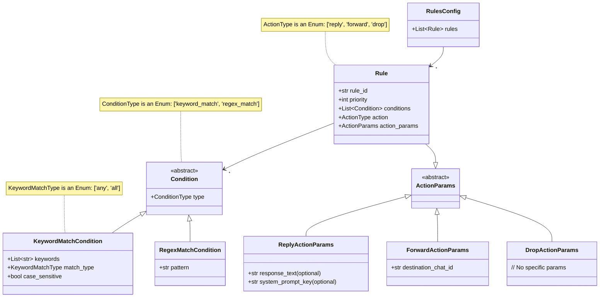

# Техническое Задание: E3.1 Определение схемы YAML-правил и создание менеджера правил

**Дата:** 29.05.2024
**Версия:** 1.0
**Эпик:** E3: Router & Dynamic Instructions
**Связанная задача:** E3.1 (согласно `docs/Epic3/Epic3.md`)

## 1. Введение и Цели

Целью данной задачи является разработка механизма управления правилами маршрутизации пользовательских сообщений. Этот механизм должен позволять гибко настраивать логику поведения бота через внешний YAML-файл, без необходимости изменения кода.

Основные компоненты:
1.  Четко определенная схема для YAML-файла правил (`rules.yaml`).
2.  Pydantic модели для валидации этих правил.
3.  Класс `RulesManager` для загрузки, валидации, доступа и "горячей" перезагрузки правил.
4.  Пример файла `rules.yaml`, демонстрирующий различные типы правил, включая основанные на предоставленных `instructions.txt`.

*Примечание о связи с OpenAI Agent SDK: Компоненты, разрабатываемые в рамках данной задачи (схема YAML, Pydantic модели, `RulesManager`), являются стандартными Python-артефактами. Они создают необходимую инфраструктуру для `RouterAgent` (задача E3.2), который будет являться агентом, построенным с использованием OpenAI Agent SDK. `RulesManager` будет предоставлять данные для этого агента, но сам по себе не будет использовать SDK.*

## 2. Функциональные Требования

### FR-E3.1-1: Схема YAML-правил
Система должна поддерживать YAML-файл (`rules.yaml`) для определения правил маршрутизации. Каждое правило должно содержать следующие поля:
*   `rule_id` (строка, обязательное, уникальное): Уникальный идентификатор правила.
*   `priority` (целое число, обязательное): Приоритет правила. Меньшее значение означает более высокий приоритет.
*   `conditions` (список объектов, обязательное): Список условий, при выполнении ВСЕХ из которых правило считается сработавшим.
    *   Каждое условие в списке должно быть объектом, определяющим тип условия и его параметры.
*   `action` (строка, обязательное): Действие, которое необходимо выполнить, если правило сработало. Допустимые значения: `reply`, `forward`, `drop`.
*   `action_params` (словарь, обязательное): Параметры для действия. Структура зависит от значения поля `action`.
    *   Если `action: "reply"`:
        *   `response_text` (строка, опционально): Заранее заданный текст для немедленного ответа.
        *   `system_prompt_key` (строка, опционально): Ключ для системного промпта, который будет использован `AnswerAgent`.
        *   Если указан `response_text`, он имеет приоритет над `system_prompt_key`. Хотя бы один из них должен быть указан для `action: "reply"`.
    *   Если `action: "forward"`:
        *   `destination_chat_id` (строка, обязательное): Идентификатор Telegram-чата (например, `@channel_name` или ID чата) для пересылки сообщения.
    *   Если `action: "drop"`:
        *   `action_params` может быть пустым словарем `{}`.

### FR-E3.1-2: Типы Условий
Система должна поддерживать следующие типы условий в списке `conditions`:
1.  **`keyword_match`**:
    *   `type: "keyword_match"`
    *   `keywords` (список строк, обязательное): Список ключевых слов для поиска в тексте сообщения.
    *   `match_type` (строка, обязательное): Тип совпадения. Допустимые значения:
        *   `any`: Считается совпадением, если найдено хотя бы одно ключевое слово.
        *   `all`: Считается совпадением, если найдены все ключевые слова.
    *   `case_sensitive` (булево, опционально, по умолчанию `False`): Учитывать ли регистр при поиске ключевых слов.
2.  **`regex_match`**:
    *   `type: "regex_match"`
    *   `pattern` (строка, обязательное): Регулярное выражение для проверки текста сообщения.

### FR-E3.1-3: Pydantic Модели для Валидации
Должны быть созданы Pydantic модели для:
*   Представления одного правила (`Rule`).
*   Представления каждого типа условия (`KeywordMatchCondition`, `RegexMatchCondition`).
*   Представления параметров действия (`ReplyActionParams`, `ForwardActionParams`).
*   Представления корневого объекта файла правил (например, список правил `RulesConfig`).
Эти модели будут использоваться для валидации структуры и типов данных в `rules.yaml`.

### FR-E3.1-4: Класс `RulesManager`
Должен быть реализован класс `RulesManager` со следующими обязанностями и методами:
*   **Конструктор (`__init__(self, rules_file_path: str)`)**:
    *   Принимает путь к файлу `rules.yaml`.
    *   Загружает и валидирует правила при инициализации.
*   **Метод загрузки и валидации правил (`load_rules(self) -> List[Rule]`)**:
    *   Читает YAML-файл.
    *   Парсит YAML.
    *   Валидирует содержимое с использованием Pydantic моделей.
    *   В случае ошибок валидации или парсинга, должен выбрасывать информативное исключение (например, `RuleSyntaxError`).
    *   Возвращает список валидных объектов `Rule`, отсортированных по `priority` (по возрастанию).
*   **Метод получения правил (`get_rules(self) -> List[Rule]`)**:
    *   Возвращает текущий список загруженных и отсортированных правил.
*   **Метод "горячей" перезагрузки правил (`reload_rules(self) -> bool`)**:
    *   Повторно вызывает `load_rules()`.
    *   Обновляет внутренний список правил.
    *   Возвращает `True` в случае успеха, `False` (или выбрасывает исключение) в случае ошибки.
    *   Должен логировать результат операции (успех/ошибка с деталями).

### FR-E3.1-5: Пример Файла `rules.yaml`
Должен быть создан файл `rules.yaml` в корне проекта (или в `config/`) со следующими примерами правил, основанными на ранее предоставленных `instructions.txt` и `SYSTEM_PROMPT`:

1.  **Правило для Hamster Combat (вывод средств):**
    *   `rule_id: "hamster_withdraw"`
    *   `priority: 10`
    *   `conditions`: `keyword_match` по словам типа "withdraw", "reward", "hamster", "boost" (с `match_type: "all"` или продуманным `any` и несколькими условиями).
    *   `action: "reply"`
    *   `action_params: { "response_text": "Hello! If you have received a reward in Hamster Boost, follow these instructions: https://t.me/broxus_chat/26814" }`
2.  **Правило для Hamster Combat (другая поддержка):**
    *   `rule_id: "hamster_other_support"`
    *   `priority: 11`
    *   `conditions`: `keyword_match` по "hamster", "combat", "boost", "support", "help", "tokenomics", "gameplay", "card" и т.д. (исключая слова о выводе, возможно через несколько условий или более сложный regex, чтобы не пересекаться с `hamster_withdraw`).
    *   `action: "reply"`
    *   `action_params: { "response_text": "This chat doesn't provide support for Hamster Boost. Please contact @Hamster_Boost_Support_bot for assistance with your query." }`
    *   *Примечание:* Исключение для "general comparative question" (из `instructions.txt`) реализуется через более высокий приоритет (меньшее число) правил, которые могут поймать такие общие вопросы, или через более специфичные `conditions` для правил Hamster.
3.  **Правило для пересылки сообщений с определенным паттерном:**
    *   `rule_id: "forward_urgent_issue"`
    *   `priority: 5`
    *   `conditions`: `regex_match` с паттерном, указывающим на срочность (например, `(?i)urgent|critical|blocker`).
    *   `action: "forward"`
    *   `action_params: { "destination_chat_id": "@urgent_support_channel" }`
4.  **Правило для игнорирования (drop) спам-сообщений:**
    *   `rule_id: "drop_spam_keywords"`
    *   `priority: 1`
    *   `conditions`: `keyword_match` по спам-ключам (например, "buy cheap followers", "crypto pump").
    *   `action: "drop"`
    *   `action_params: {}`
5.  **Правило для ответа с использованием `system_prompt_key`:**
    *   `rule_id: "reply_with_faq_prompt"`
    *   `priority: 100`
    *   `conditions`: `keyword_match` (например, "how to", "what is", "explain").
    *   `action: "reply"`
    *   `action_params: { "system_prompt_key": "general_faq_prompt" }`

## 3. Структуры Данных и Модели (Pydantic)

### 3.1 UML Диаграмма Классов (Mermaid)



### 3.2 Определения Pydantic Моделей (псевдокод)

```python
# pydantic_models.py (примерная структура)
from typing import List, Literal, Optional, Union
from pydantic import BaseModel, Field, validator

# Enums
ActionType = Literal["reply", "forward", "drop"]
ConditionType = Literal["keyword_match", "regex_match"]
KeywordMatchType = Literal["any", "all"]

# Condition Models
class BaseCondition(BaseModel):
    type: ConditionType

class KeywordMatchCondition(BaseCondition):
    type: Literal["keyword_match"]
    keywords: List[str] = Field(..., min_items=1)
    match_type: KeywordMatchType
    case_sensitive: bool = False

class RegexMatchCondition(BaseCondition):
    type: Literal["regex_match"]
    pattern: str

# Union of all condition types
AnyCondition = Union[KeywordMatchCondition, RegexMatchCondition]

# Action Parameter Models
class BaseActionParams(BaseModel):
    pass

class ReplyActionParams(BaseActionParams):
    response_text: Optional[str] = None
    system_prompt_key: Optional[str] = None

    @validator('system_prompt_key', always=True)
    def check_reply_params(cls, v, values):
        if not values.get('response_text') and not v:
            raise ValueError('Either response_text or system_prompt_key must be provided for reply action')
        return v

class ForwardActionParams(BaseActionParams):
    destination_chat_id: str

class DropActionParams(BaseActionParams): # Может быть пустым
    pass

# Rule Model
class Rule(BaseModel):
    rule_id: str
    priority: int
    conditions: List[AnyCondition] = Field(..., min_items=1)
    action: ActionType
    action_params: Union[ReplyActionParams, ForwardActionParams, DropActionParams] # Будет определено на основе action

    @validator('action_params', always=True)
    def validate_action_params_type(cls, v, values):
        action = values.get('action')
        if action == 'reply' and not isinstance(v, ReplyActionParams):
            raise ValueError('action_params must be ReplyActionParams for reply action')
        if action == 'forward' and not isinstance(v, ForwardActionParams):
            raise ValueError('action_params must be ForwardActionParams for forward action')
        if action == 'drop' and not isinstance(v, DropActionParams): # или просто pass
            raise ValueError('action_params must be DropActionParams for drop action')
        return v


# Config Model (for the entire rules.yaml file)
class RulesConfig(BaseModel):
    rules: List[Rule]

```
*Примечание:* Реализация `action_params` с `Union` и валидатором потребует аккуратной обработки при парсинге YAML и инстанцировании Pydantic моделей, возможно, с использованием `root_validator` или кастомного парсера в `RulesManager` для выбора правильного типа `ActionParams` на основе поля `action`.


## 4. Класс `RulesManager`

### 4.1 UML Диаграмма Класса (Mermaid)
```mermaid
classDiagram
    class RulesManager {
        -str rules_file_path
        -List~Rule~ _rules
        +__init__(rules_file_path: str)
        +load_rules() : List~Rule~
        +get_rules() : List~Rule~
        +reload_rules() : bool
    }
    RulesManager ..> Rule : uses
    RulesManager ..> "logging" : uses
    RulesManager ..> "pyyaml" : uses
    RulesManager ..> "PydanticModels" : uses
```

### 4.2 Описание Методов
*   **`__init__(self, rules_file_path: str)`**:
    *   Сохраняет `rules_file_path`.
    *   Вызывает `load_rules()` для начальной загрузки.
    *   Логирует успешную инициализацию или ошибку.
*   **`load_rules(self) -> List[Rule]`**:
    *   Открывает и читает файл по `rules_file_path`.
    *   Использует `yaml.safe_load()` для парсинга.
    *   Преобразует загруженные данные в экземпляр `RulesConfig` (или напрямую в `List[Rule]`, если YAML представляет собой список правил).
    *   Применяет Pydantic валидацию.
    *   Если есть ошибки парсинга YAML или валидации Pydantic, выбрасывает кастомное исключение (например, `RulesFileError(Exception)`) с подробным описанием ошибки.
    *   Сортирует правила по полю `priority` (по возрастанию).
    *   Сохраняет отсортированный список правил во внутренний атрибут `_rules`.
    *   Возвращает этот список.
    *   Логирует количество загруженных правил или ошибку загрузки.
*   **`get_rules(self) -> List[Rule]`**:
    *   Просто возвращает текущее значение `_rules`.
*   **`reload_rules(self) -> bool`**:
    *   Вызывает `self.load_rules()`.
    *   Если `load_rules()` завершается успешно, обновляет `_rules` и возвращает `True`.
    *   Если `load_rules()` выбрасывает исключение, перехватывает его, логирует ошибку и возвращает `False`.
    *   Логирует статус перезагрузки (успех/неудача).

## 5. Use Cases

### UC-E3.1-01: Первоначальная загрузка правил при старте бота
*   **Предусловие:** Файл `rules.yaml` существует и доступен.
*   **Действующие лица:** Система (при инициализации `RulesManager`).
*   **Основной поток:**
    1.  Система создает экземпляр `RulesManager`, передавая путь к `rules.yaml`.
    2.  `RulesManager` вызывает `load_rules()`.
    3.  `load_rules()` читает, парсит и валидирует YAML-файл с помощью Pydantic моделей.
    4.  Правила сортируются по приоритету.
    5.  Список правил сохраняется в `RulesManager`.
    6.  Система логирует успешную загрузку и количество правил.
*   **Альтернативный поток (Ошибка файла):**
    *   3а. Если файл не найден, поврежден, или YAML/Pydantic валидация не проходит.
    *   3б. `load_rules()` выбрасывает исключение `RulesFileError`.
    *   3в. Система логирует критическую ошибку, бот может не запуститься или перейти в безопасный режим без правил.

### UC-E3.1-02: "Горячая" перезагрузка правил по команде
*   **Предусловие:** `RulesManager` инициализирован. Команда `/reload_rules` вызвана.
*   **Действующие лица:** Администратор бота (через команду), Система (`RouterAgent` или обработчик команд вызывает `RulesManager`).
*   **Основной поток:**
    1.  Система вызывает метод `reload_rules()` у экземпляра `RulesManager`.
    2.  `RulesManager` повторно вызывает `load_rules()`.
    3.  Происходит чтение, парсинг, валидация нового содержимого `rules.yaml`.
    4.  Новый список правил (отсортированный) заменяет старый в `RulesManager`.
    5.  `reload_rules()` возвращает `True`.
    6.  Система логирует успешную перезагрузку и количество новых правил.
*   **Альтернативный поток (Ошибка файла при перезагрузке):**
    *   3а. Если файл не найден, поврежден, или YAML/Pydantic валидация не проходит.
    *   3б. `load_rules()` выбрасывает исключение.
    *   3в. `reload_rules()` перехватывает исключение, логирует ошибку и возвращает `False`.
    *   3г. `RulesManager` продолжает использовать старый (предыдущий валидный) набор правил.

## 6. Требования к реализации

*   **Язык:** Python 3.10+
*   **Библиотеки:** `PyYAML` для работы с YAML, `Pydantic` для валидации данных.
*   **Обработка ошибок:** Предусмотреть информативные сообщения об ошибках при парсинге и валидации файла правил.
*   **Логирование:** Использовать стандартный модуль `logging` для логирования процесса загрузки, перезагрузки правил и возникающих ошибок.
*   **Тестирование:** Модуль `rules_manager.py` и Pydantic модели должны быть покрыты unit-тестами.
    *   Тесты на корректную загрузку валидного `rules.yaml`.
    *   Тесты на различные ошибки в `rules.yaml` (неверный синтаксис YAML, несоответствие Pydantic моделям, отсутствующие обязательные поля, неверные типы данных).
    *   Тесты на корректную сортировку правил по приоритету.
    *   Тесты на работу `reload_rules()` (успешная перезагрузка, откат к старым правилам при ошибке).

## 7. Замечания и Открытые Вопросы
*   Рассмотреть размещение `rules.yaml` (например, в корне проекта, в директории `config/` или `data/`). По умолчанию, пусть будет `rules.yaml` в корне.
*   Определить стратегию поведения бота, если `rules.yaml` не найден или содержит критические ошибки при первоначальной загрузке (например, работа без правил, использование "безопасного" набора правил по умолчанию, аварийное завершение). Для MVP: логировать ошибку и работать без правил (или с пустым списком правил).
