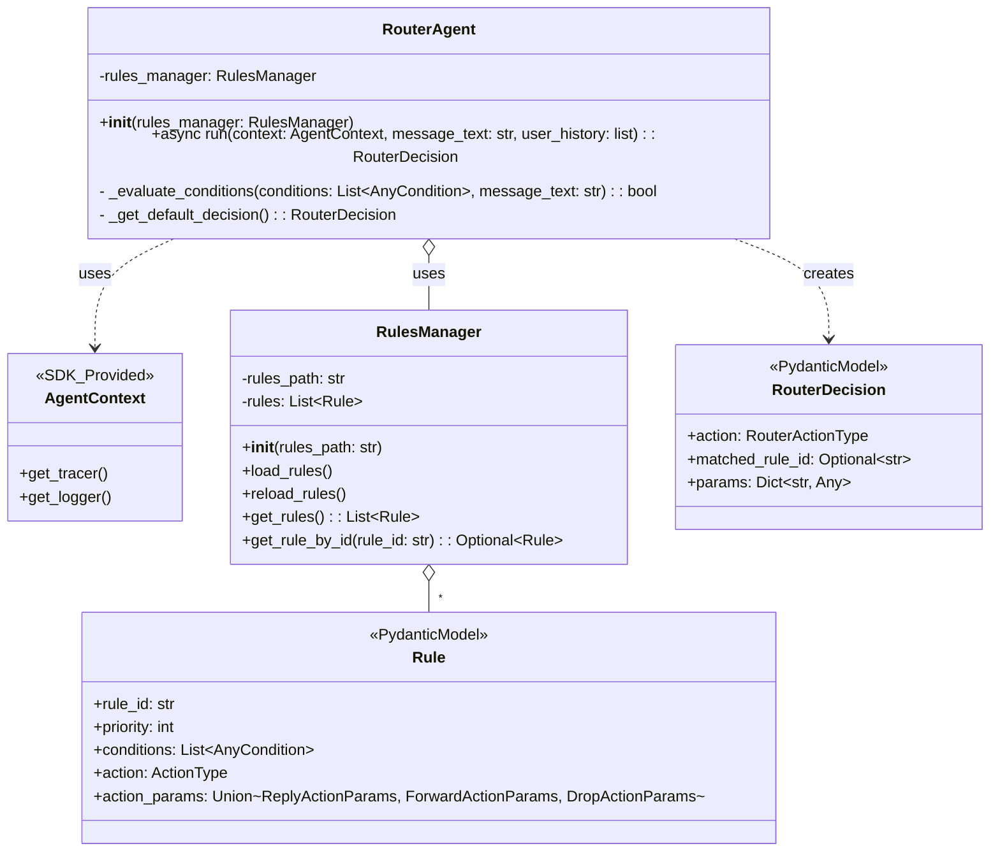
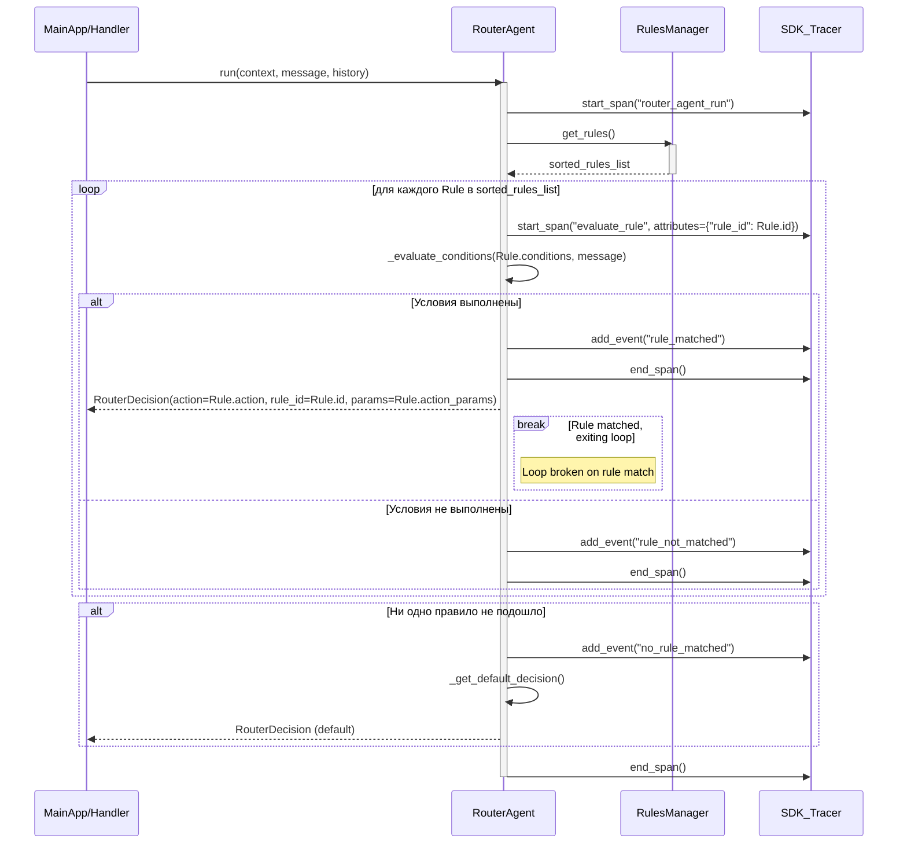

# Техническое Задание: E3.2 Реализация RouterAgent

## 1. Введение

### 1.1. Цель документа
Этот документ описывает технические требования к реализации `RouterAgent`, компонента системы Support Bot, отвечающего за принятие решений о дальнейшей обработке входящих сообщений пользователя на основе предопределенных правил.

### 1.2. Область применения
Данное ТЗ распространяется на разработку класса `RouterAgent`, его интеграцию с `RulesManager`, определение структуры возвращаемых им решений и взаимодействие с другими компонентами системы.

### 1.3. Ссылки на связанные документы
*   `docs/Epic3/Epic3.md`: Описание Эпика 3, включая высокоуровневые задачи и User Stories.
*   `docs/Epic3/TR-E3.1.md`: Техническое задание на `RulesManager` и схему `rules.yaml`.
*   Документация OpenAI Agent SDK (в части Handoffs, Tracing, Guardrails – будет релевантно для интеграции).

## 2. Термины и определения
*   **RouterAgent**: Агент, анализирующий входящее сообщение и на основе правил определяющий следующее действие.
*   **RulesManager**: Компонент, отвечающий за загрузку, валидацию и предоставление правил из `rules.yaml`.
*   **Rule**: Набор условий и соответствующее действие, определенное в `rules.yaml`.
*   **Condition**: Условие, которое должно быть выполнено для срабатывания правила (например, `keyword_match`, `regex_match`).
*   **Action**: Действие, выполняемое при срабатывании правила (например, `reply`, `forward`, `drop`).
*   **RouterDecision**: Объект, возвращаемый `RouterAgent`, содержащий принятое решение (действие и его параметры).
*   **AgentContext**: Контекст выполнения агента, предоставляемый SDK.
*   **UserHistory**: Список предыдущих сообщений в диалоге.
*   **Handoff**: Механизм передачи управления и данных другому агенту (например, `AnswerAgent`).

## 3. Функциональные требования (FR)

### FR-RA-001: Инициализация `RouterAgent`
*   `RouterAgent` должен инициализироваться с обязательным параметром – экземпляром класса `RulesManager`.
*   Класс `RouterAgent` должен наследоваться от `agents.Agent` (из OpenAI Agent SDK).

### FR-RA-002: Получение правил маршрутизации
*   Перед обработкой каждого сообщения `RouterAgent` должен получать актуальный отсортированный список правил от `RulesManager`.

### FR-RA-003: Обработка входящего сообщения
*   `RouterAgent` должен иметь асинхронный метод `run(self, context: AgentContext, message_text: str, user_history: list) -> RouterDecision` (или аналогичный, соответствующий сигнатуре SDK).
*   Метод `run` принимает на вход текст текущего сообщения пользователя (`message_text`), историю диалога (`user_history`) и контекст агента (`context`).

### FR-RA-004: Применение условий правил
*   Для каждого правила из списка агент должен последовательно проверять выполнение всех его `conditions` по отношению к `message_text`.
*   Реализация проверки условий должна использовать параметры, указанные в правиле (например, `keywords`, `match_type`, `case_sensitive` для `keyword_match`; `pattern` для `regex_match`).
*   (Опционально, для будущих улучшений): Рассмотреть возможность использования `user_history` при проверке условий, если это будет необходимо.

### FR-RA-005: Выбор правила на основе приоритета
*   Агент должен обрабатывать правила в соответствии с их `priority` (меньшее значение – выше приоритет).
*   Первое правило, все условия которого выполнены для данного `message_text`, считается сработавшим. Дальнейшая проверка правил прекращается.

### FR-RA-006: Формирование `RouterDecision`
*   После нахождения сработавшего правила, `RouterAgent` должен сформировать и вернуть объект `RouterDecision`.
*   `RouterDecision` должен содержать:
    *   `action`: Тип действия (e.g., `"reply"`, `"forward"`, `"drop"`).
    *   `matched_rule_id`: ID сработавшего правила (или `None`, если ни одно правило не подошло).
    *   `params`: Словарь с параметрами для действия, извлеченными из `action_params` сработавшего правила (например, `response_text`, `system_prompt_key`, `destination_chat_id`).

### FR-RA-007: Обработка по умолчанию
*   Если ни одно из правил не соответствует входящему сообщению, `RouterAgent` должен вернуть `RouterDecision` с действием по умолчанию.
*   Действие по умолчанию может быть, например, `action: "default_reply"` с указанием `system_prompt_key` для общего системного промпта. Это поведение должно быть конфигурируемым или четко определенным.

### FR-RA-008: Поддержка различных типов условий
*   `RouterAgent` должен корректно обрабатывать как минимум следующие типы условий, определенные в `RulesManager` и `rules.yaml`:
    *   `keyword_match`
    *   `regex_match`

### FR-RA-009: Поддержка различных типов действий
*   `RouterAgent` должен корректно формировать `RouterDecision` для как минимум следующих типов действий:
    *   `reply`
    *   `forward`
    *   `drop`

## 4. Нефункциональные требования (NFR)

### NFR-RA-001: Производительность
*   Обработка сообщения и выбор правила должны выполняться достаточно быстро, чтобы не создавать заметных задержек для пользователя. Время обработки одного сообщения агентом не должно превышать TBD мс на типовой нагрузке (конкретное значение будет определено на этапе тестирования).

### NFR-RA-002: Расширяемость
*   Архитектура агента должна позволять относительно легко добавлять поддержку новых типов условий и действий в будущем с минимальными изменениями в основной логике `RouterAgent`.

### NFR-RA-003: Интеграция с OpenAI Agent SDK
*   `RouterAgent` должен использовать возможности OpenAI Agent SDK для:
    *   Логирования процесса принятия решений (см. E3.6.1).
    *   Трассировки выполнения, включая создание кастомных "spans" для детализации этапов (см. E3.6.2).

## 5. Модели данных (Pydantic)

### 5.1. `RouterActionParams`
Объединение (Union) Pydantic моделей, представляющих параметры для различных действий. Эти модели уже определены в `src/rules_manager/models.py` как `ReplyActionParams`, `ForwardActionParams`, `DropActionParams`. `RouterAgent` будет получать их из `Rule.action_params`.

### 5.2. `RouterDecision`
```python
from typing import Literal, Optional, Dict, Any
from pydantic import BaseModel

# Действия, которые может вернуть RouterAgent
RouterActionType = Literal["reply", "forward", "drop", "default_reply"]

class RouterDecision(BaseModel):
    action: RouterActionType
    matched_rule_id: Optional[str] = None
    # Параметры, специфичные для действия.
    # Для 'reply': {'response_text': str} или {'system_prompt_key': str}
    # Для 'forward': {'destination_chat_id': str}
    # Для 'drop': {}
    # Для 'default_reply': {'system_prompt_key': str} (или другие параметры по умолчанию)
    params: Dict[str, Any] = {}
```

### 5.3. `ReplyHandoffData` (для задачи E3.3.3)
Эта модель будет использоваться при передаче управления `AnswerAgent`.
```python
from typing import List
from pydantic import BaseModel

class ReplyHandoffData(BaseModel):
    user_message: str
    history: List # TODO: Уточнить тип элементов истории (например, сообщения OpenAI)
    system_prompt: Optional[str] = None # Если system_prompt_key был разрешен в конкретный текст
    system_prompt_key: Optional[str] = None # Если передается ключ
    # Могут быть добавлены другие поля, необходимые AnswerAgent
```

## 6. Архитектура и Дизайн

### 6.1. UML Диаграмма классов (Mermaid)



### 6.2. UML Диаграмма последовательности (Mermaid)
Основной поток обработки сообщения `RouterAgent`.



## 7. Use Cases (Сценарии использования)

### UC-RA-001: Сообщение соответствует правилу "reply" с `response_text`
*   **Предусловие**: `rules.yaml` содержит правило R1 с `action: "reply"` и `action_params: {"response_text": "Hello!"}`.
*   **Действия**:
    1.  Пользователь отправляет сообщение M1, которое соответствует условиям правила R1.
    2.  `RouterAgent` обрабатывает M1.
    3.  `RouterAgent` определяет, что R1 сработало.
*   **Результат**: `RouterAgent` возвращает `RouterDecision(action="reply", matched_rule_id="R1_id", params={"response_text": "Hello!"})`.

### UC-RA-002: Сообщение соответствует правилу "reply" с `system_prompt_key`
*   **Предусловие**: `rules.yaml` содержит правило R2 с `action: "reply"` и `action_params: {"system_prompt_key": "faq_query"}`.
*   **Действия**:
    1.  Пользователь отправляет сообщение M2, которое соответствует условиям правила R2.
    2.  `RouterAgent` обрабатывает M2.
    3.  `RouterAgent` определяет, что R2 сработало.
*   **Результат**: `RouterAgent` возвращает `RouterDecision(action="reply", matched_rule_id="R2_id", params={"system_prompt_key": "faq_query"})`.

### UC-RA-003: Сообщение соответствует правилу "forward"
*   **Предусловие**: `rules.yaml` содержит правило R3 с `action: "forward"` и `action_params: {"destination_chat_id": "admin_chat"}`.
*   **Действия**:
    1.  Пользователь отправляет сообщение M3, которое соответствует условиям R3.
    2.  `RouterAgent` обрабатывает M3.
    3.  `RouterAgent` определяет, что R3 сработало.
*   **Результат**: `RouterAgent` возвращает `RouterDecision(action="forward", matched_rule_id="R3_id", params={"destination_chat_id": "admin_chat"})`.

### UC-RA-004: Сообщение соответствует правилу "drop"
*   **Предусловие**: `rules.yaml` содержит правило R4 с `action: "drop"`.
*   **Действия**:
    1.  Пользователь отправляет сообщение M4 (например, спам), соответствующее условиям R4.
    2.  `RouterAgent` обрабатывает M4.
    3.  `RouterAgent` определяет, что R4 сработало.
*   **Результат**: `RouterAgent` возвращает `RouterDecision(action="drop", matched_rule_id="R4_id", params={})`.

### UC-RA-005: Сообщение не соответствует ни одному правилу
*   **Предусловие**: `rules.yaml` не содержит правил, соответствующих сообщению M5, или все соответствующие правила имеют более низкий приоритет, чем другие не сработавшие. Определено поведение по умолчанию (например, `action: "default_reply"`, `params: {"system_prompt_key": "general_fallback"}`).
*   **Действия**:
    1.  Пользователь отправляет сообщение M5.
    2.  `RouterAgent`