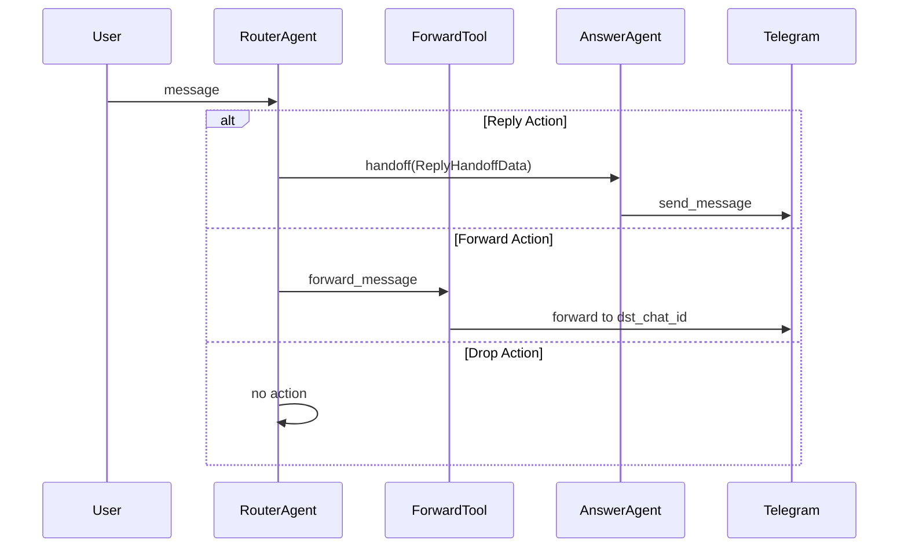
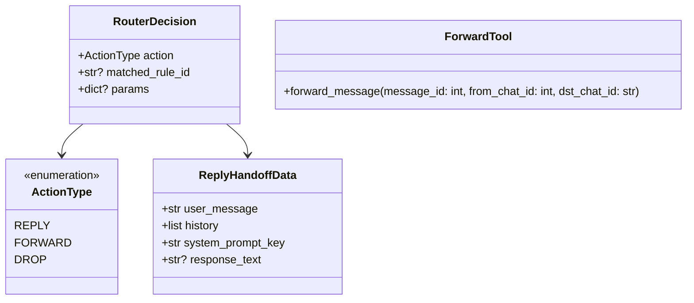

# Техническое задание: E3.3 Реализация действий (Reply Handoff, Forward Tool, Drop)

## 1. Общие сведения

### 1.1 Назначение документа
Данный документ описывает технические требования к реализации механизмов обработки действий RouterAgent: Reply Handoff, Forward Tool и Drop.

### 1.2 Определения и сокращения
- **Reply Handoff** - передача управления к AnswerAgent для генерации ответа
- **Forward Tool** - инструмент для пересылки сообщения в другой чат
- **Drop** - игнорирование сообщения
- **RouterDecision** - решение RouterAgent о выборе действия
- **AnswerAgent** - агент, ответственный за генерацию ответов (будет реализован в Epic 5)

## 2. Диаграммы

### 2.1 Диаграмма последовательности (Sequence Diagram)


### 2.2 Диаграмма классов (Class Diagram)


## 3. Use Cases

### UC1: Reply Handoff
**Актор:** RouterAgent
**Предусловия:**
- RouterDecision.action = REPLY
- В params есть system_prompt_key или response_text

**Основной сценарий:**
1. RouterAgent создает объект ReplyHandoffData
2. Если есть response_text:
   - Отправляет сообщение напрямую через Telegram API
3. Если есть system_prompt_key:
   - Выполняет handoff к AnswerAgent
   - AnswerAgent генерирует ответ
   - Ответ отправляется пользователю

**Постусловия:**
- Пользователь получает ответ
- Действие логируется

### UC2: Forward Message
**Актор:** RouterAgent
**Предусловия:**
- RouterDecision.action = FORWARD
- В params есть destination_chat_id

**Основной сценарий:**
1. RouterAgent вызывает ForwardTool
2. ForwardTool пересылает сообщение в указанный чат
3. Действие логируется

**Альтернативный сценарий:**
1. Если пересылка невозможна:
   - Логируется ошибка
   - Отправляется уведомление администратору

### UC3: Drop Message
**Актор:** RouterAgent
**Предусловия:**
- RouterDecision.action = DROP

**Основной сценарий:**
1. RouterAgent прекращает обработку сообщения
2. Действие логируется

## 4. Технические требования

### 4.1 Требования к ReplyHandoffData
```python
class ReplyHandoffData(BaseModel):
    user_message: str
    history: List[Dict[str, str]]
    system_prompt_key: Optional[str] = None
    response_text: Optional[str] = None
```

### 4.2 Требования к ForwardTool
```python
class ForwardTool:
    async def forward_message(
        self,
        message_id: int,
        from_chat_id: int,
        dst_chat_id: str
    ) -> bool:
        """
        Пересылает сообщение в указанный чат.
        
        Returns:
            bool: True если пересылка успешна, False в противном случае
        """
```

### 4.3 Требования к логированию
- Каждое действие должно логироваться с timestamp
- Для Reply: user_message, response_text/system_prompt_key
- Для Forward: message_id, from_chat_id, dst_chat_id
- Для Drop: причина (если есть)

## 5. Критерии приемки

1. Reply Handoff:
   - [ ] Корректная передача данных к AnswerAgent
   - [ ] Прямая отправка response_text работает
   - [ ] Все действия логируются

2. Forward Tool:
   - [ ] Успешная пересылка в существующий чат
   - [ ] Корректная обработка ошибок
   - [ ] Логирование результатов

3. Drop:
   - [ ] Сообщение игнорируется
   - [ ] Действие логируется

## 6. Зависимости

1. RouterAgent (E3.2)
2. RulesManager (E3.1)
3. Telegram Bot API
4. OpenAI Agent SDK для handoff

## 7. Ограничения

1. Максимальное время выполнения handoff: 10 секунд
2. Максимальное время пересылки: 5 секунд
3. Размер ReplyHandoffData.history: ≤ 10 сообщений
