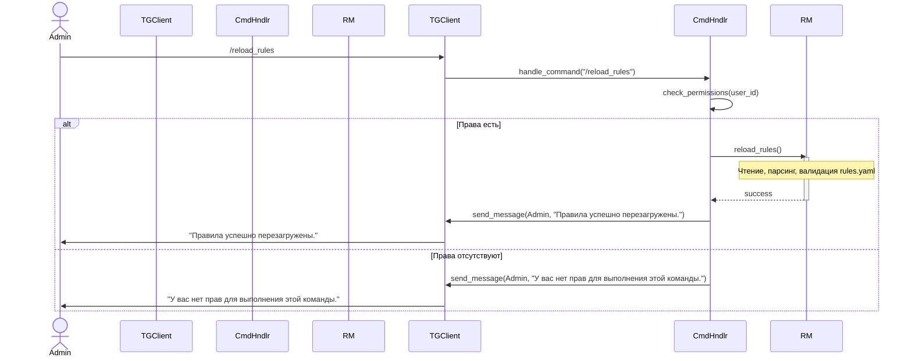
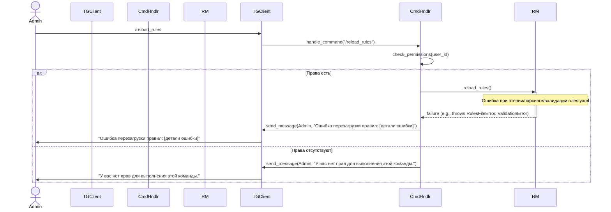

# Техническое Задание: E3.4 Реализация команды /reload_rules

## 1. Введение

### 1.1. Цель документа
Настоящее Техническое Задание (ТЗ) определяет требования к проектированию и реализации функциональности перезагрузки правил маршрутизации для Telegram-бота "Support Bot". Эта функциональность позволит администраторам обновлять конфигурацию правил на лету, без необходимости перезапуска всего приложения.

### 1.2. Область применения
Данное ТЗ распространяется на компонент обработки команд Telegram и его взаимодействие с модулем `RulesManager` в рамках системы "Support Bot".

### 1.3. Определения, акронимы и сокращения
*   **ТЗ:** Техническое Задание
*   **Support Bot:** Наименование разрабатываемой системы (Telegram-бот поддержки)
*   **YAML:** YAML Ain't Markup Language, формат сериализации данных
*   **RulesManager:** Компонент системы, отвечающий за загрузку, хранение, валидацию и предоставление правил маршрутизации.
*   **UC:** Use Case (Вариант использования)
*   **FR:** Functional Requirement (Функциональное требование)
*   **PRD:** Product Requirements Document
*   **API:** Application Programming Interface

### 1.4. Ссылки
*   `docs/Epic3/Epic3.md` - Описание Эпика 3, содержащего задачу E3.4.
*   `docs/PRD_SupportBot.md` - Общий документ с требованиями к продукту.
*   `README.md` - Описание проекта, включая описание `rules.yaml` и `RulesManager`.

## 2. Общие сведения

### 2.1. Назначение системы
"Support Bot" - это интеллектуальный помощник, который автоматизирует процесс поддержки пользователей через Telegram. Ключевой функцией бота является гибкая маршрутизация входящих сообщений на основе набора правил, определенных в файле `rules.yaml`.

### 2.2. Заинтересованные стороны
*   **Администраторы бота/Контент-менеджеры:** Пользователи, ответственные за настройку и обновление правил маршрутизации.
*   **Команда разработки:** Исполнители, ответственные за реализацию и поддержку функциональности.

## 3. Требования к функциональности (Functional Requirements)

### 3.1. Описание функции "Перезагрузка правил"
Система должна предоставлять возможность инициировать принудительную перезагрузку правил маршрутизации из конфигурационного файла (`rules.yaml`) во время работы бота. Это позволяет применять изменения в логике маршрутизации без прерывания обслуживания пользователей.

### 3.2. FR-E3.4-01: Реализация команды `/reload_rules`
*   Система должна обрабатывать Telegram-команду `/reload_rules`.
*   Обработчик данной команды должен быть интегрирован в существующую инфраструктуру обработки команд (например, в `src/handlers.py`).

### 3.3. FR-E3.4-02: Взаимодействие с `RulesManager`
*   При получении команды `/reload_rules` обработчик должен вызывать метод `reload_rules()` у активного экземпляра `RulesManager`.
*   Предполагается, что метод `RulesManager.reload_rules()` инкапсулирует логику чтения файла `rules.yaml`, его парсинга, валидации правил и обновления внутреннего состояния менеджера правил.

### 3.4. FR-E3.4-03: Обратная связь пользователю
*   Система должна информировать пользователя, отправившего команду `/reload_rules`, о результате выполнения операции.
    *   В случае успешной перезагрузки правил, пользователю должно быть отправлено подтверждающее сообщение.
    *   В случае ошибки при перезагрузке (например, файл не найден, ошибка синтаксиса YAML, ошибка валидации правил), пользователю должно быть отправлено сообщение об ошибке, содержащее краткое описание проблемы.

### 3.5. FR-E3.4-04: Контроль доступа (Авторизация)
*   Выполнение команды `/reload_rules` должно быть доступно только авторизованным пользователям (например, администраторам бота).
    *   *Примечание: Механизм определения и проверки прав администратора выходит за рамки данной задачи E3.4, но должен быть учтен при интеграции. Предполагается, что такой механизм существует или будет реализован.*

## 4. Сценарии использования (Use Cases)

### 4.1. UC-E3.4-01: Успешная перезагрузка правил
*   **ID:** UC-E3.4-01
*   **Название:** Успешная перезагрузка правил конфигурации
*   **Действующие лица:** Администратор Бота
*   **Предусловия:**
    1.  Администратор Бота авторизован для выполнения команды `/reload_rules`.
    2.  Файл `rules.yaml` существует, доступен для чтения ботом и содержит корректные данные, соответствующие схеме правил.
    3.  Бот запущен и функционирует.
*   **Основной поток событий:**
    1.  Администратор Бота отправляет команду `/reload_rules` в чат с ботом.
    2.  Система (обработчик команд Telegram) получает и распознает команду.
    3.  Система проверяет права Администратора Бота на выполнение данной команды.
    4.  Обработчик команды вызывает метод `RulesManager.reload_rules()`.
    5.  `RulesManager` успешно считывает, парсит и валидирует правила из `rules.yaml`. Внутреннее состояние `RulesManager` обновляется новыми правилами.
    6.  Система отправляет Администратору Бота сообщение об успешной перезагрузке правил (например, "Правила успешно перезагружены.").
*   **Постусловия:**
    1.  Актуальные правила из `rules.yaml` загружены в `RulesManager` и будут использоваться для маршрутизации последующих сообщений.
    2.  Администратор Бота уведомлен об успешном выполнении операции.

### 4.2. UC-E3.4-02: Неудачная перезагрузка правил
*   **ID:** UC-E3.4-02
*   **Название:** Неудачная перезагрузка правил конфигурации
*   **Действующие лица:** Администратор Бота
*   **Предусловия:**
    1.  Администратор Бота авторизован для выполнения команды `/reload_rules`.
    2.  Бот запущен и функционирует.
*   **Основной поток событий:**
    1.  Администратор Бота отправляет команду `/reload_rules` в чат с ботом.
    2.  Система (обработчик команд Telegram) получает и распознает команду.
    3.  Система проверяет права Администратора Бота на выполнение данной команды.
    4.  Обработчик команды вызывает метод `RulesManager.reload_rules()`.
    5.  `RulesManager` в процессе перезагрузки сталкивается с ошибкой (например, файл `rules.yaml` не найден, содержит синтаксические ошибки, или правила не проходят валидацию). `RulesManager` генерирует исключение или возвращает признак ошибки.
    6.  Обработчик команды перехватывает исключение или обрабатывает ошибку от `RulesManager`.
    7.  Система отправляет Администратору Бота сообщение об ошибке, содержащее информацию о причине (например, "Ошибка перезагрузки правил: Файл 'rules.yaml' не найден." или "Ошибка перезагрузки правил: Обнаружена ошибка валидации в правиле с ID 'X'. Детали: [описание ошибки].").
*   **Постусловия:**
    1.  `RulesManager` продолжает использовать предыдущую успешно загруженную версию правил (если таковая имелась). Если предыдущей версии не было, `RulesManager` может оставаться в состоянии без правил.
    2.  Администратор Бота уведомлен о неудаче и, по возможности, о причине ошибки.
*   **Альтернативные потоки / Исключения:**
    *   5a. Файл `rules.yaml` не существует или недоступен для чтения.
    *   5b. Файл `rules.yaml` имеет невалидный YAML-синтаксис.
    *   5c. Структура или значения данных в `rules.yaml` не соответствуют Pydantic-моделям правил (ошибка валидации).

## 5. Диаграммы UML

### 5.1. Диаграмма вариантов использования (Use Case Diagram)

```mermaid
graph LR
    actor Администратор as Admin
    rectangle "Система SupportBot" {
      usecase "Перезагрузить правила (/reload_rules)" as UC_ReloadRules
    }
    Admin -- UC_ReloadRules
```

### 5.2. Диаграмма последовательности: Успешная перезагрузка



### 5.3. Диаграмма последовательности: Неудачная перезагрузка



## 6. Требования к пользовательскому интерфейсу

### 6.1. Формат команды
Команда для инициации перезагрузки правил: `/reload_rules`

### 6.2. Сообщения обратной связи
*   **При успешной перезагрузке:**
    *   Текст: "Правила успешно перезагружены."
*   **При ошибке перезагрузки:**
    *   Общий формат: "Ошибка перезагрузки правил: {детальное описание ошибки}."
    *   Примеры:
        *   "Ошибка перезагрузки правил: Файл 'rules.yaml' не найден."
        *   "Ошибка перезагрузки правил: Некорректный формат YAML в файле 'rules.yaml'. Строка X, позиция Y."
        *   "Ошибка перезагрузки правил: Ошибка валидации правила с ID '{rule_id}'. Поле '{field_name}': {pydantic_error_message}."
        *   "Ошибка перезагрузки правил: Отсутствуют права на чтение файла 'rules.yaml'."
*   **При отсутствии прав доступа к команде:**
    *   Текст: "У вас нет прав для выполнения этой команды." (Или аналогичное сообщение, соответствующее общей политике авторизации бота).

## 7. Нефункциональные требования

### 7.1. Надежность
*   В случае ошибки во время перезагрузки правил, `RulesManager` должен сохранить и продолжать использовать последнюю успешно загруженную конфигурацию правил. Если предыдущей успешной загрузки не было, `RulesManager` должен находиться в безопасном состоянии (например, без активных правил или с правилами по умолчанию, если таковые предусмотрены).
*   Новые, некорректные правила не должны применяться и нарушать работу бота.

### 7.2. Удобство использования
*   Сообщения об ошибках должны быть максимально информативными для администратора, чтобы облегчить диагностику и исправление проблем в файле `rules.yaml`.

### 7.3. Безопасность
*   Доступ к команде `/reload_rules` должен быть строго ограничен авторизованными пользователями (администраторами).

### 7.4. Логирование
*   Все попытки перезагрузки правил (как успешные, так и неудачные) должны логироваться.
*   В лог должна записываться информация: временная метка, идентификатор пользователя, инициировавшего команду, результат операции (успех/неудача), и, в случае неудачи, детали ошибки. Это соответствует требованию FR-13 и поможет в отладке и мониторинге.

## 8. Предположения и зависимости
*   Существует и функционирует компонент `RulesManager` (согласно E3.1), который предоставляет публичный метод `reload_rules()`. Этот метод отвечает за всю логику загрузки и валидации правил из файла `rules.yaml` и может генерировать исключения в случае ошибок.
*   В системе существует механизм обработки Telegram-команд (например, в `src/handlers.py`), в который будет интегрирован новый обработчик.
*   Экземпляр `RulesManager` доступен (например, через dependency injection или глобальный контекст) в модуле, где будет реализован обработчик команды `/reload_rules`.
*   Существует механизм для идентификации пользователей и проверки их прав доступа (например, список ID администраторов в конфигурации). Реализация этого механизма не входит в рамки данной задачи E3.4.
