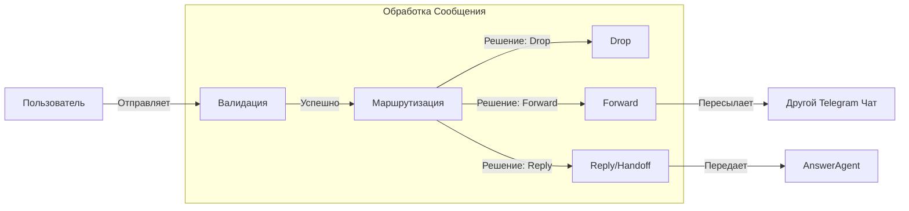
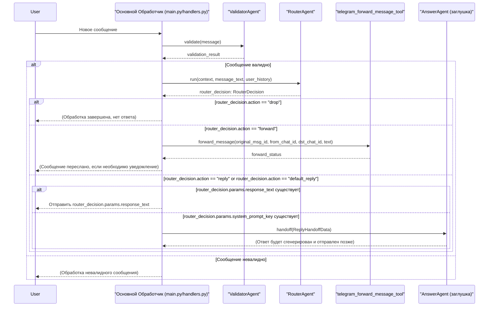
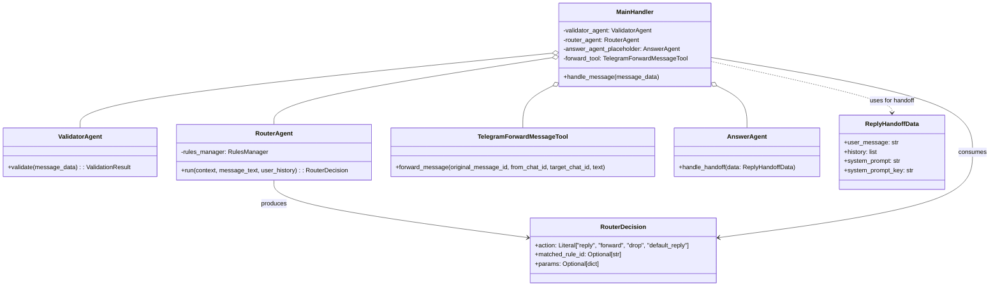

# Техническое Задание: E3.5 Интеграция `RouterAgent` в основной поток обработки сообщений

## 1. Описание Задачи

Задача заключается в интеграции разработанного `RouterAgent` в существующий основной поток обработки входящих сообщений Telegram-бота. Это включает вызов `RouterAgent` после `ValidatorAgent`, анализ принятого им решения (`RouterDecision`) и выполнение соответствующих действий: прекращение обработки (`drop`), пересылка сообщения (`forward`) или передача управления `AnswerAgent` для генерации ответа (`reply`/`default_reply`).

## 2. Общие Сведения и Контекст

Данная задача является частью Эпика 3 "Router & Dynamic Instructions", направленного на создание гибкой системы маршрутизации сообщений на основе YAML-правил. `RouterAgent` (задача E3.2) отвечает за анализ входящего сообщения и определение необходимого действия согласно этим правилам. Задача E3.5 обеспечивает встраивание этого агента в общую архитектуру обработки сообщений.

Согласно `Epic3.md`:
-   **E3.5.1:** В главном обработчике сообщений (`main.py` или `handlers.py`), после `ValidatorAgent` (из Эпика 2), вызывать `RouterAgent.run()`.
-   **E3.5.2:** Анализировать `RouterDecision` от `RouterAgent`:
    -   Если `drop`, завершить обработку.
    -   Если `forward`, вызвать соответствующий инструмент.
    -   Если `reply` (или `default_reply`), инициировать `handoff` к `AnswerAgent` (или его заглушке) с подготовленными данными.

Интеграция `RouterAgent` позволит боту принимать решения о дальнейшей судьбе сообщения (проигнорировать, переслать, ответить) на основе заранее сконфигурированных правил, что является ключевым функционалом для управления потоком обращений.

## 3. Цели Задачи

*   Обеспечить вызов `RouterAgent` в рамках основного цикла обработки сообщений.
*   Реализовать логику обработки решения (`RouterDecision`), возвращаемого `RouterAgent`.
*   Корректно выполнять действия `drop`, `forward` и `reply` (включая `handoff` к `AnswerAgent`) на основе решения `RouterAgent`.
*   Обеспечить плавную интеграцию с предыдущими (например, `ValidatorAgent`) и последующими (например, `AnswerAgent`) компонентами системы.

## 4. Требования

### 4.1. Функциональные требования

*   **FR1:** Система должна вызывать `RouterAgent.run()` для каждого входящего сообщения после его успешной валидации `ValidatorAgent`.
*   **FR2:** В `RouterAgent.run()` должны передаваться текст сообщения и история переписки пользователя, как это определено в E3.2.2.
*   **FR3:** Система должна получать объект `RouterDecision` от `RouterAgent`.
*   **FR4:** Если `RouterDecision.action` имеет значение `"drop"`:
    *   Обработка сообщения должна быть немедленно прекращена.
    *   Никаких дальнейших действий с сообщением предприниматься не должно.
*   **FR5:** Если `RouterDecision.action` имеет значение `"forward"`:
    *   Система должна извлечь `destination_chat_id` из `RouterDecision.params`.
    *   Система должна вызвать инструмент `telegram_forward_message_tool` (из E3.3.2) с необходимыми параметрами (ID оригинального сообщения, ID исходного чата, ID целевого чата, текст сообщения).
*   **FR6:** Если `RouterDecision.action` имеет значение `"reply"`:
    *   **FR6.1:** Если `RouterDecision.params` содержит `response_text`, этот текст должен быть отправлен пользователю напрямую, без привлечения `AnswerAgent`.
    *   **FR6.2:** Если `RouterDecision.params` содержит `system_prompt_key` (и отсутствует `response_text`), система должна инициировать `handoff` к `AnswerAgent` (или его заглушке).
    *   **FR6.3:** Данные для `handoff` должны соответствовать структуре `ReplyHandoffData` (определенной в E3.3.3), включая `user_message`, `history` и `system_prompt` (или `system_prompt_key`).
*   **FR7:** Если `RouterDecision.action` имеет значение `"default_reply"` (поведение в случае отсутствия совпавших правил):
    *   Система должна инициировать `handoff` к `AnswerAgent` (или его заглушке) с параметрами, соответствующими этому случаю (например, дефолтный `system_prompt_key`).

### 4.2. Нефункциональные требования

*   **NFR1:** Интеграция не должна значительно замедлять общее время обработки сообщения.
*   **NFR2:** Логика интеграции должна быть отказоустойчивой, корректно обрабатывая возможные ошибки при вызове `RouterAgent` или последующих действий.
*   **NFR3:** Код интеграции должен быть понятным, хорошо структурированным и легко поддерживаемым.

### 4.3. Предположения и Ограничения

*   `ValidatorAgent` (Эпик 2) уже интегрирован и функционирует корректно.
*   `RouterAgent` (E3.2) полностью реализован и протестирован автономно.
*   Структура `RouterDecision` (E3.2.3) определена и используется `RouterAgent`.
*   Инструмент `telegram_forward_message_tool` (E3.3.2) реализован и доступен для вызова.
*   Механизм `handoff` и структура `ReplyHandoffData` (E3.3.3) определены. Заглушка `AnswerAgent` доступна для `handoff`.
*   Основной обработчик сообщений (например, в `main.py` или `handlers.py`) является местом для данной интеграции.

## 5. UML Диаграммы

### 5.1. Диаграмма Потока Обработки Сообщений

### 5.2. Диаграмма Последовательности (Sequence Diagram)

### 5.3. Диаграмма Классов (Class Diagram)

## 6. Варианты Использования (Use Cases)

### UC1: Обработка входящего сообщения с использованием RouterAgent

*   **ID:** UC-E3.5-001
*   **Название:** Обработка входящего сообщения с использованием RouterAgent.
*   **Акторы:** Основной обработчик сообщений (часть Системы).
*   **Предусловия:**
    1.  Система получила новое входящее сообщение от пользователя.
    2.  Сообщение успешно прошло валидацию `ValidatorAgent`.
    3.  `RouterAgent` инициализирован и доступен.
*   **Основной успешный сценарий:**
    1.  Основной обработчик вызывает `RouterAgent.run()`, передавая ему текст сообщения, историю переписки и другой необходимый контекст.
    2.  `RouterAgent` анализирует сообщение на основе сконфигурированных правил и возвращает объект `RouterDecision`.
    3.  Основной обработчик получает `RouterDecision`.
    4.  **Если `RouterDecision.action` == "drop"**:
        a.  Основной обработчик прекращает дальнейшую обработку сообщения.
    5.  **Если `RouterDecision.action` == "forward"**:
        a.  Основной обработчик извлекает `destination_chat_id` и другие параметры из `RouterDecision.params`.
        b.  Основной обработчик вызывает `telegram_forward_message_tool` с полученными параметрами для пересылки сообщения.
    6.  **Если `RouterDecision.action` == "reply"`**:
        a.  **Если `RouterDecision.params` содержит `response_text`**:
            i.  Основной обработчик отправляет `response_text` пользователю напрямую.
        b.  **Если `RouterDecision.params` содержит `system_prompt_key`**:
            i.  Основной обработчик формирует объект `ReplyHandoffData`, используя `system_prompt_key`, сообщение пользователя и историю.
            ii. Основной обработчик выполняет `handoff` к `AnswerAgent` (или его заглушке), передавая `ReplyHandoffData`.
    7.  **Если `RouterDecision.action` == "default_reply"**:
        a.  Основной обработчик формирует объект `ReplyHandoffData`, используя дефолтный `system_prompt_key` (или эквивалентную логику), сообщение пользователя и историю.
        b.  Основной обработчик выполняет `handoff` к `AnswerAgent` (или его заглушке), передавая `ReplyHandoffData`.
*   **Постусловия:**
    *   Сообщение обработано согласно решению `RouterAgent`: либо проигнорировано, либо переслано, либо отправлен прямой ответ, либо передано для генерации ответа `AnswerAgent`.
*   **Альтернативные сценарии / Исключения:**
    *   **AS1:** `RouterAgent.run()` вызывает исключение.
        *   Система логирует ошибку.
        *   Обработка сообщения может быть прервана или может быть предпринята попытка ответа по умолчанию (например, сообщение об ошибке пользователю).
    *   **AS2:** Ошибка при вызове `telegram_forward_message_tool`.
        *   Система логирует ошибку.
        *   Может быть предпринята попытка уведомить администратора или пользователя.
    *   **AS3:** Ошибка при выполнении `handoff` к `AnswerAgent`.
        *   Система логирует ошибку.
        *   Может быть предпринята попытка ответа по умолчанию или уведомления администратора.

## 7. Валидация и Верификация

*   **V1: Модульное тестирование:**
    *   Тестирование компонента, ответственного за вызов `RouterAgent` и обработку `RouterDecision`, с использованием mock-объектов для `RouterAgent`, `telegram_forward_message_tool` и `AnswerAgent`.
    *   Проверка корректности вызовов и передачи параметров для каждого типа `action` в `RouterDecision`.
*   **V2: Интеграционное тестирование:**
    *   Создание набора тестовых сценариев, где сообщения пользователя должны приводить к различным решениям `RouterAgent` (drop, forward, reply с прямым текстом, reply с handoff, default_reply).
    *   Проверка, что основной поток обработки корректно выполняет действия, предписанные `RouterAgent`.
    *   Проверка работы интеграции с реальным (или тестовым экземпляром) `ValidatorAgent` и заглушкой `AnswerAgent`.
    *   Проверка корректности пересылки сообщений через `telegram_forward_message_tool`.
    *   Проверка корректности данных, передаваемых в `AnswerAgent` при `handoff`.
*   **V3: Сквозное тестирование (End-to-End):**
    *   Тестирование полного цикла обработки сообщения: от отправки пользователем до получения ожидаемого результата (сообщение проигнорировано, переслано, получен прямой ответ, получен ответ от `AnswerAgent`).
*   **V4: Логирование:**
    *   Проверка, что все ключевые шаги интеграции (вызов `RouterAgent`, полученное `RouterDecision`, выполненное действие) логируются согласно требованиям FR-13 и E3.6.

## 8. Зависимости

*   **D1:** Завершенная и протестированная реализация `ValidatorAgent` (Эпик 2).
*   **D2:** Завершенная и протестированная реализация `RouterAgent` (`src/agents/router_agent.py`, задача E3.2), включая корректное формирование `RouterDecision`.
*   **D3:** Завершенная реализация `RulesManager` и загрузка правил из `rules.yaml` (E3.1).
*   **D4:** Реализованный инструмент `telegram_forward_message_tool` (`src/tools/telegram_tools.py`, задача E3.3.2).
*   **D5:** Определенная структура `ReplyHandoffData` и механизм `handoff` (задача E3.3.3).
*   **D6:** Наличие заглушки (placeholder) для `AnswerAgent`, способной принять `handoff`.
*   **D7:** Существующий основной обработчик сообщений (например, в `main.py` или `handlers.py`), куда будет встраиваться логика.

## 9. Риски и Способы их Уменьшения

*   **R1: Некорректная обработка `RouterDecision`**
    *   *Описание:* Логика в основном обработчике может неправильно интерпретировать `action` или `params` из `RouterDecision`.
    *   *Вероятность:* Средняя.
    *   *Влияние:* Высокое (неверное поведение бота).
    *   *Смягчение:* Тщательное модульное и интеграционное тестирование всех веток обработки `RouterDecision` (см. раздел "Валидация и Верификация"). Четкое следование спецификации `RouterDecision`.
*   **R2: Проблемы с производительностью**
    *   *Описание:* Добавление `RouterAgent` в цепочку обработки может привести к увеличению задержки ответа пользователю.
    *   *Вероятность:* Низкая (если `RouterAgent` сам по себе оптимизирован).
    *   *Влияние:* Среднее.
    *   *Смягчение:* Мониторинг времени отклика. Если проблема возникнет, потребуется профилирование и оптимизация либо `RouterAgent`, либо логики интеграции. (Задача оптимизации самого `RouterAgent` выходит за рамки E3.5).
*   **R3: Ошибки интеграции с внешними компонентами**
    *   *Описание:* Ошибки при вызове `telegram_forward_message_tool` или при `handoff` к `AnswerAgent`.
    *   *Вероятность:* Средняя.
    *   *Влияние:* Среднее.
    *   *Смягчение:* Использование mock-объектов на ранних этапах, тщательное интеграционное тестирование. Обеспечение корректной обработки ошибок от этих компонентов (логирование, возможно, fallback-логика).
*   **R4: Неполная или некорректная передача данных `RouterAgent`**
    *   *Описание:* `RouterAgent` может не получать все необходимые данные (например, полную историю сообщений), что приведет к неверным решениям.
    *   *Вероятность:* Низкая.
    *   *Влияние:* Высокое.
    *   *Смягчение:* Четкое следование контракту `RouterAgent.run()` (E3.2.2). Тестирование с различными вариантами контекста.
*   **R5: Конфликты с существующей логикой обработки**
    *   *Описание:* Новая логика может конфликтовать или нарушать работу уже существующей обработки сообщений.
    *   *Вероятность:* Низкая.
    *   *Влияние:* Высокое.
    *   *Смягчение:* Аккуратное встраивание в существующий код. Ревью кода. Поэтапное тестирование.

## 10. План Реализации Задачи E3.5

### 10.1. Краткий обзор текущего состояния проекта (на основе Epic3.md)

На данный момент, в рамках Эпика 3, следующие ключевые компоненты и задачи считаются завершенными и готовыми к интеграции или использованию:

*   **E3.1: Определение схемы YAML-правил и создание менеджера правил:**
    *   Схема `rules.yaml` определена.
    *   Pydantic модели для валидации правил созданы.
    *   `RulesManager` (`rules_manager.py`) реализован, включая загрузку, валидацию, сортировку и перезагрузку правил.
    *   Пример `rules.yaml` создан.
*   **E3.2: Реализация `RouterAgent`:**
    *   Класс `RouterAgent(agents.Agent)` в `src/agents/router_agent.py` создан и принимает `RulesManager`.
    *   Основная логика агента в `async run(...)` реализована, включая итерацию по правилам и определение совпавшего правила.
    *   Структура `RouterDecision` (Pydantic модель) определена и возвращается агентом.
*   **E3.3: Реализация действий (Reply Handoff, Forward Tool, Drop):**
    *   Логика для `action="drop"` в `RouterDecision` понятна (прекращение обработки).
    *   Инструмент `telegram_forward_message_tool` создан в `src/tools/telegram_tools.py` и зарегистрирован в `RouterAgent` (или готов к вызову).
    *   Для `action="reply"`:
        *   Обработка `response_text` (прямой ответ) и `system_prompt_key` (для `AnswerAgent`) в `RouterDecision` предусмотрена.
        *   Структура `ReplyHandoffData` для передачи данных в `AnswerAgent` определена.
        *   Подготовлен вызов `handoff(agent=answer_agent_placeholder, ...)` для интеграции.
*   **E3.4: Реализация команды `/reload_rules`:**
    *   Обработчик команды `/reload_rules` добавлен и вызывает `rules_manager.reload_rules()`.
    *   Обратная связь пользователю о результате выполнения команды реализована.
*   **ValidatorAgent (из Эпика 2):** Предполагается, что данный агент интегрирован и функционирует, выполняя первичную валидацию сообщений перед их передачей `RouterAgent`.

Таким образом, основные строительные блоки (`RulesManager`, `RouterAgent`, `RouterDecision`, `telegram_forward_message_tool`, механизм `handoff`) для задачи E3.5 уже существуют.

### 10.2. Перечень функций и компонентов для повторного использования

Для реализации E3.5 будут непосредственно использованы следующие существующие компоненты и их функциональность:

1.  **`RouterAgent.run(context, message_text, user_history)`:** Основной метод, который будет вызываться для получения `RouterDecision`.
2.  **`RouterDecision` (Pydantic модель):** Структура данных, возвращаемая `RouterAgent`, которая будет анализироваться для определения дальнейших действий.
3.  **`telegram_forward_message_tool(bot, original_message_id, from_chat_id, target_chat_id, text)`:** Инструмент для выполнения действия `forward`.
4.  **Механизм `handoff` и Pydantic модель `ReplyHandoffData`:** Для передачи управления и данных `AnswerAgent` (или его заглушке).
5.  **Существующий главный обработчик сообщений (в `main.py` или `handlers.py`):** Место, куда будет встраиваться логика вызова `RouterAgent` и обработки его решения. Предполагается, что он уже обрабатывает вызов `ValidatorAgent`.

### 10.3. Пошаговый план действий по реализации E3.5

**Цель:** Интегрировать `RouterAgent` в основной поток обработки сообщений, обеспечив корректное выполнение действий (`drop`, `forward`, `reply`/`default_reply`) на основе его решений.

**Местоположение основного кода интеграции:** Главный обработчик входящих сообщений (например, функция в `src/handlers.py` или `main.py`, которая вызывается для каждого нового сообщения от пользователя).

---

**Этап 1: Модификация основного обработчика сообщений для вызова `RouterAgent`**

*   **Задачи:**
    1.  В главном обработчике сообщений, после успешного вызова `ValidatorAgent` (из Эпика 2), добавить вызов `RouterAgent.run()`.
    2.  Убедиться, что в `RouterAgent.run()` передаются все необходимые параметры:
        *   `context`: Контекст агента (если используется OpenAI Agent SDK).
        *   `message_text`: Текст входящего сообщения.
        *   `user_history`: История переписки пользователя.
    3.  Получить объект `RouterDecision` в качестве результата работы `RouterAgent.run()`.
*   **Необходимые разработки и доработки:**
    *   Внесение изменений в код основного обработчика сообщений.
    *   Инициализация и передача экземпляра `RouterAgent` в место вызова (если это еще не сделано).
*   **Ожидаемый результат:** `RouterAgent` вызывается для каждого валидного сообщения, и его `RouterDecision` доступно для дальнейшей обработки.

---

**Этап 2: Реализация логики обработки `RouterDecision`**

*   **Задачи:**
    1.  Проанализировать полученный `RouterDecision.action`.
    2.  **Для `action == "drop"`:**
        *   Реализовать логику немедленного прекращения дальнейшей обработки сообщения. Никакие ответы или другие действия не должны выполняться.
    3.  **Для `action == "forward"`:**
        *   Извлечь `destination_chat_id` и другие необходимые параметры (текст сообщения, ID оригинального сообщения, ID исходного чата) из `RouterDecision.params`.
        *   Вызвать `telegram_forward_message_tool` с этими параметрами.
        *   Обработать результат вызова инструмента (логирование успеха/ошибки).
    4.  **Для `action == "reply"`:**
        *   **Если `RouterDecision.params` содержит `response_text`:**
            *   Реализовать отправку `response_text` пользователю напрямую (например, используя `await update.message.reply_text(response_text)` в `python-telegram-bot`).
        *   **Если `RouterDecision.params` содержит `system_prompt_key` (и нет `response_text`):**
            *   Сформировать объект `ReplyHandoffData`, включая `user_message`, `history` и `system_prompt` (полученный по `system_prompt_key` из хранилища промптов, которое должно быть доступно).
            *   Инициировать `handoff` к `AnswerAgent` (или его заглушке), передавая `ReplyHandoffData`.
    5.  **Для `action == "default_reply"` (или аналогичного поведения по умолчанию, если ни одно правило не совпало):**
        *   Сформировать `ReplyHandoffData`, используя дефолтный `system_prompt_key` или другую логику для получения системного промпта по умолчанию.
        *   Инициировать `handoff` к `AnswerAgent` (или его заглушке).
*   **Необходимые разработки и доработки:**
    *   Разработка условной логики (if/elif/else) в основном обработчике для разбора `RouterDecision.action`.
    *   Интеграция вызовов `telegram_forward_message_tool`.
    *   Реализация прямой отправки текстовых ответов.
    *   Интеграция механизма `handoff` к `AnswerAgent` (или его заглушке).
    *   Обеспечение доступа к хранилищу системных промптов для получения `system_prompt` по `system_prompt_key`.
*   **Ожидаемый результат:** Все типы `RouterDecision` корректно обрабатываются, и соответствующие действия выполняются.

---

**Этап 3: Тестирование**

*   **Задачи:**
    1.  **Модульное тестирование (если применимо к новым блокам кода):**
        *   Протестировать отдельные функции или методы, реализующие специфическую логику обработки `RouterDecision` (например, формирование `ReplyHandoffData`), используя mock-объекты для зависимостей.
    2.  **Интеграционное тестирование:**
        *   Подготовить тестовые случаи в `rules.yaml`, покрывающие все варианты `action`: `drop`, `forward` (с реальным или mock `telegram_forward_message_tool`), `reply` (с `response_text` и с `system_prompt_key`).
        *   Протестировать сценарий, когда ни одно правило не срабатывает (для проверки `default_reply`).
        *   Отправлять тестовые сообщения боту и проверять:
            *   Для `drop`: сообщение не обрабатывается дальше, нет ответа.
            *   Для `forward`: сообщение корректно пересылается (или вызов mock-инструмента происходит с верными параметрами).
            *   Для `reply` с `response_text`: пользователь получает заданный текст.
            *   Для `reply`/`default_reply` с `system_prompt_key`: `handoff` к `AnswerAgent` (заглушке) инициируется с корректными `ReplyHandoffData`.
    3.  **Проверка логирования:** Убедиться, что решения `RouterAgent` и выполненные действия логируются в соответствии с E3.6.1.
*   **Ожидаемый результат:** Функционал работает корректно для всех сценариев, определенных в ТЗ и `rules.yaml`.

---

**Этап 4: Развертывание и Мониторинг**

*   **Задачи:**
    1.  Развернуть обновленный код в рабочей или тестовой среде.
    2.  Наблюдать за работой системы, обращая внимание на:
        *   Корректность маршрутизации сообщений.
        *   Отсутствие ошибок при обработке `RouterDecision`.
        *   Производительность системы.
        *   Полноту и корректность логов.
*   **Ожидаемый результат:** Стабильная работа интегрированного `RouterAgent` в общем потоке обработки сообщений.

---

### 10.4. Описание необходимых разработок и доработок (сводно)

*   **Основной обработчик сообщений (`main.py`/`handlers.py`):**
    *   Интеграция вызова `RouterAgent.run()`.
    *   Добавление логики ветвления на основе `RouterDecision.action`.
    *   Реализация прямого ответа (`response_text`).
    *   Интеграция вызова `telegram_forward_message_tool`.
    *   Интеграция вызова `handoff` к `AnswerAgent` (или его заглушке) с формированием `ReplyHandoffData`.
*   **Конфигурация/Доступ к данным:**
    *   Обеспечение доступа к экземпляру `RouterAgent`.
    *   Обеспечение доступа к экземпляру `telegram_forward_message_tool`.
    *   Обеспечение доступа к заглушке `AnswerAgent`.
    *   Обеспечение доступа к хранилищу системных промптов для получения промпта по ключу (если это не часть `AnswerAgent`).
*   **Тестовые артефакты:**
    *   Обновление `rules.yaml` для создания тестовых сценариев.
    *   Написание интеграционных тестов.

Этот план обеспечивает последовательную реализацию задачи E3.5, опираясь на уже существующие компоненты и минимизируя дублирование работы.
