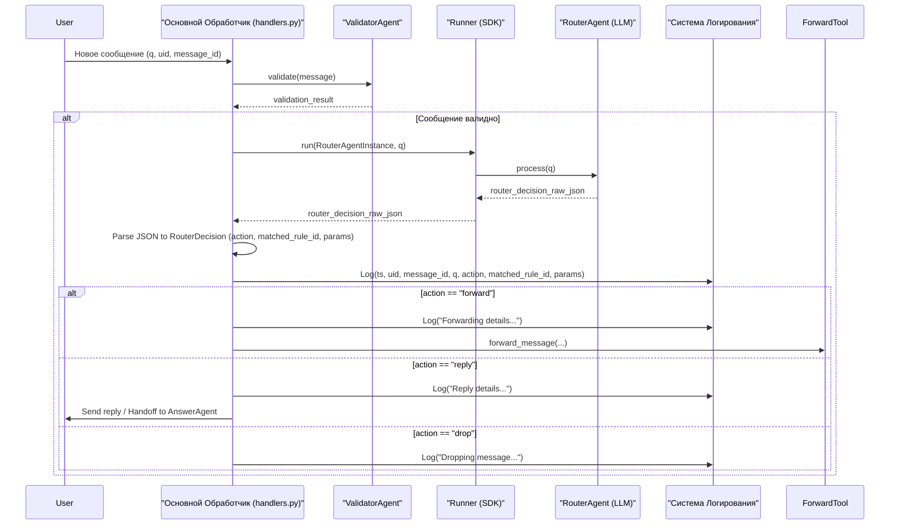
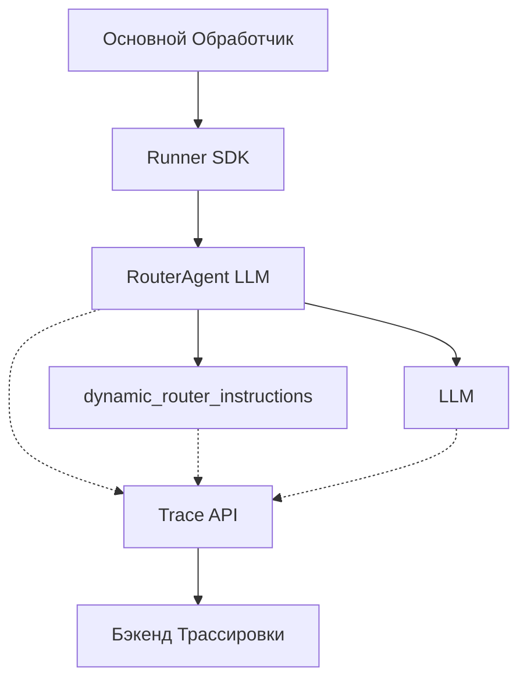

# Техническое Задание: E3.6 Логирование и Трассировка для `RouterAgent`

## 1. Описание Задачи

Задача заключается во внедрении и расширении механизмов логирования и трассировки для `RouterAgent`. Цель — обеспечить детальную запись процесса принятия решений агентом и его взаимодействия с другими компонентами системы. Это включает как стандартное логирование ключевой информации о решениях, так и использование возможностей трассировки, предоставляемых OpenAI Agent SDK, для более глубокого анализа внутреннего процесса работы агента.

## 2. Общие Сведения и Контекст

Данная задача является частью Эпика 3 "Router & Dynamic Instructions". `RouterAgent` (E3.2) играет центральную роль в маршрутизации входящих сообщений на основе YAML-правил. Качественное логирование и трассировка критически важны для отладки, мониторинга работы правил, анализа поведения пользователей и производительности системы (FR-13).

Согласно `Epic3.md`:
*   **E3.6.1:** Расширить логирование (FR-13) для записи решений `RouterAgent`: `ts` (timestamp), `uid` (user ID), `matched_rule_id` (если есть), `action` (reply/forward/drop), `q` (исходное сообщение), `params` (например, `dst_chat_id`).
*   **E3.6.2:** Использовать встроенный механизм трассировки OpenAI Agent SDK.
    *   При необходимости добавить кастомные "spans" с помощью `trace()` или `custom_span()` внутри `RouterAgent` для детализации процесса принятия решения (например, `rule_evaluation_span`, `action_execution_span`).

Задача E3.5 уже интегрировала `RouterAgent` в основной поток, и часть логирования решений уже может присутствовать в `src/bot/handlers.py`. Эта задача (E3.6) фокусируется на полноте логирования согласно FR-13 и на специфической трассировке внутри самого `RouterAgent`.

## 3. Цели Задачи

*   Обеспечить полное логирование всех решений `RouterAgent` с указанными в FR-13 полями.
*   Интегрировать и использовать стандартные возможности трассировки OpenAI Agent SDK для `RouterAgent`.
*   Внедрить кастомные spans трассировки внутри `RouterAgent` для ключевых этапов его работы (например, оценка правил, выполнение действия).
*   Улучшить возможности отладки и мониторинга `RouterAgent`.
*   Собрать данные, необходимые для анализа эффективности правил и поведения системы.

## 4. Требования

### 4.1. Функциональные требования к логированию (E3.6.1)

*   **FR-LOG-1:** Для каждого сообщения, обработанного `RouterAgent`, должна создаваться запись в логе.
*   **FR-LOG-2:** Каждая запись лога о решении `RouterAgent` должна содержать как минимум следующие поля:
    *   `ts`: Timestamp события (в формате ISO 8601 или аналогичном, легко читаемом и сортируемом).
    *   `uid`: Уникальный идентификатор пользователя (например, `telegram_user_id`).
    *   `message_id`: Уникальный идентификатор сообщения Telegram.
    *   `q`: Полный текст исходного сообщения пользователя.
    *   `action`: Принятое `RouterAgent` действие (например, `"drop"`, `"forward"`, `"reply"`, `"default_reply"`).
    *   `matched_rule_id`: ID правила, которое сработало. Если ни одно правило не сработало (для `default_reply`), значение должно быть `null` или отсутствовать.
    *   `params`: Параметры, связанные с действием (например, для `forward` - `{"destination_chat_id": "..."}`, для `reply` - `{"response_text": "..."}` или `{"system_prompt_key": "..."}`). Должен быть представлен в виде JSON-строки или структурированного объекта.
*   **FR-LOG-3:** Логи должны записываться с использованием существующей системы логирования проекта (например, модуль `logging` Python, настроенный в `src/bot/config.py`).
*   **FR-LOG-4:** Уровень логирования для этих записей должен быть INFO или DEBUG, в зависимости от политики логирования проекта.
*   **FR-LOG-5:** Место логирования: эта информация должна логироваться в том месте, где принимается и обрабатывается решение `RouterAgent` (вероятно, в `src/bot/handlers.py` после получения `RouterDecision`). Существующий код в `src/bot/handlers.py` уже содержит логирование, его нужно будет проверить на соответствие этим требованиям и дополнить при необходимости.

### 4.2. Функциональные требования к трассировке (E3.6.2) (ОТЛОЖЕНО)

*   **FR-TRACE-1 (ОТЛОЖЕНО):** Для `RouterAgent` должен быть активирован встроенный механизм трассировки OpenAI Agent SDK (если он не активен по умолчанию).
*   **FR-TRACE-2 (ОТЛОЖЕНО):** Внутри `RouterAgent` (в файле `src/bot_agents/router_agent.py`, вероятно, в функции `dynamic_router_instructions` или при вызове LLM) должны быть добавлены кастомные spans для детализации процесса принятия решения. Как минимум:
    *   **`rule_evaluation_span`**: Должен охватывать процесс оценки правил LLM (или логический блок, где LLM принимает решение на основе правил и сообщения).
    *   **(Опционально, если применимо)** `action_preparation_span`: Если есть отдельный этап подготовки параметров для действия перед возвратом `RouterDecision`.
*   **FR-TRACE-3 (ОТЛОЖЕНО):** Кастомные spans должны содержать релевантные атрибуты (например, для `rule_evaluation_span` - количество правил, возможно, хэш сообщения).
*   **FR-TRACE-4 (ОТЛОЖЕНО):** Трассировки должны быть доступны для просмотра с использованием инструментов, совместимых с OpenAI Agent SDK (например, LangSmith, если SDK его поддерживает и настроен, или другие бэкенды трассировки).

### 4.3. Нефункциональные требования

*   **NFR1:** Логирование и трассировка не должны оказывать значительного негативного влияния на производительность обработки сообщений.
*   **NFR2:** Записи логов должны быть структурированными и легко парсимыми для последующего анализа.
*   **NFR3:** Настройка трассировки должна быть гибкой, позволяя включать/отключать или изменять уровень детализации при необходимости (например, через конфигурацию).

### 4.4. Предположения и Ограничения

*   OpenAI Agent SDK используется для `RouterAgent` и предоставляет API для трассировки (`trace()`, `custom_span()`).
*   Существует настроенная система логирования (Python `logging`).
*   Код `RouterAgent` находится в `src/bot_agents/router_agent.py`.
*   Основная обработка решений `RouterAgent` происходит в `src/bot/handlers.py`.
*   Инфраструктура для сбора и просмотра трасс (например, LangSmith или аналогичный инструмент) либо уже настроена, либо ее настройка выходит за рамки данной задачи, но должна быть учтена возможность экспорта/просмотра трасс.

## 5. UML Диаграммы

### 5.1. Диаграмма Последовательности (Логирование Решения RouterAgent)

### 5.2. Диаграмма Компонентов (Фокус на Трассировке) (ОТЛОЖЕНО)

## 6. Варианты Использования (Use Cases)

### UC1: Логирование решения RouterAgent

*   **ID:** UC-E3.6-001
*   **Название:** Логирование решения RouterAgent.
*   **Акторы:** Система (Основной обработчик).
*   **Предусловия:**
    1.  `RouterAgent` успешно обработал сообщение и вернул `RouterDecision` (или эквивалент в виде JSON).
    2.  Система логирования инициализирована.
*   **Основной успешный сценарий:**
    1.  Основной обработчик в `src/bot/handlers.py` получает решение от `RouterAgent`.
    2.  Основной обработчик извлекает все необходимые поля: `ts` (генерируется текущее время), `uid`, `message_id`, `q` (исходное сообщение), `action`, `matched_rule_id`, `params`.
    3.  Основной обработчик формирует структурированную лог-запись.
    4.  Основной обработчик записывает эту запись в лог с уровнем INFO (или DEBUG).
*   **Постусловия:**
    *   В системном логе появляется запись, содержащая все указанные поля, описывающая решение `RouterAgent`.
*   **Альтернативные сценарии / Исключения:**
    *   **AS1:** Ошибка при извлечении какого-либо поля (например, `params` отсутствует, хотя ожидался).
        *   Система логирует ошибку извлечения данных.
        *   Система все равно пытается залогировать максимально возможное количество информации с указанием на проблему.

### UC2: Трассировка внутреннего процесса RouterAgent (ОТЛОЖЕНО)

*   **ID:** UC-E3.6-002
*   **Название:** Трассировка внутреннего процесса RouterAgent с использованием кастомных spans.
*   **Акторы:** Разработчик (при анализе трасс), `RouterAgent`.
*   **Предусловия:**
    1.  `RouterAgent` инициализирован с поддержкой трассировки SDK.
    2.  Механизм трассировки (например, экспорт в LangSmith) настроен и активен.
*   **Основной успешный сценарий:**
    1.  Когда `RouterAgent` (или его компонент `dynamic_router_instructions` / вызов LLM) начинает процесс оценки правил, создается или активируется `custom_span` (например, `rule_evaluation_span`).
    2.  В span добавляются релевантные атрибуты (например, количество правил, хэш сообщения).
    3.  (Если применимо) Другие кастомные spans (например, `action_preparation_span`) создаются для других ключевых этапов.
    4.  Встроенная трассировка SDK также фиксирует вызовы LLM, использование инструментов (если есть внутри агента) и т.д.
    5.  После завершения обработки сообщения агентом, все данные трассировки (включая кастомные spans) отправляются в бэкенд трассировки.
*   **Постусловия:**
    *   В бэкенде трассировки доступна полная трасса выполнения `RouterAgent` для данного сообщения, включая кастомные spans с детальной информацией о процессе принятия решения.
*   **Альтернативные сценарии / Исключения:**
    *   **AS1:** Ошибка при создании/завершении кастомного span.
        *   Система логирует ошибку, связанную с трассировкой.
        *   Работа агента продолжается, если это возможно.
    *   **AS2:** Бэкенд трассировки недоступен.
        *   SDK трассировки обрабатывает эту ситуацию (например, буферизует данные или отбрасывает их, в зависимости от конфигурации).
        *   Работа агента продолжается.

## 7. Валидация и Верификация

*   **V-LOG-1: Анализ логов:** Проверить логи работы бота после обработки тестовых сообщений. Убедиться, что для каждого решения `RouterAgent` присутствует запись, содержащая все поля, указанные в FR-LOG-2, и что значения корректны.
*   **V-LOG-2: Соответствие формату:** Проверить, что timestamp, uid, и другие поля соответствуют ожидаемым форматам.
*   **V-LOG-3:** Полнота логирования: Убедиться, что логируются все типы решений (`drop`, `forward`, `reply`, `default_reply`) и различные варианты `params`.
*   **V-TRACE-1 (ОТЛОЖЕНО): Просмотр трасс:** Использовать инструмент просмотра трасс (например, LangSmith) для анализа трасс, сгенерированных `RouterAgent` при обработке тестовых сообщений.
*   **V-TRACE-2 (ОТЛОЖЕНО): Наличие кастомных spans:** Убедиться, что в трассах присутствуют ожидаемые кастомные spans (`rule_evaluation_span` и др.) и что они содержат релевантные атрибуты.
*   **V-TRACE-3 (ОТЛОЖЕНО): Корректность встроенной трассировки:** Проверить, что вызовы LLM и другие стандартные события SDK корректно отображаются в трассах.
*   **V-PERF-1: Тестирование производительности:** Провести замеры времени обработки сообщений до и после внедрения расширенного логирования и трассировки, чтобы убедиться в отсутствии значительного снижения производительности.

## 8. Зависимости

*   **D1:** Завершенная интеграция `RouterAgent` в основной поток (E3.5).
*   **D2:** Рабочий `RouterAgent` (`src/bot_agents/router_agent.py`).
*   **D3:** Настроенная система логирования Python (модуль `logging`).
*   **D4:** OpenAI Agent SDK, используемый `RouterAgent`, с поддержкой трассировки.
*   **D5 (Опционально, для просмотра трасс):** Настроенный бэкенд для сбора и просмотра трасс (например, LangSmith).

## 9. Риски и Способы их Уменьшения

*   **R1: Чрезмерное логирование и снижение производительности.**
    *   *Описание:* Слишком детализированное или частое логирование/трассировка может замедлить обработку сообщений.
    *   *Вероятность:* Средняя (для трассировки), Низкая (для логирования).
    *   *Влияние:* Среднее.
    *   *Смягчение:* Оптимизировать объем логируемых данных. Использовать асинхронное логирование, если возможно. Настраивать уровень детализации трассировки. Провести тестирование производительности (V-PERF-1).
*   **R2: Ошибки в коде логирования/трассировки.**
    *   *Описание:* Ошибки в реализации могут приводить к падению обработчика или некорректной записи данных.
    *   *Вероятность:* Средняя.
    *   *Влияние:* Высокое (если приводит к падению), Среднее (если данные некорректны).
    *   *Смягчение:* Тщательное тестирование (V-LOG-1, V-TRACE-1). Использование блоков try-except для обертывания кода логирования/трассировки.
*   **R3 (ОТЛОЖЕНО): Некорректная настройка бэкенда трассировки.**
    *   *Описание:* Если бэкенд трассировки (например, LangSmith) настроен неправильно, трассы могут не сохраняться или быть недоступными.
    *   *Вероятность:* Средняя (если настройка сложная).
    *   *Влияние:* Среднее (теряется ценная отладочная информация).
    *   *Смягчение:* Следовать официальной документации по настройке. Провести тестовую отправку и проверку трасс на раннем этапе.
*   **R4 (ОТЛОЖЕНО): Неполнота или избыточность кастомных spans.**
    *   *Описание:* Кастомные spans могут не покрывать все важные этапы или, наоборот, быть слишком гранулярными и зашумлять трассу.
    *   *Вероятность:* Средняя.
    *   *Влияние:* Низкое-Среднее.
    *   *Смягчение:* Проанализировать ключевые этапы работы `RouterAgent`. Итеративно добавлять и настраивать spans. Получить обратную связь от команды по полезности информации в трассах.
*   **R5 (ОТЛОЖЕНО): Зависимость от внешних сервисов трассировки.**
    *   *Описание:* Если внешний сервис трассировки недоступен, это может повлиять на сбор данных (хотя работа самого бота не должна прерываться).
    *   *Вероятность:* Низкая-Средняя.
    *   *Влияние:* Низкое (если бот продолжает работать), Среднее (если ошибки SDK не обрабатываются корректно).
    *   *Смягчение:* Убедиться, что SDK корректно обрабатывает недоступность бэкенда. Рассмотреть возможность локального сбора трасс как резервный вариант, если это поддерживается.

## 10. Статус Задачи

*   **Логирование (E3.6.1):** Реализовано. Требуется ручное тестирование полноты и корректности логов, а также тестирование производительности.
*   **Трассировка (E3.6.2):** Реализация отложена.

## 11. План Реализации

### 11.1. Краткий Обзор Текущего Состояния Проекта

*   **Интеграция `RouterAgent` (E3.5):** `RouterAgent` успешно интегрирован в основной поток обработки сообщений в `src/bot/handlers.py`. Он получает сообщения, обрабатывает их и возвращает `RouterDecision`.
*   **Базовое Логирование:** Вероятно, в `src/bot/handlers.py` уже существует некоторое базовое логирование решений `RouterAgent`, однако оно требует проверки на соответствие полным требованиям FR-LOG-2 (все поля, включая `message_id` и структурированные `params`).
*   **`RouterAgent` Логика:** Основная логика `RouterAgent`, включая вызов LLM и обработку правил, находится в `src/bot_agents/router_agent.py`.
*   **Система Логирования:** В проекте используется стандартный модуль `logging` Python, настроенный в `src/bot/config.py`.
*   **OpenAI Agent SDK:** `RouterAgent` использует OpenAI Agent SDK, который по умолчанию предоставляет возможности трассировки.

### 11.2. Функции и Компоненты для Повторного Использования

*   **Существующая система логирования:** Модуль `logging` Python и его конфигурация в `src/bot/config.py` будут использоваться для записи логов (FR-LOG-3).
*   **Механизм обработки решений в `src/bot/handlers.py`:** Существующий код, обрабатывающий `RouterDecision`, станет местом для расширения логирования.
*   **`RouterAgent` (`src/bot_agents/router_agent.py`):** В этот файл будут добавляться кастомные spans трассировки.
*   **Встроенная трассировка OpenAI Agent SDK:** Будет использована для автоматического сбора данных о вызовах LLM, использовании инструментов и т.д. (FR-TRACE-1). Документация SDK ([OpenAI Agents SDK Tracing](https://openai.github.io/openai-agents-python/tracing/)) подтверждает, что трассировка включена по умолчанию.

### 11.3. Пошаговый План Действий

**Ответственный:** Команда разработки (если не указано иное).
**Сроки:** Указаны относительно начала этапа.

**Этап 1: Расширенное Логирование Решений `RouterAgent` (E3.6.1)**
    *   **Задача 1.1:** Анализ существующего логирования в `src/bot/handlers.py`.
        *   Описание: Проверить текущие записи логов на предмет наличия полей из FR-LOG-2.
        *   Срок: 1 день.
        *   **Статус: Выполнено.**
    *   **Задача 1.2:** Модификация и дополнение логирования в `src/bot/handlers.py`.
        *   Описание: Добавить или изменить код для логирования всех обязательных полей: `ts` (текущее время в ISO 8601), `uid` (из объекта `update` или `message`), `message_id` (из объекта `message`), `q` (полный текст сообщения), `action` (из `RouterDecision`), `matched_rule_id` (из `RouterDecision`, `null` если нет), `params` (из `RouterDecision`, как JSON-строка или структурированный объект).
        *   Срок: 2 дня.
        *   **Статус: Выполнено (формат `ts` в `config.py`, поля в `handlers.py`).**
    *   **Задача 1.3:** Установка корректного уровня логирования.
        *   Описание: Убедиться, что для данных записей используется уровень INFO (или DEBUG, согласно политике проекта), как указано в FR-LOG-4.
        *   Срок: 0.5 дня.
        *   **Статус: Выполнено (используется INFO).**
    *   **Задача 1.4:** Тестирование логирования.
        *   Описание: Протестировать логирование для всех типов действий (`drop`, `forward`, `reply`, `default_reply`) и различных вариантов `params`. Проверить соответствие V-LOG-1, V-LOG-2, V-LOG-3.
        *   Срок: 1.5 дня.
        *   **Статус: Требуется ручное тестирование.**

**Этап 2: Активация и Настройка Базовой Трассировки (E3.6.2) (ОТМЕНЕНО/ОТЛОЖЕНО)**
    *   **Задача 2.1 (ОТМЕНЕНО/ОТЛОЖЕНО):** Проверка активации трассировки OpenAI Agent SDK.
        *   Описание: Убедиться, что трассировка включена по умолчанию. При необходимости проверить переменные окружения (`OPENAI_AGENTS_DISABLE_TRACING`) или конфигурацию запуска (`RunConfig.tracing_disabled`), как указано в [документации SDK](https://openai.github.io/openai-agents-python/tracing/).
        *   Срок: 0.5 дня.
    *   **Задача 2.2 (ОТМЕНЕНО/ОТЛОЖЕНО):** Идентификация мест для кастомных spans в `RouterAgent`.
        *   Описание: Определить в `src/bot_agents/router_agent.py` точные участки кода, отвечающие за оценку правил (вызов LLM, применение `dynamic_router_instructions`) и, возможно, подготовку параметров действия, где будут размещены кастомные spans.
        *   Срок: 1 день.

**Этап 3: Внедрение Кастомных Spans Трассировки (E3.6.2) (ОТМЕНЕНО/ОТЛОЖЕНО)**
    *   **Задача 3.1 (ОТМЕНЕНО/ОТЛОЖЕНО):** Реализация `rule_evaluation_span`.
        *   Описание: В `src/bot_agents/router_agent.py` обернуть логику оценки правил (например, вызов LLM или блок обработки инструкций) с помощью `custom_span()` или контекстного менеджера `with trace()`, как описано в [документации SDK](https://openai.github.io/openai-agents-python/tracing/#creating-spans). Span должен называться `rule_evaluation_span`.
        *   Срок: 2 дня.
    *   **Задача 3.2 (ОТМЕНЕНО/ОТЛОЖЕНО):** Добавление атрибутов в `rule_evaluation_span`.
        *   Описание: В созданный span добавить релевантные атрибуты, такие как количество анализируемых правил, хэш сообщения, или другие идентификаторы, помогающие понять контекст (FR-TRACE-3).
        *   Срок: 1 день.
    *   **Задача 3.3 (ОТМЕНЕНО/ОТЛОЖЕНО) (Опционально):** Реализация `action_preparation_span`.
        *   Описание: Если в `RouterAgent` есть явный этап подготовки параметров действия перед возвратом `RouterDecision`, создать для него соответствующий `custom_span`.
        *   Срок: 1 день (если необходимо).
    *   **Задача 3.4 (ОТМЕНЕНО/ОТЛОЖЕНО):** Настройка чувствительных данных в трассировке.
        *   Описание: Убедиться, что настройки `RunConfig.trace_include_sensitive_data` соответствуют политике проекта по обработке чувствительных данных в логах LLM и вызовов функций.
        *   Срок: 0.5 дня.

**Этап 4: Валидация, Верификация и Оптимизация (Частично Отменено)**
    *   **Задача 4.1 (ОТМЕНЕНО/ОТЛОЖЕНО):** Тестирование трассировки.
        *   Описание: Провести тестовые прогоны `RouterAgent`. Просмотреть трассы с использованием совместимого инструмента (например, LangSmith, если настроен, или другой бэкенд). Проверить наличие и корректность кастомных spans и их атрибутов (V-TRACE-1, V-TRACE-2, V-TRACE-3).
        *   Срок: 2 дня (может зависеть от доступности инструментов просмотра).
    *   **Задача 4.2:** Тестирование производительности (NFR1, V-PERF-1).
        *   Описание: Провести замеры времени обработки сообщений до и после внедрения изменений. Убедиться в отсутствии значительного негативного влияния.
        *   Срок: 1 день.
        *   **Статус: Требуется ручное тестирование.**
    *   **Задача 4.3:** Анализ и устранение рисков (R1-R5).
        *   Описание: Пересмотреть потенциальные риски и убедиться, что приняты меры по их смягчению.
        *   Срок: 0.5 дня.
        *   **Статус: Частично выполнено (R2 учтен при кодировании), остальное при тестировании и для отложенной трассировки.**

**Этап 5: Документирование и Подготовка к Развертыванию**
    *   **Задача 5.1:** Обновление документации проекта.
        *   Описание: Отразить в документации проекта реализованные механизмы логирования и трассировки, их конфигурацию и способы использования.
        *   Срок: 1 день.
        *   **Статус: Выполнено (TR-E3.6.md, PRD_SupportBot.md обновлены).**
    *   **Задача 5.2:** Подготовка к развертыванию.
        *   Описание: Включить изменения в следующую версию для развертывания.
        *   Срок: 0.5 дня.
        *   **Статус: Код готов к включению в развертывание.**

### 11.4. Описание Необходимых Разработок и Доработок

*   **`src/bot/handlers.py`:**
    *   **Разработка:** Реализация функции для формирования полного набора данных для логирования согласно FR-LOG-2.
    *   **Доработка:** Модификация существующих вызовов `logger` для использования новой функции и обеспечения полноты логируемых данных. Гарантировать, что `params` логируются как структурированный JSON.
*   **`src/bot_agents/router_agent.py` (Разработка для трассировки отложена):**
    *   **Разработка (ОТЛОЖЕНО):** Внедрение `custom_span()` (или `trace()`) из OpenAI Agent SDK для создания `rule_evaluation_span` и, возможно, `action_preparation_span`.
    *   **Разработка (ОТЛОЖЕНО):** Добавление атрибутов к кастомным spans для предоставления контекста (например, количество правил, хэш сообщения).
*   **Конфигурация Трассировки (если необходимо) (ОТЛОЖЕНО):**
    *   **Доработка (ОТЛОЖЕНО):** Если стандартный экспорт трасс в OpenAI не подходит или требуется другой бэкенд (например, LangSmith, как указано в `External tracing processors list` в [документации SDK](https://openai.github.io/openai-agents-python/tracing/#external-tracing-processors-list)), может потребоваться настройка `custom_trace_processors` через `add_trace_processor()` или `set_trace_processors()`. Это выходит за рамки первоочередной задачи, но должно быть учтено как возможное расширение.
*   **Тестовые сценарии:**
    *   **Разработка:** Создание или обновление тестовых сценариев для проверки полноты логирования и корректности трассировки для различных видов входящих сообщений и решений `RouterAgent`.
