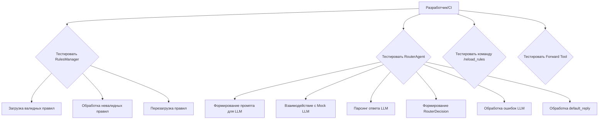
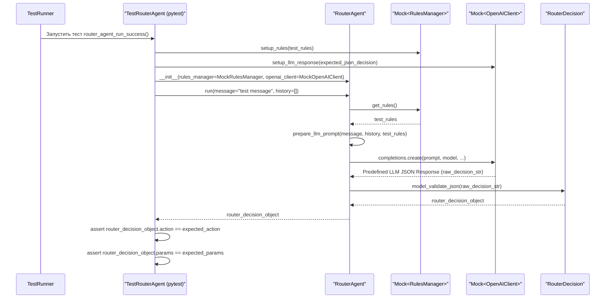
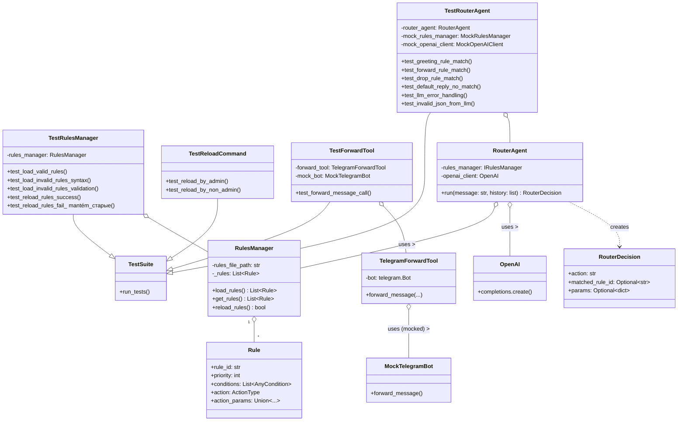

# Техническое Задание: E3.7 Тестирование `RouterAgent`

## 1. Описание Задачи

Задача E3.7 заключается в комплексном тестировании компонента `RouterAgent` и связанных с ним модулей. Цель — обеспечить корректную работу `RouterAgent` в соответствии с определёнными YAML-правилами, включая загрузку правил, их применение для маршрутизации сообщений, обработку команд управления и работу вспомогательных инструментов. Тестирование должно охватывать как модульные (unit) тесты для отдельных компонентов, так и интеграционные тесты для проверки их взаимодействия.

## 2. Общие Сведения и Контекст

Данная задача является частью Эпика 3 "Router & Dynamic Instructions". Согласно `Epic3.md`, задача E3.7 "Тестирование `RouterAgent`" включает:
*   **E3.7.1:** Написание unit-тестов для `RulesManager` (загрузка, валидация, перезагрузка правил).
*   **E3.7.2:** Написание unit-тестов для `RouterAgent`:
    *   Тестирование логики определения действия (`reply`, `forward`, `drop`, `default_reply`) и формирования `RouterDecision`.
    *   Тестирование взаимодействия с LLM для получения решения на основе правил.
    *   Тестирование обработки случая, когда ни одно правило не совпадает (или LLM не может определить правило).
*   **E3.7.3:** Написание интеграционных тестов для команды `/reload_rules`.
*   **E3.7.4:** Написание тестов для инструмента `telegram_forward_message_tool` (возможно, с использованием mock `telegram.Bot`).

`RouterAgent` играет ключевую роль в маршрутизации входящих сообщений, используя YAML-правила и взаимодействие с LLM для принятия решений. Качественное тестирование необходимо для обеспечения надежности и предсказуемости этого критически важного компонента.

## 3. Цели Задачи

*   Проверить корректность загрузки, валидации и перезагрузки правил маршрутизации модулем `RulesManager`.
*   Убедиться, что `RouterAgent` правильно формирует запросы к LLM, передавая ему актуальные правила и сообщение пользователя.
*   Верифицировать, что `RouterAgent` корректно интерпретирует ответы LLM (JSON `RouterDecision`) и формирует соответствующий объект `RouterDecision`.
*   Проверить корректность обработки различных сценариев маршрутизации: `reply` (прямой и через `system_prompt_key`), `forward`, `drop`, и `default_reply`.
*   Обеспечить стабильную работу команды `/reload_rules`, включая проверку прав доступа.
*   Подтвердить работоспособность инструмента `telegram_forward_message_tool` через мокирование.
*   Достигнуть высокого уровня тестового покрытия для модулей `RulesManager` и `RouterAgent`.
*   Создать набор автоматизированных тестов, которые могут быть интегрированы в CI/CD пайплайн.

## 4. Требования

### 4.1. Функциональные требования к тестированию

*   **FR-TEST-RM-1:** Модульные тесты для `RulesManager` должны покрывать:
    *   Успешную загрузку и валидацию корректного файла `rules.yaml` (включая все типы правил и условий из предоставленного `rules.yaml`).
    *   Обработку некорректных файлов `rules.yaml` (синтаксические ошибки, ошибки валидации Pydantic).
    *   Корректное применение приоритетов правил (хотя основное применение приоритетов ложится на LLM, `RulesManager` должен их корректно загружать и предоставлять).
    *   Успешную перезагрузку правил через метод `reload_rules()`.
    *   Обработку ошибок при перезагрузке (например, если новый файл некорректен, должны сохраняться старые правила).
*   **FR-TEST-RA-1:** Модульные тесты для `RouterAgent` должны покрывать:
    *   Корректное получение правил от `RulesManager` (через mock).
    *   Правильное формирование промпта для LLM, включающего сообщение пользователя и сериализованные правила.
    *   Успешное взаимодействие с LLM (через mock), включая отправку запроса и получение ответа.
    *   Корректный парсинг JSON-ответа от LLM в объект `RouterDecision`.
    *   Обработку различных типов `action` (`reply`, `forward`, `drop`, `default_reply`) и соответствующих `params`.
    *   Обработку некорректного или неожиданного JSON-ответа от LLM.
    *   Обработку ошибок при вызове LLM.
    *   Реализацию логики `default_reply`, если LLM не возвращает подходящего решения или не удается его получить.
*   **FR-TEST-CMD-1:** Интеграционные тесты для команды `/reload_rules` должны покрывать:
    *   Успешную перезагрузку правил администратором.
    *   Отправку пользователю сообщения об успехе/ошибке перезагрузки.
    *   Запрет на выполнение команды неавторизованным пользователем.
    *   Взаимодействие с реальным (или частично мокированным) `RulesManager`.
*   **FR-TEST-TOOL-1:** Модульные тесты для `telegram_forward_message_tool` должны покрывать:
    *   Корректный вызов метода `bot.forward_message` (или аналогичного) с правильными параметрами (`original_message_id`, `from_chat_id`, `target_chat_id`).
    *   Использование мокированного экземпляра `telegram.Bot`.

### 4.2. Нефункциональные требования к тестированию

*   **NFR-TEST-1:** Все тесты должны быть автоматизированы и выполняться без ручного вмешательства.
*   **NFR-TEST-2:** Тесты должны быть идемпотентными и давать воспроизводимые результаты.
*   **NFR-TEST-3:** Тесты не должны зависеть от внешних сервисов (например, реальных API Telegram или OpenAI); все внешние вызовы должны быть мокированы.
*   **NFR-TEST-4:** Код тестов должен быть читаемым, поддерживаемым и следовать общим принципам написания качественного кода.
*   **NFR-TEST-5:** Тесты должны быть достаточно быстрыми для регулярного запуска в процессе разработки и в CI.

### 4.3. Предположения

*   Реализация `RulesManager` (E3.1), `RouterAgent` (E3.2), `telegram_forward_message_tool` (E3.3.2) и команды `/reload_rules` (E3.4) завершена.
*   В проекте используется фреймворк для тестирования (например, `pytest`).
*   Доступны библиотеки для мокирования (например, `unittest.mock`, `pytest-mock`).
*   Структура `rules.yaml` соответствует предоставленному файлу и моделям Pydantic.

### 4.4. Ограничения

*   Тесты не будут проверять внутреннюю логику LLM (т.е. насколько "умно" LLM выбирает правило), а только корректность взаимодействия `RouterAgent` с LLM и обработки его ответа.
*   Тесты не будут проверять реальную доставку сообщений через Telegram API.

## 5. UML Диаграммы

### 5.1. Диаграмма Вариантов Использования (Тестирование)

### 5.2. Диаграмма Последовательности (Unit-тест `RouterAgent.run` с LLM)

### 5.3. Диаграмма Классов (Ключевые компоненты для тестирования)

## 6. Варианты Использования (Use Cases)

### UC-TEST-RM-LOAD: Тестирование `RulesManager` - Загрузка валидных правил
*   **ID:** UC-TEST-RM-LOAD
*   **Акторы:** TestRunner
*   **Предусловия:**
    1.  Существует валидный файл `rules.yaml` (например, предоставленный пользователем).
    2.  Создан экземпляр `RulesManager` с путем к этому файлу.
*   **Основной успешный сценарий:**
    1.  TestRunner инициирует загрузку правил через `rules_manager.load_rules()` (или при инициализации `RulesManager`).
    2.  `RulesManager` читает, парсит YAML и валидирует его содержимое с помощью Pydantic моделей.
    3.  Правила успешно загружаются и сохраняются в `RulesManager`.
*   **Постусловия:**
    *   Метод `rules_manager.get_rules()` возвращает список объектов `Rule`, соответствующий содержимому `rules.yaml`.
    *   Количество загруженных правил соответствует ожидаемому.
    *   Не возникает исключений.
*   **Вариации:**
    *   Тестирование с файлом, содержащим все типы действий (`reply`, `forward`, `drop`) и условий (`keyword_match`, `regex_match`).
    *   Тестирование с пустым списком правил в `rules.yaml`.

### UC-TEST-RM-INVALID: Тестирование `RulesManager` - Обработка невалидных правил
*   **ID:** UC-TEST-RM-INVALID
*   **Акторы:** TestRunner
*   **Предусловия:**
    1.  Существует невалидный файл `rules.yaml` (например, с синтаксической ошибкой YAML или ошибкой валидации Pydantic - отсутствует обязательное поле, неверный тип данных).
*   **Основной успешный сценарий:**
    1.  TestRunner пытается инициализировать `RulesManager` или вызвать `load_rules()` с путем к невалидному файлу.
    2.  `RulesManager` обнаруживает ошибку при парсинге или валидации.
*   **Постусловия:**
    *   `RulesManager` генерирует соответствующее исключение (например, `yaml.YAMLError`, `pydantic.ValidationError`, или кастомное `RulesFileError`).
    *   Список правил в `RulesManager` остается пустым или не изменяется (если ошибка произошла при `reload_rules`).
*   **Вариации:**
    *   Тест с нарушением структуры YAML.
    *   Тест с отсутствием обязательного поля в правиле (например, `rule_id` или `action`).
    *   Тест с неверным типом данных для поля (например, `priority` - строка вместо числа).

### UC-TEST-RM-RELOAD: Тестирование `RulesManager` - Перезагрузка правил
*   **ID:** UC-TEST-RM-RELOAD
*   **Акторы:** TestRunner
*   **Предусловия:**
    1.  `RulesManager` инициализирован с начальным набором правил (например, из `initial_rules.yaml`).
    2.  Существует второй файл `updated_rules.yaml` с измененным/новым набором правил.
*   **Основной успешный сценарий:**
    1.  TestRunner изменяет путь к файлу правил в `RulesManager` (если необходимо) или подменяет содержимое файла, на который он указывает.
    2.  TestRunner вызывает `rules_manager.reload_rules()`.
    3.  `RulesManager` успешно загружает и валидирует правила из `updated_rules.yaml`.
*   **Постусловия:**
    *   `rules_manager.get_rules()` возвращает новый набор правил из `updated_rules.yaml`.
    *   Метод `reload_rules()` возвращает `True`.
*   **Альтернативные сценарии:**
    *   **AS1:** `updated_rules.yaml` невалиден.
        *   `reload_rules()` возвращает `False`.
        *   `rules_manager.get_rules()` продолжает возвращать начальный набор правил.
        *   Логгируется ошибка.

### UC-TEST-RA-DECISION: Тестирование `RouterAgent` - Принятие решения
*   **ID:** UC-TEST-RA-DECISION
*   **Акторы:** TestRunner
*   **Предусловия:**
    1.  Создан экземпляр `RouterAgent` с мокированными `RulesManager` и `OpenAIClient`.
    2.  `MockRulesManager` настроен возвращать предопределенный список правил при вызове `get_rules()`.
    3.  `MockOpenAIClient` настроен возвращать предопределенный JSON-ответ (имитирующий `RouterDecision`) при вызове метода completions.
*   **Основной успешный сценарий:**
    1.  TestRunner вызывает `router_agent.run(message="...", history=[])` с тестовым сообщением.
    2.  `RouterAgent` получает правила от `MockRulesManager`.
    3.  `RouterAgent` формирует промпт на основе сообщения и правил.
    4.  `RouterAgent` вызывает `MockOpenAIClient`, который возвращает настроенный JSON.
    5.  `RouterAgent` успешно парсит JSON в объект `RouterDecision`.
*   **Постусловия:**
    *   Возвращенный `RouterDecision` содержит ожидаемые `action`, `matched_rule_id` и `params`, соответствующие настроенному JSON-ответу от `MockOpenAIClient`.
*   **Вариации:**
    *   Тестирование для каждого типа действия: `reply` (с `response_text`), `reply` (с `system_prompt_key`), `forward`, `drop`.
    *   Тестирование для `default_reply`, когда `MockOpenAIClient` возвращает JSON, указывающий на отсутствие совпадения, или когда происходит ошибка вызова LLM.
    *   Тестирование обработки некорректного JSON-ответа от `MockOpenAIClient` (например, `RouterAgent` должен обработать ошибку и, возможно, вернуть `default_reply`).
    *   Тестирование сценария, когда `MockOpenAIClient` имитирует ошибку API (например, таймаут, ошибка авторизации).

### UC-TEST-CMD-RELOAD: Тестирование команды `/reload_rules`
*   **ID:** UC-TEST-CMD-RELOAD
*   **Акторы:** TestRunner (симулирующий Telegram Update)
*   **Предусловия:**
    1.  Настроен обработчик команды `/reload_rules`.
    2.  `RulesManager` (реальный или мокированный) доступен обработчику.
    3.  Сконфигурированы ID администраторов.
*   **Основной успешный сценарий (Администратор):**
    1.  TestRunner симулирует получение команды `/reload_rules` от пользователя с ID администратора.
    2.  Обработчик команды вызывает `rules_manager.reload_rules()`.
    3.  `rules_manager.reload_rules()` возвращает `True`.
    4.  Пользователю отправляется сообщение об успешной перезагрузке.
*   **Постусловия (Администратор):**
    *   Метод `rules_manager.reload_rules()` был вызван.
    *   Мок Telegram API подтверждает отправку сообщения об успехе.
*   **Альтернативные сценарии:**
    *   **AS1 (Не администратор):** Пользователь без прав администратора отправляет команду.
        *   `rules_manager.reload_rules()` не вызывается.
        *   Пользователю отправляется сообщение об отсутствии прав.
    *   **AS2 (Ошибка перезагрузки):** `rules_manager.reload_rules()` возвращает `False`.
        *   Пользователю отправляется сообщение об ошибке перезагрузки.

### UC-TEST-TOOL-FWD: Тестирование `telegram_forward_message_tool`
*   **ID:** UC-TEST-TOOL-FWD
*   **Акторы:** TestRunner
*   **Предусловия:**
    1.  Создан экземпляр `TelegramForwardTool` с мокированным `telegram.Bot`.
*   **Основной успешный сценарий:**
    1.  TestRunner вызывает `forward_tool.forward_message(original_message_id=123, from_chat_id=456, target_chat_id="789", text="Test message")`.
    2.  `TelegramForwardTool` вызывает соответствующий метод на мокированном `telegram.Bot` (например, `mock_bot.forward_message(...)`).
*   **Постусловия:**
    *   Метод `mock_bot.forward_message` (или аналогичный, в зависимости от реализации инструмента) был вызван ровно один раз с корректными аргументами (`chat_id="789"`, `from_chat_id=456`, `message_id=123`).
*   **Вариации:** Проверить, что инструмент корректно обрабатывает разные типы `target_chat_id` (строка, число), если это предусмотрено.

## 7. Валидация и Верификация

*   **V1: Ревью Кода Тестов:** Весь тестовый код должен пройти ревью другими членами команды для обеспечения качества, полноты и корректности.
*   **V2: Прогон Тестов в CI:** Все тесты должны успешно выполняться в CI/CD пайплайне при каждом коммите/пулл-реквесте в основную ветку.
*   **V3: Отчеты о Покрытии Кода:** Генерировать отчеты о покрытии кода (например, с помощью `pytest-cov`). Целевое покрытие для модулей `src/rules_manager/manager.py` и `src/bot_agents/router_agent.py` должно быть высоким (например, > 85%).
*   **V4: Матрица Трассировки Тестов:** Создать документ или таблицу, связывающую каждый пункт функциональных требований (FR-TEST-*) с конкретными тестовыми случаями/методами, чтобы убедиться в полном покрытии.
*   **V5: Ручное выборочное тестирование (Smoke Test):** После успешного прохождения автоматических тестов, провести несколько ручных проверок с использованием реального (но тестового) экземпляра бота и правил, чтобы убедиться в общей адекватности поведения (не является заменой автоматических тестов).

## 8. Зависимости

*   **D1:** Завершенная и отлаженная реализация `RulesManager` (E3.1).
*   **D2:** Завершенная и отлаженная реализация `RouterAgent` (E3.2), включая логику взаимодействия с LLM.
*   **D3:** Завершенная реализация инструмента `telegram_forward_message_tool` (E3.3.2).
*   **D4:** Завершенная реализация команды `/reload_rules` и ее обработчика (E3.4).
*   **D5:** Настроенный тестовый фреймворк (например, `pytest`) и необходимые плагины (`pytest-mock`, `pytest-asyncio`, `pytest-cov`).
*   **D6:** Доступ к актуальной версии файла `rules.yaml` для использования в тестовых сценариях (или его мокирования).

## 9. Риски и Способы их Уменьшения

*   **R1: Некорректное мокирование зависимостей.**
    *   *Описание:* Моки `RulesManager`, `OpenAIClient`, `telegram.Bot` могут не точно отражать поведение реальных компонентов, что приведет к ложноположительным или ложноотрицательным результатам тестов.
    *   *Вероятность:* Средняя.
    *   *Смягчение:* Тщательное проектирование моков, использование проверенных библиотек для мокирования. Ревью кода моков. Фокус на тестировании контрактов взаимодействия.
*   **R2: Низкое или нерелевантное тестовое покрытие.**
    *   *Описание:* Автоматические тесты могут не покрывать важные сценарии использования или краевые случаи, особенно в логике взаимодействия с LLM.
    *   *Вероятность:* Средняя.
    *   *Смягчение:* Использование инструментов для анализа покрытия кода. Регулярное обновление тестов при изменении кода. Ревью тестовых сценариев на полноту. Матрица трассировки.
*   **R3: "Хрупкие" тесты (Brittle Tests).**
    *   *Описание:* Тесты часто ломаются из-за незначительных изменений во внутренней реализации тестируемых модулей, даже если их внешнее поведение не изменилось.
    *   *Вероятность:* Средняя.
    *   *Смягчение:* Тестирование публичных API и поведения, а не деталей реализации. Использование стабильных идентификаторов и контрактов.
*   **R4: Сложность тестирования взаимодействия с LLM.**
    *   *Описание:* Детерминированное тестирование компонента, чье поведение частично зависит от недетерминированного LLM, представляет сложность.
    *   *Вероятность:* Высокая (для части, касающейся самого LLM, но мы мокируем).
    *   *Смягчение:* Мокирование LLM-клиента. Тестирование фокусируется на:
        *   Корректности формирования промпта для LLM.
        *   Корректности парсинга ответа LLM (используя предопределенные мокированные ответы).
        *   Обработке различных типов ответов и ошибок от LLM.
*   **R5: Неполное понимание всех возможных сценариев работы `RouterAgent`.**
    *   *Описание:* Могут быть упущены некоторые комбинации правил, сообщений или состояний, которые не будут покрыты тестами.
    *   *Вероятность:* Средняя.
    *   *Смягчение:* Анализ существующего `rules.yaml` для генерации тестовых случаев. Обсуждение сценариев с командой. Итеративное добавление тестов по мере выявления новых случаев.
*   **R6: Обновление зависимостей может сломать тесты.**
    *   *Описание:* Изменение API во внешних библиотеках (даже мокированных) или в `OpenAI Agent SDK` может потребовать обновления тестов.
    *   *Вероятность:* Низкая-Средняя.
    *   *Смягчение:* Фиксация версий зависимостей. Регулярный запуск тестов для быстрого выявления проблем.

## 10. План Реализации Тестирования (E3.7)

### 10.1. Краткий Обзор Текущего Состояния Проекта (в контексте тестирования)

На основе анализа структуры директории `tests` можно сделать следующие выводы:
*   Существует директория `tests/rules_manager/` с файлом `test_rules_manager.py`. Это указывает на то, что реализация задачи **E3.7.1 (Unit-тесты для `RulesManager`)** частично или полностью выполнена. Необходимо провести ревизию этих тестов на соответствие требованиям `FR-TEST-RM-1` из данного ТЗ.
*   Существует директория `tests/agents/` с файлом `test_language_validator_agent.py`. Хотя этот тест не относится напрямую к E3.7, он демонстрирует, что в проекте уже применяется подход к тестированию агентов, вероятно, с использованием `pytest` и мокирования, что можно использовать как образец.
*   Тесты для `RouterAgent` (**E3.7.2**), команды `/reload_rules` (**E3.7.3**) и инструмента `telegram_forward_message_tool` (**E3.7.4**) на данный момент, скорее всего, отсутствуют или требуют создания с нуля.
*   Общая инфраструктура для тестирования (например, `pytest`, конфигурационные файлы, основные фикстуры) может уже существовать.

### 10.2. Функции и Компоненты для Повторного Использования

*   **Существующая структура тестов:** Организация тестов в директории `tests/` с поддиректориями для каждого модуля (`rules_manager`, `agents`).
*   **Подходы к мокированию:** Принципы мокирования, использованные в `test_rules_manager.py` и `test_language_validator_agent.py`, могут быть адаптированы для новых тестов (например, мокирование файловой системы, HTTP-запросов, если используется).
*   **Тестовые данные:** Файлы `rules.yaml` (валидные и невалидные), используемые в `test_rules_manager.py`, могут быть расширены или использованы повторно.
*   **Общие фикстуры `pytest`:** Если в проекте определены общие фикстуры (например, для создания временных файлов, мокирования окружения), их следует использовать.
*   **Конфигурация `pytest`:** Существующие настройки `pytest` (например, в `pyproject.toml` или `pytest.ini`).

### 10.3. Пошаговый План Действий

**Ответственный:** Команда разработки (если не указано иное).
**Сроки:** Указаны относительно начала этапа.

**Этап 1: Анализ и Завершение Тестирования `RulesManager` (E3.7.1)**
    *   **Задача 1.1:** Ревью существующих тестов в `tests/rules_manager/test_rules_manager.py`.
        *   Описание: Проверить покрытие всех требований из `FR-TEST-RM-1` данного ТЗ (успешная загрузка, обработка невалидных файлов, приоритеты, перезагрузка, обработка ошибок перезагрузки).
        *   Срок: 2 дня.
    *   **Задача 1.2:** Доработка/написание недостающих тестов для `RulesManager`.
        *   Описание: На основе ревью (Задача 1.1) реализовать недостающие тестовые случаи.
        *   Срок: 3 дня.

**Этап 2: Разработка Unit-тестов для `RouterAgent` (E3.7.2)**
    *   **Задача 2.1:** Создание тестового файла `tests/agents/test_router_agent.py`.
        *   Описание: Настроить базовую структуру, импорты, необходимые фикстуры (например, для мокирования `RulesManager` и `OpenAIClient`).
        *   Срок: 1 день.
    *   **Задача 2.2:** Разработка моков для `RulesManager` и `OpenAIClient`.
        *   Описание: Создать мок-версии `RulesManager`, способные возвращать предопределенные наборы правил. Создать мок-версии `OpenAIClient` (или его релевантных частей), способные возвращать предопределенные JSON-ответы (успешные и ошибочные).
        *   Срок: 2 дня.
    *   **Задача 2.3:** Тестирование формирования промпта и взаимодействия с `MockOpenAIClient`.
        *   Описание: Проверить, что `RouterAgent` корректно формирует промпт для LLM на основе сообщения и правил, и правильно вызывает мокированный `OpenAIClient`.
        *   Срок: 2 дня.
    *   **Задача 2.4:** Тестирование парсинга ответа LLM и формирования `RouterDecision`.
        *   Описание: Проверить, что `RouterAgent` корректно парсит различные JSON-ответы от `MockOpenAIClient` и создает валидные объекты `RouterDecision` для всех типов `action` (`reply` с `response_text`, `reply` с `system_prompt_key`, `forward`, `drop`).
        *   Срок: 3 дня.
    *   **Задача 2.5:** Тестирование обработки `default_reply` и ошибок LLM.
        *   Описание: Проверить сценарии, когда LLM не возвращает совпадений, возвращает некорректный JSON, или имитируется ошибка API LLM. Убедиться, что `RouterAgent` корректно обрабатывает эти ситуации и переходит к `default_reply` или другой логике обработки ошибок.
        *   Срок: 2 дня.

**Этап 3: Разработка Интеграционных Тестов для Команды `/reload_rules` (E3.7.3)**
    *   **Задача 3.1:** Создание тестового файла (например, `tests/handlers/test_reload_command.py`).
        *   Описание: Настроить тесты для проверки команды `/reload_rules`, используя мокированный Telegram Bot API и, возможно, реальный (или частично мокированный) `RulesManager`.
        *   Срок: 1 день.
    *   **Задача 3.2:** Тестирование успешной перезагрузки администратором.
        *   Описание: Симулировать вызов команды от администратора, проверить вызов `RulesManager.reload_rules()` и отправку сообщения об успехе.
        *   Срок: 1.5 дня.
    *   **Задача 3.3:** Тестирование запрета для не-администраторов и обработки ошибок.
        *   Описание: Симулировать вызов команды от обычного пользователя. Проверить обработку ошибок, если `RulesManager.reload_rules()` возвращает ошибку, и корректность отправки сообщений пользователю.
        *   Срок: 1.5 дня.

**Этап 4: Разработка Unit-тестов для `telegram_forward_message_tool` (E3.7.4)**
    *   **Задача 4.1:** Создание тестового файла (например, `tests/tools/test_telegram_tools.py`).
        *   Описание: Настроить тесты для `TelegramForwardTool`.
        *   Срок: 0.5 дня.
    *   **Задача 4.2:** Тестирование вызова `bot.forward_message`.
        *   Описание: Использовать мокированный экземпляр `telegram.Bot` и проверить, что метод `forward_message` (или аналогичный) вызывается с корректными параметрами.
        *   Срок: 1.5 дня.

**Этап 5: Валидация, Покрытие Кода и Ревью**
    *   **Задача 5.1:** Запуск всех тестов и анализ результатов.
        *   Описание: Убедиться, что все тесты проходят успешно.
        *   Срок: 0.5 дня (после каждого этапа и финально).
    *   **Задача 5.2:** Анализ покрытия кода.
        *   Описание: Сгенерировать отчеты о покрытии кода. Достичь целевого покрытия (>85%) для `RulesManager` и `RouterAgent`.
        *   Срок: 1 день.
    *   **Задача 5.3:** Ревью кода тестов.
        *   Описание: Провести командное ревью всего написанного тестового кода.
        *   Срок: 2 дня (параллельно с разработкой или после).
    *   **Задача 5.4:** Создание матрицы трассировки тестов.
        *   Описание: Документировать связь между требованиями `FR-TEST-*` и реализованными тестами.
        *   Срок: 1 день.

### 10.4. Описание Необходимых Разработок и Доработок

*   **`tests/rules_manager/test_rules_manager.py`:**
    *   **Доработка:** Провести ревизию существующих тестов на предмет полного соответствия всем пунктам `FR-TEST-RM-1`. Дополнить тесты, если обнаружены пробелы, особенно для краевых случаев и обработки ошибок при перезагрузке правил.
*   **`tests/agents/test_router_agent.py` (Новый файл):**
    *   **Разработка:** Полная реализация unit-тестов согласно `FR-TEST-RA-1`. Это включает:
        *   Создание моков для `RulesManager` (возврат различных наборов правил) и `OpenAIClient` (имитация различных ответов LLM: корректный JSON для `reply`/`forward`/`drop`, JSON для `default_reply`, некорректный JSON, ошибки API).
        *   Написание параметризованных тестов для проверки всех видов `action` и `params` из актуального `rules.yaml` и возможных ответов LLM.
        *   Тестирование логики формирования промпта для LLM.
*   **`tests/handlers/test_reload_command.py` (Новый файл, или в существующем файле тестов для хендлеров):**
    *   **Разработка:** Реализация интеграционных тестов для команды `/reload_rules` согласно `FR-TEST-CMD-1`.
        *   Мокирование `telegram.Update`, `telegram.Message`, `telegram.User`, `telegram.Chat`, `telegram.Bot` для симуляции входящих команд и проверки исходящих сообщений.
        *   Проверка логики определения прав администратора.
        *   Интеграция с `RulesManager` (возможно, частично мокированным для контроля процесса перезагрузки).
*   **`tests/tools/test_telegram_tools.py` (Новый файл, или в существующем файле тестов для инструментов):**
    *   **Разработка:** Реализация unit-тестов для `TelegramForwardTool` согласно `FR-TEST-TOOL-1`.
        *   Мокирование экземпляра `telegram.Bot` и проверка вызова его методов с ожидаемыми аргументами.
*   **Общие тестовые утилиты/фикстуры:**
    *   **Разработка/Доработка:** Создание или адаптация общих фикстур `pytest` (например, для создания временных файлов `rules.yaml`, для мокирования глобальных объектов или настроек, если это необходимо).
