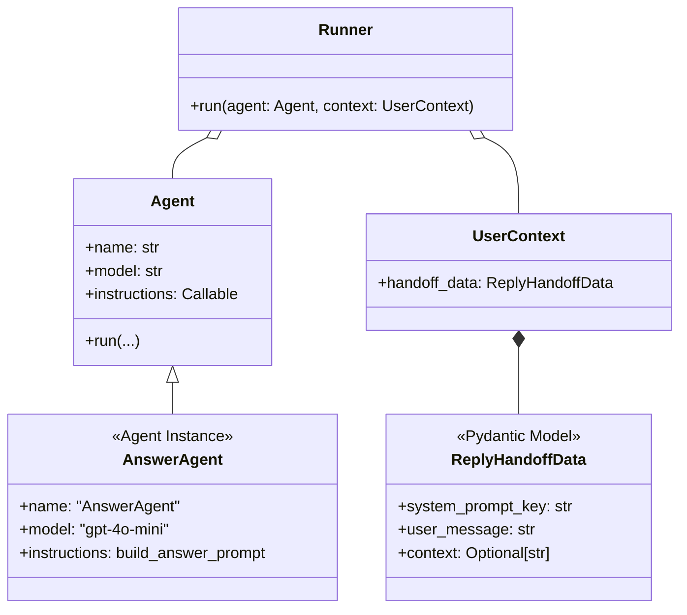
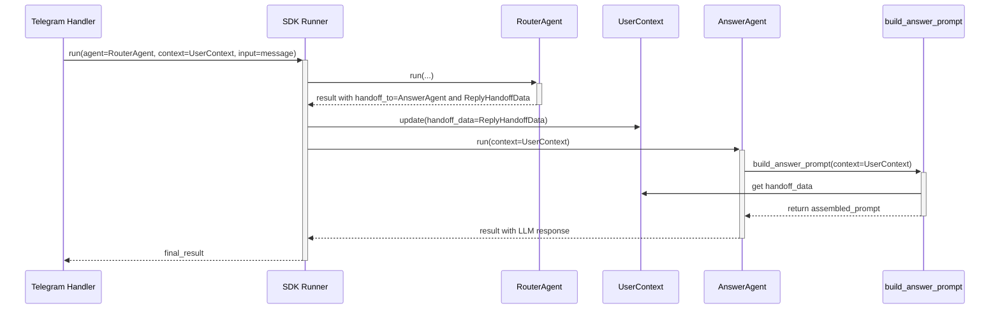

# Техническая спецификация: E4.1. Создание структуры `AnswerAgent`

**Дата:** 25.07.2024
**Автор:** Egor
**Версия:** 1.0

---

## 1. Описание задачи

В рамках эпика **E4. Answer Generation** необходимо создать базовую архитектуру для `AnswerAgent`. Этот агент будет отвечать за финальную генерацию ответа пользователю с помощью LLM. Задача включает определение самого агента, его конфигурации и моделей данных, необходимых для его работы, в соответствии с архитектурой `OpenAI Agent SDK`.

## 2. Общая информация и контекст

Данная задача является первой в эпике `E4. Answer Generation`. Согласно плану декомпозиции, `AnswerAgent` является ключевым компонентом, который получает управление от `RouterAgent` в случае, если необходимо сгенерировать развернутый ответ.

`RouterAgent` определяет, что на сообщение пользователя нужно ответить с помощью LLM, и передает `AnswerAgent`'у ключ системного промпта (`system_prompt_key`). `AnswerAgent` использует этот ключ и другие данные для формирования итогового запроса к модели `gpt-4o-mini`.

Эта задача закладывает фундамент для последующей реализации логики сборки промпта и взаимодействия с OpenAI API.

## 3. Цели и задачи

- Создать и сконфигурировать экземпляр `Agent` из `OpenAI Agent SDK`, который будет выполнять роль `AnswerAgent`.
- Определить структуру данных (`ReplyHandoffData`) для передачи необходимой информации от `RouterAgent` к `AnswerAgent`.
- Интегрировать `AnswerAgent` в общую архитектуру проекта, подготовив его к использованию в механизме `handoff`.
- Обеспечить соответствие реализации лучшим практикам, описанным в документации `OpenAI Agent SDK`, в частности, подходу с `dynamic_instructions`.

## 4. Требования

### 4.1. Функциональные требования

1.  **Создание файла агента:**
    - В директории `src/bot_agents/` должен быть создан файл `answer_agent.py`.

2.  **Определение агента:**
    - В `src/bot_agents/answer_agent.py` должен быть определен и экспортирован экземпляр `agents.Agent` с именем `answer_agent`.

3.  **Конфигурация агента:**
    - `name`: "AnswerAgent"
    - `model`: "gpt-4o-mini"
    - `instructions`: В качестве инструкций должна быть передана ссылка на функцию `build_answer_prompt` (которая будет реализована в Задаче E4.2). Это реализует паттерн **Dynamic Instructions**.

4.  **Модель данных для Handoff:**
    - В существующем файле `src/bot_agents/models.py` должна быть определена Pydantic-модель `ReplyHandoffData`.
    - `ReplyHandoffData` должна содержать следующие поля:
        - `system_prompt_key: str` — ключ для выбора системного промпта.
        - `user_message: str` — оригинальное сообщение пользователя.
        - `context: Optional[str] = None` — поле для будущего контекста из RAG (Эпик E5).

### 4.2. Нефункциональные требования

1.  **Стиль кода:** Код должен соответствовать стайл-гайду проекта (black, ruff).
2.  **Расширяемость:** Структура должна позволять легко добавлять новые данные в `ReplyHandoffData` (например, историю диалога) без нарушения обратной совместимости.

## 5. UML-диаграммы

### 5.1. Class Diagram

Диаграмма классов показывает основные компоненты и их взаимосвязи. `AnswerAgent` — это экземпляр класса `agents.Agent`. Он работает с `UserContext`, который содержит `ReplyHandoffData`.

### 5.2. Sequence Diagram

Диаграмма последовательности иллюстрирует процесс передачи управления (handoff) от `RouterAgent` к `AnswerAgent`.

## 6. Use Cases

### 6.1. Use Case: Генерация ответа на основе системного промпта

-   **Actor:** `System Runner` (оркестратор SDK).
-   **Preconditions:**
    1.  `RouterAgent` определил, что требуется `reply` с генерацией.
    2.  Экземпляр `ReplyHandoffData` с `system_prompt_key` и `user_message` создан.
    3.  Запрос на `handoff` к `AnswerAgent` инициирован.
-   **Main Success Scenario:**
    1.  `Runner` передает управление `AnswerAgent`.
    2.  `AnswerAgent` вызывается с `UserContext`, содержащим `ReplyHandoffData`.
    3.  `AnswerAgent` для получения инструкций вызывает привязанную функцию `build_answer_prompt`, передавая ей `context`.
    4.  Функция `build_answer_prompt` извлекает `ReplyHandoffData`, формирует промпт (логика будет в E4.2) и возвращает его.
    5.  `AnswerAgent` (под капотом SDK) отправляет промпт в `gpt-4o-mini`.
    6.  Модель генерирует ответ.
    7.  `AnswerAgent` возвращает сгенерированный текст в качестве результата своей работы.
-   **Postconditions:**
    -   Текстовый ответ от LLM доступен для `Handler`'а, который отправит его пользователю.

## 7. Валидация и верификация

1.  **Unit-тесты:**
    -   Тест для `src/bot_agents/answer_agent.py`: проверить, что экземпляр `answer_agent` создан, имеет правильные `name`, `model` и `instructions`.
    -   Тест для `src/bot_agents/models.py`: проверить корректность полей и типов Pydantic-модели `ReplyHandoffData`.
2.  **Интеграционный тест:**
    -   Создать тест, который эмулирует `handoff` от mock-`RouterAgent` к `AnswerAgent`.
    -   Тест должен проверить, что `AnswerAgent` вызывается и что он, в свою очередь, пытается вызвать функцию `build_answer_prompt`. Функцию `build_answer_prompt` можно замокать, чтобы она возвращала статическую строку для проверки потока.

## 8. Зависимости

-   **Эпик E0:** Настроенный проект с установленным `OpenAI Agent SDK`.
-   **Задача E4.2:** Реализация функции `build_answer_prompt`. Данная задача (E4.1) только определяет, что `AnswerAgent` будет ее использовать.

## 9. Риски и их минимизация

-   **Риск:** Неочевидные особенности работы механизма `handoff` и `context` в `OpenAI Agent SDK`.
    -   **Митигация:** Внимательное следование официальной документации. Создание минимального жизнеспособного примера (PoC) для проверки потока данных при `handoff`, если возникнут сложности.
-   **Риск:** Структура `ReplyHandoffData` может потребовать изменений при реализации будущих эпиков (E5).
    -   **Митигация:** Использование Pydantic и `Optional` полей сделает модель гибкой. Все новые поля для истории и RAG-контекста будут добавляться как опциональные.

---

## 10. План реализации

### 10.1. Краткий обзор текущего состояния проекта

Проект уже имеет базовую архитектуру на основе `OpenAI Agent SDK`. В директории `src/bot_agents/` существуют `RouterAgent` и `LanguageValidatorAgent`, а также файл `models.py` для моделей данных. Это говорит о том, что ключевые паттерны, такие как создание агентов и определение моделей для передачи данных, уже применяются в проекте. `RouterAgent` является точкой входа для маршрутизации запросов, что полностью соответствует контексту текущей задачи.

### 10.2. Перечень функций для повторного использования

1.  **Структура агента:** Файл `src/bot_agents/router_agent.py` может быть использован как референс для создания `answer_agent.py`. Структура определения агента, его конфигурация и экспорт будут аналогичны.
2.  **Модели данных:** Файл `src/bot_agents/models.py` является подходящим местом для определения новой Pydantic-модели `ReplyHandoffData`, что позволит сохранить консистентность кодовой базы.

### 10.3. Пошаговый план действий

**Этап 1: Создание модели данных `ReplyHandoffData`**

1.  **Действие:** В файле `src/bot_agents/models.py` определить Pydantic-модель `ReplyHandoffData`.
2.  **Поля:**
    - `system_prompt_key: str`
    - `user_message: str`
    - `context: Optional[str] = None`
3.  **Критерий готовности:** Модель определена, импортирована в `src/bot_agents/__init__.py` для удобного доступа и покрыта unit-тестом для проверки корректности полей и типов.

**Этап 2: Создание и конфигурация `AnswerAgent`**

1.  **Действие:** Создать файл `src/bot_agents/answer_agent.py`.
2.  **Действие:** В новом файле определить и экспортировать экземпляр `agents.Agent` с именем `answer_agent`.
3.  **Конфигурация:**
    - `name`: "AnswerAgent"
    - `model`: "gpt-4o-mini"
    - `instructions`: Ссылка на заглушку функции `build_answer_prompt`. Так как сама функция будет реализована в E4.2, на данном этапе можно создать временную mock-функцию, возвращающую статичную строку-промпт.
4.  **Критерий готовности:** Файл `answer_agent.py` создан. Экземпляр агента сконфигурирован согласно ТЗ. Написан unit-тест, проверяющий `name`, `model` и привязку `instructions`.

**Этап 3: Интеграция и тестирование**

1.  **Действие:** Обновить `RouterAgent`, чтобы он мог инициировать `handoff` на `AnswerAgent` и передавать `ReplyHandoffData`. (Примечание: этот шаг может быть выделен в отдельную задачу, но является необходимым для проверки полной работоспособности).
2.  **Действие:** Создать интеграционный тест, эмулирующий `handoff` от `RouterAgent` к `AnswerAgent`.
3.  **Тестирование:**
    - Замокать `build_answer_prompt` так, чтобы она возвращала предсказуемый промпт.
    - Проверить, что `AnswerAgent` корректно получает `ReplyHandoffData` через `UserContext`.
    - Убедиться, что `AnswerAgent` пытается выполнить вызов LLM с промптом, который вернула mock-функция.
4.  **Критерий готовности:** Интеграционный тест успешно проходит, демонстрируя корректную передачу управления и данных между агентами.

### 10.4. Описание необходимых разработок и доработок

-   **`src/bot_agents/models.py`:** Требуется доработка путем добавления новой Pydantic-модели.
-   **`src/bot_agents/answer_agent.py`:** Требуется разработка нового модуля с нуля.
-   **`src/bot_agents/router_agent.py`:** Потребуется модификация для инициирования `handoff` на `AnswerAgent`.
-   **`tests/`:** Необходимо создание новых unit- и интеграционных тестов для покрытия создаваемой функциональности.
-   **`src/bot_prompts/` (предполагаемое расположение):** В рамках задачи E4.2 потребуется создать модуль для `build_answer_prompt` и хранения текстов системных промптов. На текущем этапе можно обойтись временной заглушкой.
