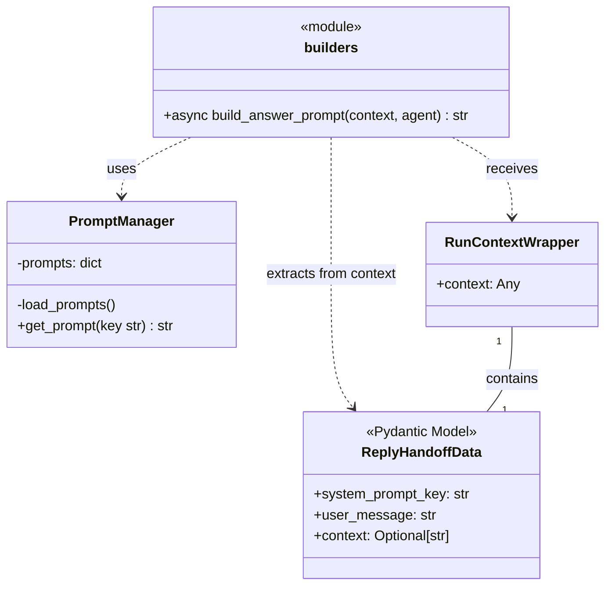
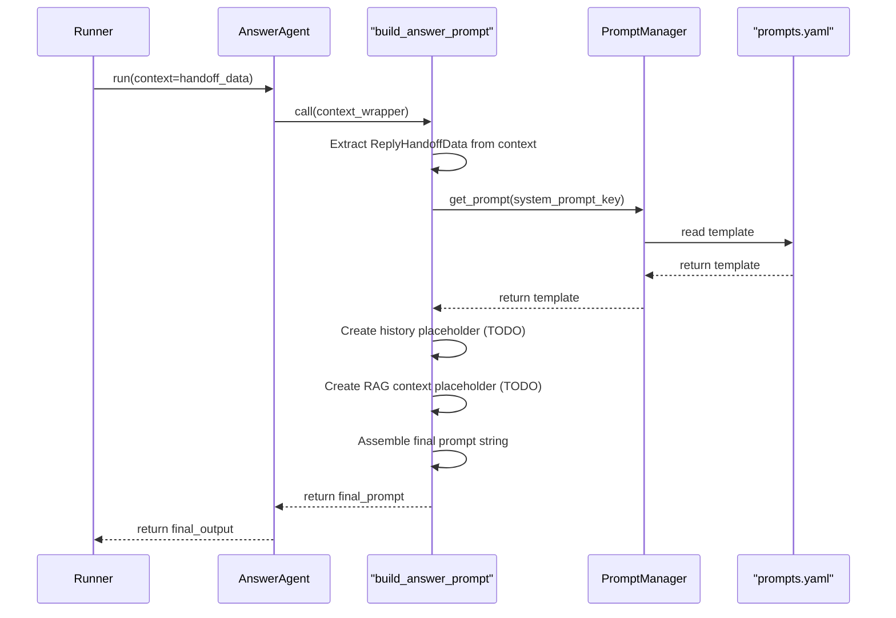

# Техническое Задание (ТЗ): E4.2 - Реализация функции для динамической сборки промпта

- **Эпик**: E4. Answer Generation
- **Задача**: E4.2. Реализация функции для динамической сборки промпта
- **Дата**: 28.07.2024
- **Версия**: 1.0

---

## 1. Task Description

The primary task is to implement a Python function, `build_answer_prompt`, responsible for dynamically constructing the final instruction prompt for the `AnswerAgent`. This function will serve as the `dynamic_instructions` for the agent, as per the OpenAI Agent SDK's design pattern. It will assemble the prompt by combining a base system prompt (retrieved using a key), the user's message, and placeholders for conversation history and RAG context, which will be implemented in a future epic (E5).

## 2. Background & Context

This task is a core part of **Epic E4: Answer Generation**. The goal of this epic is to generate coherent and relevant responses to user queries using an LLM. As outlined in `docs/Epic4/Epic4.md`, the `AnswerAgent` is designed to be flexible, using a dynamic function for its instructions.

From the Epic document:
> **Задача 2: Реализация функции для динамической сборки промпта**
> - **Описание:** Создать функцию, которая будет динамически собирать промпт для LLM. Эта функция будет использоваться в качестве `dynamic_instructions` для `AnswerAgent`.
> - **Предлагаемое решение:**
>   1. Создать новый модуль `src/prompts/builders.py`.
>   2. Реализовать в нем асинхронную функцию `build_answer_prompt(...)`.
>   3. Внутри функции:
>      - Получить `ReplyHandoffData` из `context`.
>      - Загрузить системный промпт по `system_prompt_key` из хранилища (например, `prompts.yaml`).
>      - Добавить заглушки для будущих данных (история диалога, RAG-контекст).
>      - Собрать итоговый промпт из всех частей.

This function is the bridge between the routing logic (which decides *that* a generative answer is needed) and the LLM (which *generates* the answer).

## 3. Objectives

- To create a modular and scalable mechanism for building prompts for the `AnswerAgent`.
- To abstract the logic of prompt construction away from the agent's definition and the main bot logic.
- To prepare the architecture for future integration of conversation history and RAG context (Epic E5) by including clearly marked placeholders.
- To centralize prompt templates in a manageable configuration file (`prompts.yaml`).

## 4. Requirements

### Functional Requirements

1.  **Module Creation**: A new file, `src/prompts/builders.py`, must be created to house the prompt building logic.
2.  **Function Signature**: An asynchronous function `build_answer_prompt(context_wrapper: RunContextWrapper, agent: Agent) -> str` shall be implemented in this module.
3.  **Context Processing**: The function must extract the `ReplyHandoffData` object from the `context_wrapper.context`.
4.  **Prompt Template Management**:
    *   A new component, `PromptManager`, will be created to handle loading prompt templates from a YAML file.
    *   The `PromptManager` will read from a new `prompts.yaml` file located in the project root.
    *   The function will use the `system_prompt_key` from `ReplyHandoffData` to request the corresponding template from the `PromptManager`.
5.  **Prompt Construction**: The final prompt must be assembled according to the following structure:
    ```
    <system_prompt_template>

    Conversation History:
    <history_placeholder>

    Provided Context:
    <rag_context_placeholder>

    User's Question:
    <user_message>
    ```
6.  **Placeholders for Future Features (Epic E5)**:
    *   The `<history_placeholder>` shall be a hardcoded string: `Conversation history is not yet implemented.`
    *   The `<rag_context_placeholder>` shall be the content of `handoff_data.context` if present, otherwise a default string: `No additional context provided.`
    *   Both placeholders must be accompanied by `// TODO: [E5] ...` comments in the code.

### Non-Functional Requirements

1.  **Asynchronicity**: The implementation must be fully asynchronous (`async/await`).
2.  **Modularity**: Prompt templates must be stored separately from the code in `prompts.yaml`.
3.  **Error Handling**: If a `system_prompt_key` does not exist in `prompts.yaml`, the function should log an error and fall back to a default, safe system prompt.
4.  **Clarity**: The code must be well-commented, especially the sections related to future integrations.

## 5. UML Diagrams (Mermaid)

### Use Case Diagram


### Class Diagram

*This diagram shows the key components and their relationships.*



### Sequence Diagram

*This diagram illustrates the workflow of building a prompt.*



## 6. Use Cases

### Use Case #1: Successful Prompt Generation

- **Use Case**: Generate a prompt for a "how-to" question.
- **Actor**: `Runner` (Agent SDK).
- **Preconditions**:
    1.  `RouterAgent` has decided to hand off to `AnswerAgent`.
    2.  The `RunContext` passed to `AnswerAgent` contains `ReplyHandoffData` with `system_prompt_key = "general_faq_prompt"` and `user_message = "how to use this bot?"`.
    3.  `prompts.yaml` exists and contains an entry for `general_faq_prompt`.
- **Main Success Scenario**:
    1.  The `Agent SDK` invokes `build_answer_prompt`, passing the context.
    2.  The function extracts `system_prompt_key` ("general_faq_prompt") and `user_message`.
    3.  It calls `PromptManager.get_prompt("general_faq_prompt")` and receives the corresponding system prompt template (e.g., "You are a helpful assistant. Answer the user's question clearly.").
    4.  It initializes the placeholder for conversation history: `Conversation history is not yet implemented.`
    5.  It initializes the placeholder for RAG context: `No additional context provided.`
    6.  It assembles the final prompt string by combining the system prompt, placeholders, and the user's message.
    7.  The function returns the complete, formatted prompt string to the `AnswerAgent`.
- **Postconditions**: The `AnswerAgent` receives a valid, structured prompt ready to be sent to the LLM.

### Use Case #2: Prompt Key Not Found

- **Use Case**: A non-existent prompt key is provided.
- **Actor**: `Runner` (Agent SDK).
- **Preconditions**:
    1.  `RouterAgent` hands off to `AnswerAgent`.
    2.  `ReplyHandoffData` contains `system_prompt_key = "non_existent_key"`.
- **Main Success Scenario**:
    1.  `build_answer_prompt` is invoked.
    2.  It calls `PromptManager.get_prompt("non_existent_key")`.
    3.  The `PromptManager` does not find the key and returns a default prompt (e.g., "You are a helpful assistant.").
    4.  A warning is logged indicating that the original key was not found.
    5.  The function proceeds to build the prompt using the default system prompt.
    6.  A valid fallback prompt is returned.
- **Postconditions**: The system gracefully handles the configuration error, preventing a crash and allowing the agent to still provide a generic response.

## 7. Validation & Verification

- **Unit Testing**:
    - A test suite for `build_answer_prompt` will be created in `tests/unit/prompts/`.
    - Tests will verify that the prompt is correctly assembled for various inputs.
    - The `PromptManager` will be mocked to simulate both successful key retrieval and the "key not found" scenario.
    - Assertions will check for the presence of the correct system prompt, user message, and the exact placeholder strings.
- **Integration Testing**:
    - An integration test will ensure that when `Runner.run` is called on `AnswerAgent`, the `build_answer_prompt` function is correctly invoked and its output is passed to the mocked LLM API call.
- **Code Review**: A peer review will be conducted to ensure the code adheres to the project's coding standards, is well-documented, and meets all requirements specified in this document.

## 8. Dependencies

- **Task E4.1 (Completed)**: The basic structure of `AnswerAgent` and the `ReplyHandaoffData` model must be in place.
- **New Components**: This task requires the creation of `src/prompts/builders.py`, `src/prompts/manager.py` (for `PromptManager`), and `prompts.yaml`.
- **Telegram Bot Handlers (`src/bot/handlers.py`)**: The handler that invokes `AnswerAgent` must be correctly configured to pass `ReplyHandoffData` within the `RunContext`.

## 9. Risks & Mitigations

| Risk                                                                 | Likelihood | Impact | Mitigation Strategy                                                                                                                                                              |
| :------------------------------------------------------------------- | :--------- | :----- | :------------------------------------------------------------------------------------------------------------------------------------------------------------------------------- |
| **Prompt templates become complex and hard to manage in a single YAML file.** | Medium     | Medium | **Initial**: The structure will be a simple key-value map. **Future**: If complexity increases, a subsequent task will refactor the `PromptManager` to support a nested directory structure for prompts (e.g., `/prompts/faq/general.txt`). |
| **The `build_answer_prompt` function becomes a bottleneck or overly complex.** | Low        | High   | Adhere to the Single Responsibility Principle. The function's only job is to assemble strings. Logic for fetching data (history, RAG) will be delegated to other components in Epic E5. Keep the assembly logic simple. |
| **Incorrect or missing prompt key leads to runtime errors.**         | Medium     | Low    | Implement robust error handling in the `PromptManager` to return a default prompt and log a warning, as described in Use Case #2. This ensures system resilience.                 |

## 10. План Реализации

### 10.1. Краткий обзор текущего состояния проекта

На данный момент в проекте уже реализованы следующие ключевые компоненты, которые закладывают основу для выполнения данной задачи:

- **`AnswerAgent` (`src/bot_agents/answer_agent.py`)**: Базовая структура агента существует, однако она использует временную функцию-заглушку `build_answer_prompt`, определенную в том же файле. Эта заглушка возвращает статический промпт и не использует данные из контекста.
- **`ReplyHandoffData` (`src/bot_agents/models.py`)**: Модель данных для передачи информации от `RouterAgent` к `AnswerAgent` уже определена и интегрирована.
- **Интеграция в `handlers.py` (`src/bot/handlers.py`)**: Основной обработчик текстовых сообщений уже содержит логику для вызова `AnswerAgent` через `Runner` и передачи ему `ReplyHandoffData` при срабатывании соответствующего правила.

Текущая реализация является функциональной, но негибкой, так как логика формирования промптов жестко закодирована и не отделена от определения агента.

### 10.2. Перечень функций для повторного использования

Следующие компоненты будут использованы без изменений или с минимальными доработками:

- **Модель `ReplyHandoffData`**: Будет использоваться как есть для извлечения `system_prompt_key` и `user_message`.
- **Логика вызова в `handle_text_message`**: Механизм запуска `AnswerAgent` и передачи ему контекста полностью соответствует требованиям и будет использован без изменений.
- **Конфигурация `answer_agent`**: Сам экземпляр `Agent` будет модифицирован, но его базовая инициализация будет сохранена.

### 10.3. Пошаговый план действий

Реализация будет разбита на четыре последовательных этапа.

#### Этап 1: Создание менеджера промптов и файла с шаблонами

- **Задача**: Создать централизованный механизм для управления шаблонами системных промптов.
- **Действия**:
    1.  Создать файл `prompts.yaml` в корневой директории проекта. Заполнить его первоначальными шаблонами, включая `general_faq_prompt`, `greeting_general_prompt`, `test_handoff_prompt` и обязательный `default_prompt` для обработки ошибок.
    2.  Создать новую директорию `src/prompts/` и инициализировать ее как модуль (добавить `__init__.py`).
    3.  Внутри `src/prompts/` создать файл `manager.py`.
    4.  Реализовать в `manager.py` класс `PromptManager` как синглтон. Этот класс будет:
        -   Загружать все шаблоны из `prompts.yaml` при первой инициализации.
        -   Предоставлять метод `get_prompt(key: str) -> str`, который возвращает текст шаблона по ключу. В случае отсутствия ключа, метод должен логировать ошибку и возвращать содержимое `default_prompt`.

#### Этап 2: Реализация функции-сборщика промпта

- **Задача**: Реализовать основную функцию `build_answer_prompt` в соответствии с ТЗ.
- **Действия**:
    1.  В директории `src/prompts/` создать файл `builders.py`.
    2.  В `builders.py` реализовать асинхронную функцию `build_answer_prompt(context_wrapper: RunContextWrapper, agent: Agent) -> str`.
    3.  Внутри функции:
        -   Извлечь объект `ReplyHandoffData` из `context_wrapper.context`.
        -   Использовать созданный на Этапе 1 `PromptManager` для получения системного шаблона по ключу `system_prompt_key`.
        -   Собрать итоговый промпт, строго следуя структуре, описанной в разделе 4.1.5 ТЗ, включая заглушки для истории диалога и RAG-контекста с соответствующими комментариями `TODO: [E5]`.

#### Этап 3: Интеграция и рефакторинг `AnswerAgent`

- **Задача**: Заменить временную реализацию в `AnswerAgent` на новую, модульную систему.
- **Действия**:
    1.  Открыть `src/bot_agents/answer_agent.py`.
    2.  Удалить временную функцию `build_answer_prompt`, определенную в этом файле.
    3.  Импортировать `build_answer_prompt` из `src/prompts/builders.py`.
    4.  В конструкторе `answer_agent = Agent(...)`:
        -   Заменить `instructions=...` на ссылку на новую, импортированную функцию: `instructions=build_answer_prompt`.
        -   Добавить параметр `model_settings`, указав `max_tokens=500` и `temperature=0.7` согласно ТЗ (раздел 3 Epic4.md).
    5.  Обновить `src/bot_agents/__init__.py` для корректного экспорта всех необходимых компонентов, если потребуется.

#### Этап 4: Выполнить запуск бота и протестировать