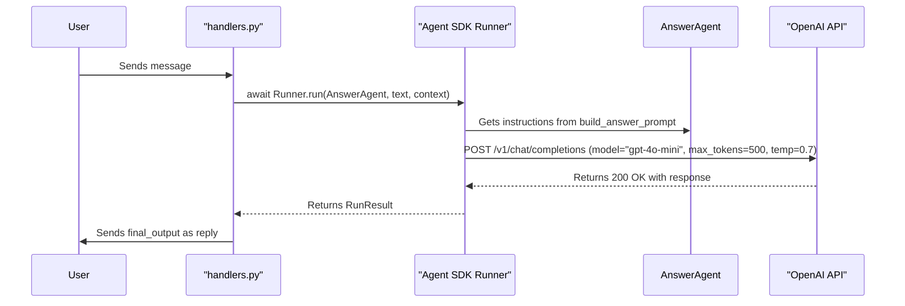
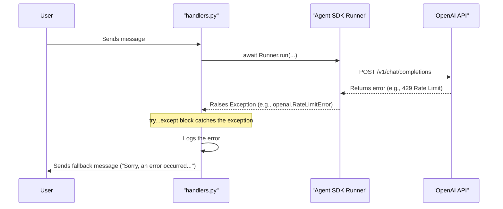

# Техническое Задание (ТЗ): E4.3 - Интеграция с OpenAI API для генерации ответа

- **Эпик**: E4. Answer Generation
- **Задача**: E4.3. Интеграция с OpenAI API для генерации ответа
- **Дата**: 28.07.2024
- **Версия**: 1.0

---

## 1. Task Description

The primary task is to ensure that the `AnswerAgent` is correctly configured to communicate with the OpenAI API for generating text responses. This involves verifying that the agent uses the specified model (`gpt-4o-mini`) and applies the correct generation parameters (`max_tokens`, `temperature`). Additionally, this task covers ensuring that the application gracefully handles potential API-related errors.

## 2. Background & Context

This task is part of **Epic E4: Answer Generation**. Following the implementation of the dynamic prompt builder in Task E4.2, the `AnswerAgent` is now capable of constructing the necessary instructions for the LLM. The next logical step is to ensure the API call itself is correctly configured and robust.

From the Epic document (`docs/Epic4/Epic4.md`):
> ### Задача 3: Интеграция с OpenAI API для генерации ответа
> - **Описание:** Убедиться, что `AnswerAgent` корректно вызывает модель `GPT-4o-mini` с собранным промптом для получения ответа.
> - **Предлагаемое решение:**
>   1. Эта задача в основном решается конфигурацией `Agent` в Задаче 1. Нужно правильно указать `model` и `model_settings`.
>   2. Задать параметры вызова в `model_settings`:
>      - `model="gpt-4o-mini"`
>      - `max_tokens=500` (согласно PRD)
>      - `temperature=0.7` (рекомендуемое стартовое значение)
>   3. SDK автоматически обработает вызов API, используя промпт из `build_answer_prompt`.
>   4. Настроить обработку ошибок API...

Much of the initial configuration was completed during Task E4.2. This document serves to formally verify that implementation against the requirements and ensure all aspects, including error handling, are covered.

## 3. Objectives

- To verify and confirm that `AnswerAgent` is configured with the correct model name and settings.
- To ensure the application is resilient to common OpenAI API errors.
- To formally document the agent's interaction with the external API.

## 4. Requirements

### Functional Requirements

1.  **Model Configuration**: The `AnswerAgent` instance in `src/bot_agents/answer_agent.py` **must** be initialized with `model="gpt-4o-mini"`.
2.  **Model Parameters**: The `AnswerAgent` instance **must** be configured with a `ModelSettings` object that specifies:
    *   `max_tokens=500`
    *   `temperature=0.7`
3.  **API Error Handling**: The calling code in `src/bot/handlers.py` **must** wrap the `Runner.run(answer_agent, ...)` call in a `try...except` block to catch potential exceptions from the API (such as `openai.RateLimitError`, `openai.APIError`, or generic `Exception`) and provide a fallback message to the user.

### Non-Functional Requirements

1.  **Logging**: Any API errors must be logged with `ERROR` level, including the traceback for debugging purposes.
2.  **User Experience**: In case of an API failure, the user should receive a generic apology message (e.g., "Sorry, I encountered an error while generating a response.") rather than seeing a technical error or no response at all. The bot should use `reply_chat_action('typing')` before the API call to indicate that work is in progress.

## 5. UML Diagrams (Mermaid)

### Component Diagram

*This diagram shows the high-level components involved in the API interaction.*

```mermaid
graph TD
    subgraph "SupportBot Application"
        A[handlers.py]
        B[AnswerAgent]
        C[OpenAI Agent SDK]
    end

    subgraph "External Services"
        D[OpenAI API]
    end

    A --> B: Invokes with user input
    B --> C: Uses to prepare and execute run
    C --> D: Makes HTTPS request
    D -->> C: Returns LLM response/error
    C -->> B: Returns result/exception
    B -->> A: Returns result/exception
```

### Sequence Diagram: Successful Response



### Sequence Diagram: API Error



## 6. Use Cases

### Use Case #1: Successful Answer Generation

- **Use Case**: The system successfully generates and returns an answer.
- **Actor**: User.
- **Preconditions**:
    1. The bot is running and `OPENAI_API_KEY` is valid.
    2. User sends a message that is routed to `AnswerAgent`.
- **Main Success Scenario**:
    1. `handle_text_message` in `handlers.py` invokes `Runner.run` with `AnswerAgent`.
    2. The `AnswerAgent` (via the SDK) makes a call to the OpenAI API with the configured model (`gpt-4o-mini`) and settings (`temperature`, `max_tokens`).
    3. The API returns a successful response.
    4. The `Runner` returns a `RunResult` object.
    5. `handle_text_message` extracts the `final_output` and sends it as a reply to the user.
- **Postconditions**: The user receives a relevant, AI-generated response.

### Use Case #2: API Rate Limit Error

- **Use Case**: The OpenAI API returns a rate limit error.
- **Actor**: User.
- **Preconditions**:
    1. The bot is running.
    2. The OpenAI account has exceeded its rate limit.
- **Main Success Scenario**:
    1. `handle_text_message` invokes `Runner.run` with `AnswerAgent`.
    2. The SDK makes an API call and receives a `429 Too Many Requests` response.
    3. The SDK raises an `openai.RateLimitError` exception.
    4. The `try...except` block in `handle_text_message` catches the exception.
    5. The handler logs the error message and traceback.
    6. The handler sends a predefined apology message to the user (e.g., "Sorry, I encountered an error while generating a detailed response.").
- **Postconditions**: The application does not crash. The user is informed of a failure without seeing technical details. The error is logged for maintainers.

## 7. Validation & Verification

- **Code Review**:
    - Verify that `src/bot_agents/answer_agent.py` contains the correct `model` and `model_settings` for the `AnswerAgent` instance.
    - Verify that the `Runner.run` call in `src/bot/handlers.py` is enclosed in a comprehensive `try...except Exception as e` block that logs errors and sends a user-facing message upon failure.
- **Testing**:
    - **Successful Path**: Perform the test from E4.2 again: send a message like "what is a bot" and confirm a valid response is received. Check the logs to ensure no errors were thrown.
    - **Failure Path (Manual)**: Temporarily invalidate the `OPENAI_API_KEY` in the `.env` file and restart the bot. Send a message that triggers the `AnswerAgent`. Verify that the bot does not crash and replies with the generic error message, and that an authentication error is logged. **Remember to restore the key afterwards.**

## 8. Dependencies

- **Task E4.1**: `AnswerAgent` and `ReplyHandoffData` structures must be defined. (Completed)
- **Task E4.2**: The dynamic prompt builder (`build_answer_prompt`) and `PromptManager` must be fully implemented and integrated. (Completed)
- **External**: A valid `OPENAI_API_KEY` with access to the `gpt-4o-mini` model is required.

## 9. Risks & Mitigations

| Risk | Likelihood | Impact | Mitigation Strategy |
| :--- | :--- | :--- | :--- |
| **Invalid or revoked `OPENAI_API_KEY`** | Medium | High | The application must have robust startup checks and clear error logging for authentication failures. The `try...except` block in the handler is the primary mitigation. |
| **API Latency** | Medium | Medium | The `reply_chat_action('typing')` indicator mitigates user perception of a stalled bot. For systemic latency, further investigation into model performance or considering response streaming (a future task) would be needed. |
| **Exceeding API Quota/Rate Limits** | Medium | High | Implement comprehensive error handling and logging to detect these issues immediately. Set up alerts on the OpenAI platform for billing/usage thresholds. |
| **Breaking Changes in OpenAI API or SDK** | Low | High | Pin the version of the `openai` and `openai-agents-python` libraries in `pyproject.toml`. Regularly review release notes before upgrading. |
