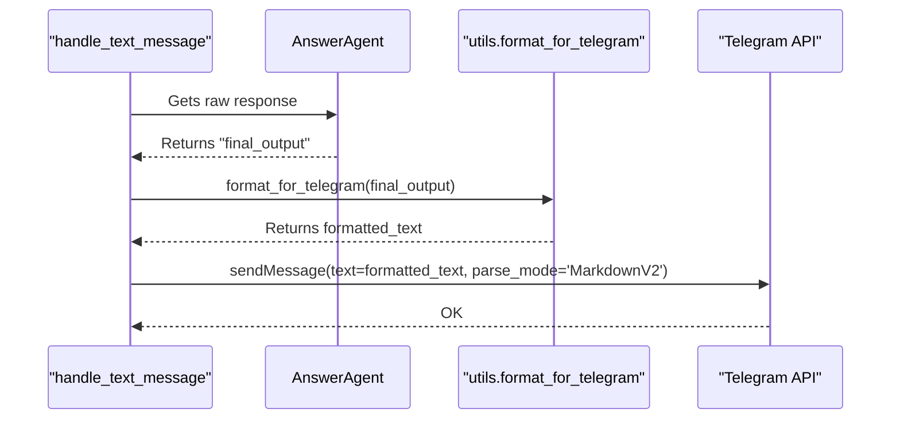

# Техническое Задание (ТЗ): E4.4 - Постобработка и форматирование ответа

- **Эпик**: E4. Answer Generation
- **Задача**: E4.4. Постобработка и форматирование ответа
- **Дата**: 28.07.2024
- **Версия**: 1.0

---

## 1. Task Description

This task involves creating a utility function to clean and format the raw text output generated by the `AnswerAgent` before it is sent to the user in Telegram. This function will ensure the response is free of common LLM artifacts (like conversational prefixes) and is safe to be parsed by Telegram's `MarkdownV2` engine, preventing rendering errors.

## 2. Background & Context

After the `AnswerAgent` successfully generates a response in Task E4.3, the raw text may not be suitable for direct display. LLMs often include prefixes such as "Answer:" or "Assistant:", and their output may contain special characters that conflict with Telegram's Markdown formatting. This task addresses the need for a post-processing step to polish the final response.

From the Epic document (`docs/Epic4/Epic4.md`):
> ### Задача 4: Постобработка и форматирование ответа
> - **Описание:** Подготовить сгенерированный LLM ответ для отправки в Telegram.
> - **Приоритет:** **Средний**
> - **Зависимости:** Задача 3.
> - **Предлагаемое решение:**
>   1. Создать утилитарную функцию `format_for_telegram(text: str) -> str` в `src/bot/utils.py`.
>   2. Функция должна очищать ответ от артефактов, которые может сгенерировать модель (например, префиксы "Ответ:", "Assistant:").
>   3. Экранировать специальные символы для `MarkdownV2`, чтобы избежать ошибок при отправке.

## 3. Objectives

- To improve the aesthetic quality and readability of the bot's responses.
- To prevent `telegram.error.BadRequest` errors caused by malformed Markdown in messages.
- To create a reusable and easily testable utility for text formatting.

## 4. Requirements

### Functional Requirements

1.  **Module and Function Creation**:
    *   A new file, `src/bot/utils.py`, must be created.
    *   A function `format_for_telegram(text: str) -> str` must be implemented within this module.
2.  **Artifact Removal**: The function must remove common leading artifacts from the text. This includes, but is not limited to:
    *   `"Ответ:"`, `"Assistant:"`, `"Response:"`, `"Here is the answer:"` and similar variations, ignoring case and leading/trailing whitespace.
3.  **MarkdownV2 Escaping**: The function must escape all special characters that have meaning in Telegram's `MarkdownV2` format to ensure they are displayed as literal characters. The characters to escape are:
    `_`, `*`, `[`, `]`, `(`, `)`, `~`, `` ` ``, `>`, `#`, `+`, `-`, `=`, `|`, `{`, `}`, `.`, `!`
4.  **Integration**: The `handle_text_message` function in `src/bot/handlers.py` must call `format_for_telegram` on the `final_output` from `AnswerAgent` before sending the message to the user via `update.message.reply_text`. The `parse_mode` for this call must be set to `ParseMode.MARKDOWN_V2`.

### Non-Functional Requirements

1.  **Purity**: The `format_for_telegram` function must be a pure function with no external dependencies or side effects.
2.  **Performance**: The function should be performant and not introduce noticeable latency to the response time.

## 5. UML Diagrams (Mermaid)

### Component Diagram

```mermaid
graph TD
    subgraph "Bot Logic"
        A[handlers.py]
        B[utils.py]
    end
    
    A --> B: Uses format_for_telegram()
```

### Sequence Diagram



## 6. Use Cases

### Use Case #1: Response Contains Artifacts and Markdown Characters

- **Use Case**: Clean and format a typical LLM response.
- **Actor**: `handle_text_message` function.
- **Preconditions**: `AnswerAgent` returns the raw string: `"  Response: The price is $1.00. Please check again."`
- **Main Success Scenario**:
    1.  The handler passes the raw string to `format_for_telegram`.
    2.  The function first strips leading whitespace and the `"Response:"` prefix. The string becomes `"The price is $1.00. Please check again."`.
    3.  The function then escapes the `.` characters.
    4.  The function returns the final formatted string: `"The price is $1\.00\. Please check again\."`.
    5.  The handler sends this formatted string to Telegram with `parse_mode=MarkdownV2`.
- **Postconditions**: The user sees the clean, correctly rendered message: "The price is $1.00. Please check again.".

### Use Case #2: Response is Clean

- **Use Case**: Process a response that requires no cleaning, only escaping.
- **Actor**: `handle_text_message` function.
- **Preconditions**: `AnswerAgent` returns the raw string: `"A-B is not C."`
- **Main Success Scenario**:
    1.  The handler passes the raw string to `format_for_telegram`.
    2.  The function finds no artifacts to remove.
    3.  The function escapes the `-` and `.` characters.
    4.  The function returns the formatted string: `"A\-B is not C\."`.
- **Postconditions**: The user sees the correctly rendered message without any part of it being misinterpreted as Markdown.

## 7. Validation & Verification

- **Unit Testing**:
    - A new test file `tests/unit/bot/test_utils.py` will be created.
    - A test suite for `format_for_telegram` will be implemented.
    - Test cases will include:
        - Strings with various leading artifacts.
        - Strings containing each of the special MarkdownV2 characters.
        - A string containing a mix of artifacts and special characters.
        - A clean string that needs no changes (besides escaping).
        - An empty string.
- **Integration Testing**:
    - Manually send a message to the bot that triggers the `AnswerAgent` (e.g., "what is `test.test`?").
    - Verify that the bot's response is displayed correctly in the Telegram client, with special characters shown as literals.

## 8. Dependencies

- **Task E4.3**: A functioning `AnswerAgent` that produces text output. (Completed)
- **Library**: `python-telegram-bot` for sending messages.

## 9. Risks & Mitigations

| Risk | Likelihood | Impact | Mitigation Strategy |
| :--- | :--- | :--- | :--- |
| **Over-escaping or incorrect escaping** | Medium | Medium | The list of characters to escape must be taken directly from the official Telegram Bot API documentation. Unit tests should cover all special characters to ensure correctness. |
| **New, unhandled LLM artifacts appear** | Medium | Low | The artifact removal logic should be simple and easy to extend. A list of regex patterns for artifacts can be used for maintainability. |
| **Performance degradation on very long texts** | Low | Low | The response length is capped at 500 tokens by the `AnswerAgent` configuration, which minimizes this risk. The formatting function will use efficient, non-blocking string operations. |
