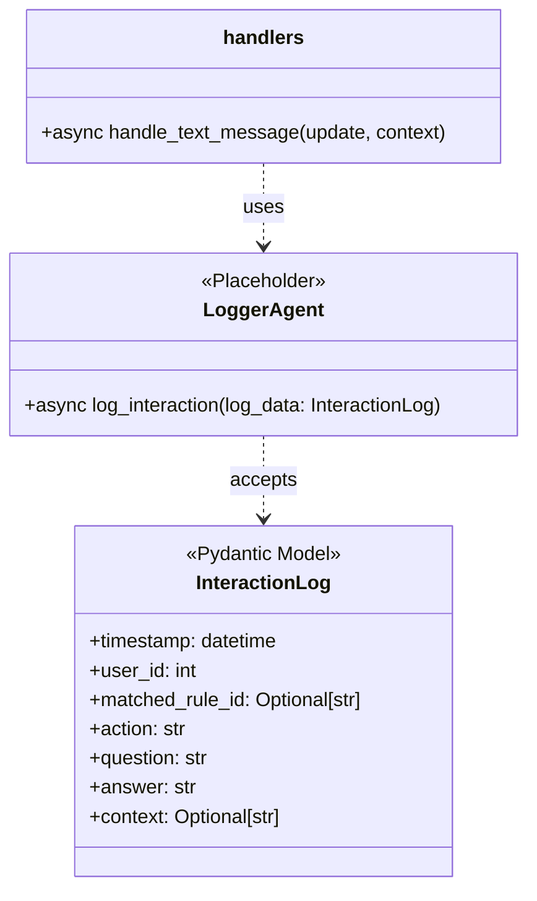
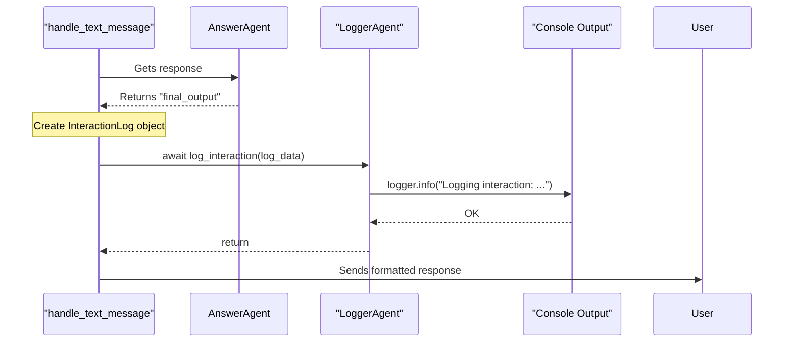

# Техническое Задание (ТЗ): E4.5 - Интеграция с LoggerAgent

- **Эпик**: E4. Answer Generation
- **Задача**: E4.5. Интеграция с `LoggerAgent`
- **Дата**: 28.07.2024
- **Версия**: 1.0

---

## 1. Task Description

This task involves integrating a logging mechanism into the main message handler (`handle_text_message`) to record the results of interactions processed by the `AnswerAgent`. A placeholder `LoggerAgent` will be created with an interface to log structured data about each successful generative response. This sets the stage for a full implementation of the logging system in Epic E6.

## 2. Background & Context

As per the project's Product Requirements Document (PRD), logging all interactions is crucial for analytics, debugging, and future improvements. After the `AnswerAgent` generates a response, all relevant data from the interaction must be captured and stored.

From the Epic document (`docs/Epic4/Epic4.md`):
> ### Задача 5: Интеграция с `LoggerAgent`
> - **Описание:** Обеспечить запись всех данных, связанных с генерацией ответа, в базу данных.
> - **Приоритет:** **Средний**
> - **Зависимости:** Задача 3, Эпик E6 (Logging).
> - **Предлагаемое решение:**
>   1. После успешного выполнения `AnswerAgent` основной обработчик (`handler`) должен вызывать `LoggerAgent`.
>   2. В лог должны записываться все компоненты из **FR-13**: `{ts, uid, rule_id, action, q, a, ctx}`.
>   3. **Важно:** Поле `ctx` будет временно содержать заглушку или пустую строку до завершения Эпика E5. Это нужно отметить в коде логирования.

This task bridges the gap between the answer generation flow and the future persistent logging system.

## 3. Objectives

- To define a clear, structured data model for interaction logs.
- To create a placeholder `LoggerAgent` that simulates the logging action without a real database dependency.
- To integrate the logging call into the `handle_text_message` function, ensuring it's called at the correct point in the logic.
- To ensure the logging process is asynchronous and does not block the user response.
- To correctly handle placeholder data for fields that are not yet fully implemented (e.g., RAG context).

## 4. Requirements

### Functional Requirements

1.  **Logging Data Model**:
    *   A Pydantic model, `InteractionLog`, must be created (e.g., in `src/bot_agents/models.py`) to structure the log data.
    *   The model must contain the fields as specified in FR-13: `timestamp`, `user_id`, `matched_rule_id`, `action`, `question`, `answer`, `context`.
2.  **Placeholder `LoggerAgent`**:
    *   A new file, `src/bot_agents/logger_agent.py`, will be created.
    *   It will contain a placeholder class, `LoggerAgent`, with an asynchronous method `log_interaction(log_data: InteractionLog)`.
    *   For this task, the method will simply log the received `InteractionLog` object to the console using the standard logger at the `INFO` level. A `TODO` comment will mark it for replacement with database logic in Epic E6.
3.  **Integration into Handler**:
    *   An instance of `LoggerAgent` must be initialized in `src/bot/handlers.py`.
    *   After `AnswerAgent` successfully returns a response and *before* it is sent to the user, `handle_text_message` must:
        a. Create an instance of `InteractionLog` with all the relevant data.
        b. Call `LoggerAgent.log_interaction()` with the created data object.
        c. The `context` field of the log data will be populated with the placeholder string from `ReplyHandoffData`.
4.  **Asynchronous Execution**: The `log_interaction` call must be `await`-ed, and the method itself must be `async def`.
5.  **Error Handling**: The call to `LoggerAgent` must be within its own `try...except` block to ensure that any failure in the logging process does not prevent the user from receiving their answer. Logging failures should be logged to the console as errors.

## 5. UML Diagrams (Mermaid)

### Class Diagram

### Sequence Diagram

## 6. Use Cases

### Use Case #1: Successful Interaction Logging

- **Use Case**: An answer is generated and the interaction is logged successfully.
- **Actor**: System (`handle_text_message`).
- **Preconditions**:
    1. A user message triggers the `AnswerAgent`.
    2. `AnswerAgent` successfully generates a response.
- **Main Success Scenario**:
    1. The handler receives the `final_output` from `AnswerAgent`.
    2. It populates an `InteractionLog` object with the user's ID, the question, the generated answer, the matched rule ID, and other metadata.
    3. It `await`s the `LoggerAgent.log_interaction` method, passing the log object.
    4. The `LoggerAgent` prints the content of the log object to the console.
    5. The handler proceeds to format and send the response to the user.
- **Postconditions**: The interaction data is visible in the console logs, and the user receives their response.

### Use Case #2: Logging Fails

- **Use Case**: The logging mechanism fails, but the user experience is not interrupted.
- **Actor**: System (`handle_text_message`).
- **Preconditions**:
    1. `AnswerAgent` generates a response.
    2. The `LoggerAgent.log_interaction` method is modified to throw an exception for testing purposes.
- **Main Success Scenario**:
    1. The handler receives the response from `AnswerAgent`.
    2. It calls `LoggerAgent.log_interaction`.
    3. The method throws an exception.
    4. The `try...except` block around the call catches the exception.
    5. The exception is logged to the console via the standard logger (`logger.error(...)`).
    6. The handler continues its execution, formats the response, and sends it to the user.
- **Postconditions**: An error is logged in the console, but the user still receives their answer from the bot. The system remains stable.

## 7. Validation & Verification

- **Code Review**:
    - Check that a new `InteractionLog` Pydantic model is created.
    - Check that the placeholder `LoggerAgent` is implemented as specified.
    - Verify that the call to `log_interaction` in `handlers.py` is present, asynchronous, wrapped in a `try...except` block, and uses the correct data.
- **Testing**:
    - Trigger a flow that uses `AnswerAgent`.
    - Check the application's console output to verify that a structured log message corresponding to the interaction is printed.
    - Confirm all fields in the logged output match the interaction that occurred.

## 8. Dependencies

- **Task E4.4 (Completed)**: A fully functional `AnswerAgent` flow that produces a final answer.
- **Epic E6 (Future)**: The full implementation of `LoggerAgent`, including the database schema and write logic, will replace the placeholder created in this task.

## 9. Risks & Mitigations

| Risk | Likelihood | Impact | Mitigation Strategy |
| :--- | :--- | :--- | :--- |
| **Blocking I/O in Logger** | Low | Medium | Ensure the `LoggerAgent`'s methods are `async` from the start. In the future (E6), use an async database driver (e.g., `aiosqlite`). |
| **Logging Failure Prevents User Reply** | Medium | High | The primary mitigation is to wrap the logging call in a dedicated `try...except` block, ensuring that failures are caught and handled gracefully without interrupting the primary flow of replying to the user. |
| **Incorrect or Incomplete Data Logged** | Medium | Medium | Use a strict Pydantic model (`InteractionLog`) to enforce data structure and types. This ensures that all required fields are present before the logging method is even called. |

---

## 10. План Реализации

Этот план описывает шаги по интеграции `LoggerAgent` в соответствии с данным ТЗ.

### Краткий обзор текущего состояния проекта

- **`src/bot/handlers.py`**: Содержит основную логику обработки сообщений в функции `handle_text_message`. Уже реализован вызов `AnswerAgent` при выполнении действия `reply` с `system_prompt_key`. Все необходимые данные для логирования (`user_id`, `question`, `matched_rule_id`, `action`) доступны в области видимости вызова `AnswerAgent`.
- **`src/bot_agents/models.py`**: Содержит Pydantic модели `RouterDecision` и `ReplyHandoffData`. Это подходящее место для добавления новой модели `InteractionLog`.
- **`src/bot_agents/answer_agent.py`**: Определяет `AnswerAgent`. Результат его работы (`final_output`) уже получается и используется в `handlers.py`.
- **`src/bot_agents/logger_agent.py`**: Файл отсутствует и должен быть создан.

### Функции для повторного использования

- **`handle_text_message`**: Основная функция-обработчик будет расширена, а не переписана.
- **`AnswerAgent` flow**: Существующий поток вызова `AnswerAgent` и получения ответа будет использован как триггер для логирования.
- **`ReplyHandoffData`**: Модель данных будет использоваться для получения `context` (в данном случае, заглушки `None`).
- **Standard Logger**: Существующий `logging` модуль будет использован внутри `LoggerAgent` для вывода в консоль.

### Пошаговый план действий

#### Этап 1: Создание моделей и агента-заглушки (Backend)

- **Задача 1.1: Расширение `models.py`**
    - **Описание:** В файл `src/bot_agents/models.py` добавить Pydantic модель `InteractionLog`.
    - **Поля:**
        - `timestamp: datetime`
        - `user_id: int`
        - `matched_rule_id: Optional[str]`
        - `action: str`
        - `question: str`
        - `answer: str`
        - `context: Optional[str]`
    - **Ответственный:** AI Assistant
    - **Срок:** ~5 минут

- **Задача 1.2: Создание `LoggerAgent`**
    - **Описание:** Создать новый файл `src/bot_agents/logger_agent.py`.
    - Внутри определить класс `LoggerAgent` с асинхронным методом `log_interaction(self, log_data: InteractionLog)`.
    - Метод должен использовать стандартный `logging.info()` для вывода содержимого `log_data` в консоль.
    - Добавить `TODO` комментарий о замене на реальную логику базы данных в Эпике E6.
    - **Ответственный:** AI Assistant
    - **Срок:** ~10 минут

- **Задача 1.3: Обновление `__init__.py`**
    - **Описание:** Экспортировать `LoggerAgent` и `InteractionLog` из `src/bot_agents/__init__.py` для удобного импорта.
    - **Ответственный:** AI Assistant
    - **Срок:** ~2 минуты

#### Этап 2: Интеграция в обработчик сообщений (Integration)

- **Задача 2.1: Модификация `handlers.py`**
    - **Описание:** Внести изменения в `src/bot/handlers.py`.
    1.  **Импорты:** Импортировать `LoggerAgent`, `InteractionLog` из `src.bot_agents` и `datetime` из стандартной библиотеки.
    2.  **Инициализация:** Создать экземпляр `logger_agent = LoggerAgent()` на уровне модуля, рядом с другими агентами.
    3.  **Логика в `handle_text_message`:** Внутри `try` блока, где обрабатывается ответ от `AnswerAgent` (после получения `final_response`), добавить новый блок `try...except`.
    4.  **Создание `log_data`:** Внутри этого блока создать экземпляр `InteractionLog`, заполнив его данными из текущего контекста: `datetime.utcnow()`, `user_id`, `router_decision.matched_rule_id`, `router_decision.action`, `text` (вопрос), `final_response` (ответ) и `handoff_data.context`.
    5.  **Вызов логгера:** Вызвать `await logger_agent.log_interaction(log_data)`.
    6.  **Обработка ошибок:** В `except` блоке логировать ошибку с помощью `logger.error()`, но не прерывать выполнение, чтобы пользователь получил ответ.
    - **Ответственный:** AI Assistant
    - **Срок:** ~15 минут

#### Этап 3: Тестирование и верификация (QA)

- **Задача 3.1: Ручное тестирование**
    - **Описание:** Запустить бота и отправить ему сообщение, которое активирует `AnswerAgent` (например, любое сообщение, не подпадающее под конкретные правила, чтобы сработал `default_reply`).
    - **Ожидаемый результат:**
        1. Бот отвечает сгенерированным текстом.
        2. В консоли появляется лог от `LoggerAgent` в формате `INFO`, содержащий все поля `InteractionLog` с корректными данными.
    - **Ответственный:** Разработчик / AI Assistant
    - **Срок:** ~5 минут

- **Задача 3.2: Тестирование сбоя логирования**
    - **Описание:** Временно изменить `LoggerAgent.log_interaction` так, чтобы он вызывал исключение.
    - **Ожидаемый результат:**
        1. В консоли появляется лог `ERROR` о сбое логирования.
        2. Бот все равно успешно отправляет ответ пользователю.
    - **Ответственный:** Разработчик / AI Assistant
    - **Срок:** ~5 минут
