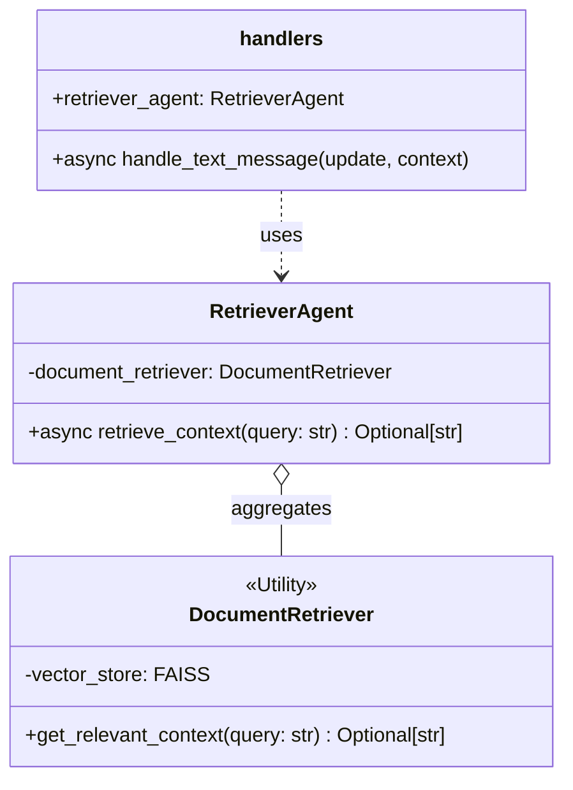
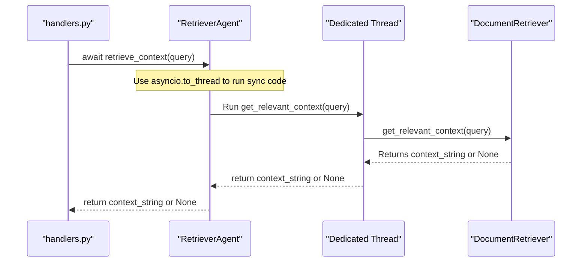

# Техническое Задание (ТЗ): E5.1 - Создание `RetrieverAgent`

- **Эпик**: E5. Retrieval (RAG)
- **Задача**: E5.1. Создание `RetrieverAgent` и интеграция `DocumentRetriever`
- **Дата**: 28.07.2024
- **Версия**: 1.0

---

## 1. Task Description

This task is to create a new agent, `RetrieverAgent`, which will act as a dedicated wrapper for the existing `DocumentRetriever` utility. The primary goal is to encapsulate the logic for context retrieval within the project's agent-based architecture, ensuring that the synchronous operations of `DocumentRetriever` do not block the main asynchronous event loop.

## 2. Background & Context

As outlined in the main Epic document (`docs/Epic5/Epic5.md`):

> ### Задача 1: Создание `RetrieverAgent` и интеграция `DocumentRetriever`
> - **Описание:** Создать нового агента `RetrieverAgent`, который будет инкапсулировать логику извлечения контекста. Основная логика будет взята из уже существующей утилиты `src/utils/rag_retriever.py`.
> - **Приоритет:** **Высокий**
> - **Зависимости:** Отсутствуют.
> - **Предлагаемое решение:**
>    1.  Создать новый файл `src/bot_agents/retriever_agent.py`.
>    2.  В нем определить класс `RetrieverAgent`. Этот класс будет являться оберткой над `DocumentRetriever`.
>    3.  `RetrieverAgent` должен инициализировать экземпляр `DocumentRetriever` при старте...
>    4.  Реализовать в `RetrieverAgent` основной асинхронный метод...
>    5.  Экспортировать `RetrieverAgent` из `src/bot_agents/__init__.py`.
>    6.  В главном файле `handlers.py` создать и инициализировать экземпляр `RetrieverAgent`.

This task formalizes the creation of the agent layer on top of the existing low-level retrieval utility.

## 3. Objectives

- To create a new `RetrieverAgent` class that encapsulates all interactions with the `DocumentRetriever`.
- To ensure the agent's methods are asynchronous and integrate cleanly with the existing `asyncio` event loop.
- To handle errors from the retrieval process gracefully.
- To make the `RetrieverAgent` available for use in the main message handler (`handlers.py`).

## 4. Requirements

### Functional Requirements

1.  **`RetrieverAgent` Class**:
    *   A new file, `src/bot_agents/retriever_agent.py`, must be created.
    *   It will contain a class named `RetrieverAgent`.
2.  **Initialization**:
    *   The `RetrieverAgent` constructor (`__init__`) must initialize an instance of `DocumentRetriever` from `src.utils.rag_retriever`.
    *   The initialization of `DocumentRetriever` should be wrapped in a `try...except` block to catch potential `RetrievalError` exceptions during startup.
3.  **Asynchronous Method**:
    *   The agent must have an `async` method: `retrieve_context(self, query: str) -> Optional[str]`.
    *   This method will be responsible for calling the `get_relevant_context` method of the `DocumentRetriever` instance.
4.  **Non-Blocking Execution**:
    *   Since `DocumentRetriever.get_relevant_context` is a synchronous, potentially long-running (I/O-bound) function, it **must** be executed in a separate thread to avoid blocking the `asyncio` event loop. This should be achieved using `asyncio.to_thread`.
5.  **Error Handling**:
    *   The call to `get_relevant_context` within the agent must be wrapped in a `try...except` block.
    *   If a `RetrievalError` (or any other exception) occurs, the agent should log the error and return `None`.
6.  **Integration**:
    *   The `RetrieverAgent` must be imported and exported in `src/bot_agents/__init__.py`.
    *   An instance of `RetrieverAgent` must be created at the module level in `src/bot/handlers.py`, similar to other agents.

## 5. UML Diagrams (Mermaid)

### Class Diagram

### Sequence Diagram

## 6. Use Cases

### Use Case #1: Successful Context Retrieval

- **Actor**: System (`handle_text_message`).
- **Preconditions**:
    1.  `RetrieverAgent` is initialized successfully.
    2.  The vector store is loaded.
    3.  A user sends a message that triggers the RAG flow.
- **Main Success Scenario**:
    1.  `handle_text_message` calls `await retriever_agent.retrieve_context(query)`.
    2.  `RetrieverAgent` schedules the execution of `document_retriever.get_relevant_context` in a separate thread.
    3.  The `DocumentRetriever` finds relevant documents in the FAISS index and returns a formatted context string.
    4.  The `RetrieverAgent` receives the string and returns it to the handler.
- **Postconditions**: The handler receives a non-empty string containing relevant context.

### Use Case #2: No Relevant Context Found

- **Actor**: System (`handle_text_message`).
- **Preconditions**: Same as Use Case #1.
- **Main Success Scenario**:
    1.  The flow proceeds as in Use Case #1.
    2.  The `DocumentRetriever` does not find any documents that meet the score threshold.
    3.  `document_retriever.get_relevant_context` returns `None`.
    4.  `RetrieverAgent` returns `None` to the handler.
- **Postconditions**: The handler receives `None`.

### Use Case #3: Retrieval Process Fails

- **Actor**: System (`handle_text_message`).
- **Preconditions**: Same as Use Case #1.
- **Main Success Scenario**:
    1.  The flow proceeds as in Use Case #1.
    2.  During the search, `DocumentRetriever` encounters an error (e.g., corrupted file) and raises a `RetrievalError`.
    3.  The `try...except` block inside `RetrieverAgent.retrieve_context` catches the exception.
    4.  The agent logs the error.
    5.  The agent returns `None`.
- **Postconditions**: The handler receives `None`, and a detailed error is recorded in the logs.

## 7. Validation & Verification

- **Code Review**:
    - Verify the existence of `src/bot_agents/retriever_agent.py`.
    - Check that `RetrieverAgent` correctly initializes `DocumentRetriever`.
    - Ensure the `retrieve_context` method is `async` and uses `asyncio.to_thread` (or equivalent).
    - Confirm that error handling is implemented as specified.
    - Check for correct instantiation and export (`__init__.py`, `handlers.py`).
- **Testing**:
    - **Unit Tests**: Create tests for `RetrieverAgent`, mocking `DocumentRetriever` to simulate success, failure, and "not found" scenarios.
    - **Integration Test**: In `handlers.py`, temporarily add a log statement to print the context returned by `retriever_agent`. Run the bot and send a message known to have a match in the vector store. Verify that the correct context is logged.

## 8. Dependencies

- **Internal**:
    - `DocumentRetriever` class from `src.utils.rag_retriever`.
    - `asyncio` standard library.
- **External**:
    - A valid and accessible FAISS vector store file (`answers_table.pkl` or as defined in config).

## 9. Risks & Mitigations

| Risk | Likelihood | Impact | Mitigation Strategy |
| :--- | :--- | :--- | :--- |
| **Blocking Event Loop** | High | High | The primary mitigation is to **strictly enforce** the use of `asyncio.to_thread` for the synchronous `get_relevant_context` call. This is a critical requirement. |
| **Startup Failure** | Medium | High | If the vector store is missing or corrupt, `DocumentRetriever` will fail to initialize. This could crash the bot on startup. The `RetrieverAgent`'s instantiation in `handlers.py` should be wrapped in a `try...except` block to log the critical failure and allow the bot to start in a degraded mode (without RAG capabilities). |
| **Configuration Errors** | Medium | Medium | An incorrect path to the vector store in the configuration will lead to startup failure. Ensure documentation and example `.env` files clearly specify the required configuration variables. |

---

## 10. План Реализации

Этот план описывает шаги для AI-ассистента по реализации `RetrieverAgent`.

### Краткий обзор текущего состояния проекта

- **Архитектура**: Проект использует асинхронную агентную архитектуру (`ValidatorAgent`, `RouterAgent`, `AnswerAgent`), управляемую из центрального обработчика `src/bot/handlers.py`.
- **`DocumentRetriever`**: В `src/utils/rag_retriever.py` уже существует синхронный класс `DocumentRetriever`, который инкапсулирует логику загрузки FAISS-индекса и поиска по нему. Однако он не интегрирован в асинхронный поток агентов.
- **Конфигурация**: Система логирования и конфигурации централизована, что позволяет легко ее использовать в новых компонентах.

### Функции для повторного использования

- **`DocumentRetriever`**: Основной класс с логикой поиска, который будет инкапсулирован (обернут) в новый агент.
- **`RetrievalError`**: Кастомное исключение, которое будет использоваться для обработки ошибок на уровне агента.
- **`logger`**: Существующий экземпляр логгера из `src.bot.config` будет использован для последовательного логирования.
- **Шаблон инициализации агента**: `RetrieverAgent` будет инициализирован в `src/bot/handlers.py` по аналогии с другими агентами, включая `try...except` блок для отказоустойчивости при запуске.
- **`asyncio.to_thread`**: Ключевая функция из стандартной библиотеки для выполнения синхронного кода `DocumentRetriever` без блокировки основного потока `asyncio`.

### Пошаговый план действий

#### Этап 1: Создание `RetrieverAgent` (Backend)

- **Задача 1.1: Создание файла и класса `RetrieverAgent`**
    - **Описание:** Создать файл `src/bot_agents/retriever_agent.py` и определить в нем класс `RetrieverAgent`. Импортировать все необходимые зависимости (`DocumentRetriever`, `Optional`, `logging`, `asyncio`, `RetrievalError`).
    - **Ответственный:** AI Assistant
    - **Срок:** ~5 минут

- **Задача 1.2: Реализация конструктора `__init__`**
    - **Описание:** В конструкторе класса `RetrieverAgent` инициализировать `DocumentRetriever`. Обернуть вызов в `try...except RetrievalError`, чтобы отловить возможные ошибки при загрузке векторной базы и корректно их залогировать, пробросив исключение дальше для обработки на уровне `handlers.py`.
    - **Ответственный:** AI Assistant
    - **Срок:** ~5 минут

- **Задача 1.3: Реализация метода `retrieve_context`**
    - **Описание:** Реализовать асинхронный метод `retrieve_context(self, query: str) -> Optional[str]`. Для вызова синхронного метода `self.document_retriever.get_relevant_context` использовать `await asyncio.to_thread(...)`. Весь вызов обернуть в `try...except`, чтобы любая ошибка во время поиска была залогирована, а метод вернул `None`, не прерывая работу бота.
    - **Ответственный:** AI Assistant
    - **Срок:** ~10 минут

#### Этап 2: Интеграция `RetrieverAgent` в систему (Integration)

- **Задача 2.1: Обновление `__init__.py`**
    - **Описание:** Экспортировать `RetrieverAgent` из `src/bot_agents/__init__.py`, добавив его в список `__all__` для удобного импорта в других частях системы.
    - **Ответственный:** AI Assistant
    - **Срок:** ~2 минуты

- **Задача 2.2: Инициализация в `handlers.py`**
    - **Описание:** Импортировать `RetrieverAgent` в `src/bot/handlers.py`. На уровне модуля, рядом с другими агентами, создать его экземпляр. Инициализацию обернуть в блок `try...except`, чтобы в случае сбоя (например, отсутствия файла базы данных) бот мог запуститься в ограниченном режиме, а в лог была записана критическая ошибка.
    - **Ответственный:** AI Assistant
    - **Срок:** ~5 минут
