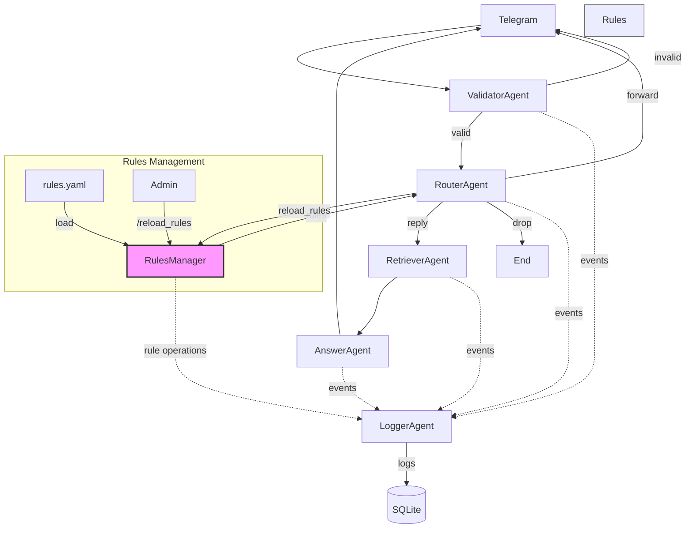

1. Executive Summary

Предлагаемый продукт — интеллектуальный Telegram-бот для поддержки пользователей блокчейн-сервисов (кошельки, мосты и т. д.). Бот сочетает валидатор входящих сообщений, динамический маршрутизатор по YAML-правилам и RAG-генерацию ответов (FAISS + GPT-4o-mini). Это позволяет:
	•	отвечать на типовые вопросы ≤ 15 с;
	•	автоматически перенаправлять «неподходящие» запросы в специализированные каналы;
	•	снизить нагрузку live-агентов ≥ 65 % без потери качества.

2. Goals & Success Metrics

Цель	KPI	Целевое значение (MVP)
Сократить время первой реакции	Median First Response Time	≤ 15 с
Уменьшить нагрузку на live-агентов	% запросов, решённых ботом	≥ 65 %
Поддерживать качество ответов	CSAT (1-5)	≥ 4.0

3. Personas

Persona	Pain	Gain
Конечный пользователь	Долгий ответ, непонятные инструкции	Мгновенный, релевантный ответ
Служба поддержки	Рутина, выгорание	Фокус на сложных кейсах

4. Scope

In-Scope
	•	Приём сообщений в группах и DM
	•	Валидатор языка/токсичности
	•	Router & Dynamic Instructions (YAML-правила: reply / forward / drop)
	•	RAG-поиск по answers_table (FAISS)
	•	Генерация ответа GPT-4o-mini
	•	Логирование диалогов в SQLite

Out-of-Scope v1
	•	Многоязычная поддержка
	•	Интеграция с CRM/Help-desk
	•	Облачный хостинг и масштабирование
	•	Продвинутая аналитика (dashboard)

5. Functional Requirements

5.1 Message Intake
	•	FR-1 Бот получает Message из Telegram API.
	•	FR-2 Извлекает последние N реплик диалога по user_id.

5.2 Validator
	•	FR-3 Проверяет язык (только EN).
	•	FR-4 Детектирует токсичность/спам; при нарушении отвечает заглушкой.

5.3 Router & Dynamic Instructions
	•	FR-5 Загружает YAML-правила при старте и по /reload_rules.
	•	FR-6 Для каждого сообщения определяет action ∈ {reply, forward, drop}.
	•	FR-7 При forward пересылает сообщение в dst_chat_id.
	•	FR-8 При reply добавляет system_prompt из правила к LLM-промпту.

5.4 Retrieval (RAG)
	•	FR-9 Извлекает top-k (≤ 3) Q&A из FAISS < 200 мс.
	•	FR-10 Формирует контекст ≤ 2 000 токенов.

5.5 Answer Generation
	•	FR-11 Собирает промпт: system_prompt + history + context + user_message.
	•	FR-12 Генерирует ответ ≤ 500 токенов и отправляет в чат.

5.6 Logging
	•	FR-13 Записывает {ts, uid, rule_id, action, q, a, ctx} в SQLite.
	•	FR-14 Экспорт логов в CSV по запросу.

6. Non-Functional Requirements
	•	Performance – ответ ≤ 2 с при 1 k RPS локально.
	•	Security – ключи в .env; шифрование логов; GDPR-удаление PII.
	•	Accessibility – чистый текст, минимум emoji.
	•	Compliance – OpenAI policy, GDPR, локальное хранение данных.

7. Tech Stack

Компонент	Выбор	Причина
Язык	Python 3.12	зрелая экосистема
Telegram	python-telegram-bot	async-поддержка
LLM	OpenAI GPT-4o-mini	цена/качество
Agent Orchestration	OpenAI Agent SDK	memory, tools
Vector Store	FAISS (pkl)	офлайн, быстро
Rules Store	YAML + pyyaml	читабельно, «горячая» перезагрузка
DB	SQLite	file-based, MVP
Env Mgmt	python-dotenv	безопасность

8. Agents

## 8.1. Обзор агентной архитектуры

Система построена на основе агентной архитектуры с использованием OpenAI Agent SDK, что обеспечивает:
- Изолированную ответственность каждого агента
- Четкие интерфейсы взаимодействия между агентами
- Возможность независимого масштабирования и модификации агентов
- Встроенные механизмы трассировки и логирования
- Поддержку handoff (передачи управления) между агентами

## 8.2. Описание агентов

### ValidatorAgent
**Роль**: Первичная фильтрация и валидация входящих сообщений.
**Ответственности**:
- Определение языка сообщения (только английский в v1)
- Проверка на токсичность/спам
- Блокировка неприемлемого контента
**Техники**:
- FastText для определения языка
- OpenAI moderation API для проверки контента
**Взаимодействие**:
- Входные данные: raw message из Telegram
- Выходные данные: validated message или rejection response
- Следующий агент: RouterAgent (если валидация пройдена)

### RouterAgent
**Роль**: Определение способа обработки сообщения на основе YAML-правил.
**Ответственности**:
- Загрузка и применение правил маршрутизации
- Анализ сообщения на соответствие условиям правил
- Принятие решения о действии (reply/forward/drop)
- Подготовка system prompt для AnswerAgent (если требуется)
**Техники**:
- Regex/keyword matching для анализа сообщений
- Приоритезация правил
- Динамическая перезагрузка правил
**Взаимодействие**:
- Входные данные: validated message
- Выходные данные: RouterDecision (action + параметры)
- Следующий агент: RetrieverAgent (для reply) или прямое действие (для forward/drop)

### RetrieverAgent
**Роль**: Поиск релевантного контекста для генерации ответа.
**Ответственности**:
- Векторизация входящего запроса
- Поиск похожих Q&A в базе знаний
- Формирование контекста для AnswerAgent
**Техники**:
- FAISS для векторного поиска
- OpenAIEmbeddings для векторизации
- Ранжирование результатов по релевантности
**Взаимодействие**:
- Входные данные: user message + метаданные
- Выходные данные: отранжированный список релевантных Q&A
- Следующий агент: AnswerAgent

### AnswerAgent
**Роль**: Генерация финального ответа пользователю.
**Ответственности**:
- Сборка промпта из всех компонентов
- Генерация связного ответа
- Форматирование ответа для Telegram
**Техники**:
- Prompt-engineering
- RAG-fusion для объединения контекста
- GPT-4o-mini для генерации
**Взаимодействие**:
- Входные данные: system prompt + user message + context + history
- Выходные данные: готовый ответ для пользователя
- Следующий этап: отправка ответа в Telegram

### LoggerAgent
**Роль**: Сбор и сохранение данных о работе системы.
**Ответственности**:
- Логирование всех этапов обработки
- Сохранение диалогов и метаданных
- Подготовка данных для аналитики
**Техники**:
- Асинхронная запись в SQLite
- Структурированное логирование
- Трассировка через OpenAI Agent SDK
**Взаимодействие**:
- Входные данные: события от всех агентов
- Выходные данные: записи в БД, логи
- Интеграции: возможность экспорта в CSV

## 8.3. Схема взаимодействия агентов



## 8.4. Расширяемость

Архитектура предусматривает возможность добавления новых агентов для расширения функциональности:
- SecurityAgent (будущее): дополнительный слой безопасности
- AnalyticsAgent (будущее): real-time анализ метрик
- MultilingualAgent (будущее): поддержка других языков
- PersonalizationAgent (будущее): адаптация ответов под пользователя

## 8.5. RulesManager

RulesManager - это ключевой компонент системы, отвечающий за управление правилами маршрутизации и их валидацию.

### 8.5.1. Назначение
- Централизованное хранение и управление правилами маршрутизации
- Валидация структуры правил при загрузке
- Предоставление правил RouterAgent в отсортированном виде
- Поддержка горячей перезагрузки правил без перезапуска бота

### 8.5.2. Структура правил (rules.yaml)
```yaml
rules:
  - rule_id: "spam_filter"
    priority: 1
    conditions:
      - type: "keyword_match"
        keywords: ["casino", "lottery", "win money"]
        match_type: "any"
        case_sensitive: false
    action: "drop"
    action_params: {}

  - rule_id: "technical_support"
    priority: 2
    conditions:
      - type: "regex_match"
        pattern: "error|bug|not working"
    action: "forward"
    action_params:
      destination_chat_id: "tech_support_group"

  - rule_id: "faq_query"
    priority: 3
    conditions:
      - type: "keyword_match"
        keywords: ["how to", "what is", "help"]
        match_type: "any"
    action: "reply"
    action_params:
      system_prompt_key: "faq_assistant"
```

### 8.5.3. Поддерживаемые типы условий
1. **keyword_match**:
   - keywords: список ключевых слов
   - match_type: "any" | "all" | "exact"
   - case_sensitive: boolean

2. **regex_match**:
   - pattern: регулярное выражение
   - flags: опции регулярного выражения

3. **composite_condition** (будущее):
   - operator: "and" | "or" | "not"
   - conditions: вложенные условия

### 8.5.4. Поддерживаемые действия
1. **reply**:
   - response_text: готовый текст ответа
   - system_prompt_key: ключ для выбора системного промпта

2. **forward**:
   - destination_chat_id: ID чата для пересылки

3. **drop**:
   - без параметров

### 8.5.5. Валидация правил
RulesManager выполняет следующие проверки:
- Уникальность rule_id
- Корректность приоритетов
- Валидность регулярных выражений
- Соответствие параметров действий схеме
- Существование указанных system_prompt_key
- Валидность destination_chat_id

### 8.5.6. API
```python
class RulesManager:
    def load_rules(self) -> None:
        """Загрузка правил из YAML-файла"""
        
    def reload_rules(self) -> None:
        """Горячая перезагрузка правил"""
        
    def get_rules(self) -> List[Rule]:
        """Получение отсортированного списка правил"""
        
    def get_rule_by_id(self, rule_id: str) -> Optional[Rule]:
        """Получение правила по ID"""
        
    def validate_rules(self) -> List[ValidationError]:
        """Валидация загруженных правил"""
```

### 8.5.7. Интеграция с системой
- RouterAgent использует RulesManager для получения и применения правил
- Telegram-команда /reload_rules вызывает метод reload_rules()
- LoggerAgent записывает все операции с правилами
- Ошибки валидации отправляются администраторам

### 8.5.8. Расширяемость
RulesManager спроектирован с учётом будущих улучшений:
- Добавление новых типов условий
- Поддержка сложных составных условий
- Интеграция с внешними источниками правил
- Версионирование правил
- A/B тестирование правил

9. Risks & Mitigations

Риск	V/I	План
Неверная маршрутизация	M/H	unit-тесты Router, тест-матрица правил
Галлюцинации LLM	H/M	human-review, уточнение промптов
OpenAI rate-limit	M/H	кеш, back-off
Утечка данных	H/H	шифрование, PII-masking

10. Epics

Эпик	Цель	Done-критерий	Ключевые задачи
E0. Git Repo & Среда	Централизованный код и reproducible-среда	Репо с README, .gitignore, pyproject.toml	Инициализировать repo; настроить pre-commit (black, ruff); Makefile/poetry для venv
E1. Telegram Handler	Принимать сообщения и отвечать «echo»	Бот онлайн, echo ≤ 2 с	Создать Bot Token; async-хендлер MessageHandler; поддержать группы и DM
E2. Validator	Фильтровать не-EN; заглушка-ответ
E3. Router & Dynamic Instructions	Выбрать инструкцию и действие (reply/forward/drop)	100 % сообщений получают верный action	YAML-rules store; RouterAgent; команда /reload_rules; пересылка в dst_chat_id
E4. Retrieval (RAG)	Достать релевантный контекст	top-3 Q&A < 200 мс	Загрузить answers_table.pkl; FAISS + OpenAIEmbeddings; get_context()
E5. Answer Generation	Сформировать связный ответ	≥ 50 % кейсов закрыты ботом	Промпт: system_prompt+history+context; GPT-4o-mini; ответ ≤ 500 токенов
E6. Logging	Хранить данные для улучшений	100 % диалогов в SQLite	Таблица dialogs; async-write; CSV-экспорт скрипт


11. Strong Opinion on Priorities
	1.	Router → Validator → Retrieval → Answer: без Router некорректные вопросы уйдут в LLM и ухудшат метрики.
	2.	Логирование обязательно в MVP — без данных невозможно улучшать правила и RAG.
	3.	Сложный UI и аналитика откладываются до подтверждения ценности автоответов.